# ACT capacity and flow-objective investigation

**Status:** complete — seed-1000 controlled matrix (§9.1–9.2), π0.5 650K/700K flow-VLM reference (§9.2.2), SmolVLA rotation-notation ablation (§9.2.3), and the official-openpi rot6d-vs-rotvec replication (§9.2.4). §9.2.4 includes a horizon-matched correction: at equal 10-step scoring, SmolVLA / π0.5 port / official openpi are all statistically tied at 9–10 mm endpoint — earlier cross-model endpoint spreads were a horizon artifact; the real differentiators are smoothness and sample efficiency. The multi-seed (seed 2000/3000) confirmation was dropped for compute efficiency after two artifact-disk failures stranded the checkpoints (§8, incident 12); a 2026-08-17 salvage audit later found six seed-2000/3000 companion checkpoints alive at partial budgets and evaluated them (§9.2.6) — variant rank order replicates across training seeds — and then scored the fully-intact historical production ACT across its entire 100k–3M budget range on the same metric set (§9.2.7). Conclusions otherwise rest on a single training seed with per-episode bootstrap intervals, supplemented by the well-trained π0.5 references. The π0.5-port 700K→1M continuation completed 2026-08-19 (1M flat at both horizons: 9.00 mm t+10 / 21.75 mm t+30; §9.2.2, §9.2.9, §9.2.11). The horizon-30 openpi arm plus the JAX-vs-PyTorch matched-recipe stack A/B completed on 2026-08-17 (§9.2.5): scoring horizon alone moves the same openpi checkpoint 2.2× in endpoint error; h30 training costs ~15% near-horizon precision versus h10 training at equal budget; JAX-vs-PyTorch at matched recipe shows no accuracy gap but the PyTorch port is ~2× smoother; and the openpi recipe's ~9× sample efficiency transfers into the PyTorch stack. A fresh ACT R50-VAE (ImageNet-V1) 1M-step run (seed 1000) completed on the host on 2026-08-18 (§9.2.8): its budget curve confirms the capacity conclusion — R50@100k already matches the historical R18@3M plateau and stays ~2 mm / ~2.7 pp Acc@0.1 ahead through 1M, with no late smoothness penalty; notably, budget improves t+30 endpoint but *degrades* t+10 endpoint on the same checkpoints, so checkpoint selection must match the executed horizon. A unified horizon-10 re-evaluation of every surviving model under one protocol with the full metric set (endpoint pose, per-component L1 / per-dim MSE, Acc@0.5/0.1 as co-primary metrics; §9.2.9) was launched 2026-08-18 — it re-scores, never retrains, and its metric definitions are normative for the report; its host rows landed the same day (at matched t+10, the ACT R50/L1 family, SmolVLA, and the 3B flow-VLMs statistically tie at 9–11 mm endpoint / Acc@0.1 0.92–0.93, the historical R18 sits above the pack at 12–13 mm even at 30× budget, and matched ACT-flow remains worst on every metric); the kiwi π0.5-port rows and the SmolVLA rot6d 1M full-width curve have since landed (§9.2.10); the §9.2.10 padding-mode A/B closed 2026-08-20 — masked-subspace ties full-width on endpoint at every budget, with only a small (7–9%) late-budget smoothness edge, so the strawberry-dataset padding pathology does not reproduce on this task. The openpi rot6d 1M-budget run was stopped at 111k on 2026-08-23 (user decision; ~2.4 s/it put the full 1M at ~27 days) and its kept 100k checkpoint scored under §9.2.9 (§9.2.12): 10.77 mm endpoint / Acc@0.1 0.915 — flat vs its 20k arm (budget buys no t+10 endpoint), while rot-2nd-diff tightens to 0.143° (GT 0.152°), the closest-to-GT h10 row; at matched 100k steps the π0.5 port (9.12 mm) and R50-VAE (ImageNet-V1) (9.20 mm) lead on endpoint. A metric-naming audit the same day renamed the legacy "jerk" columns to within-chunk second differences everywhere (with an fps correction: the dataset is 30 Hz, not 10) and added a full physical-unit re-evaluation of all 88 torch rows at dt = 1/30 s (§9.2.13): every over/under-GT smoothness call from the proxy survives as true third-derivative jerk — ACT over-smooths (rot jerk 0.15–0.56× GT, XYZ as low as 0.15×), SmolVLA jitters (2.5–3.3×), and the π0.5 port is the closest GT-tracker across the velocity→acceleration→jerk ladder while also leading endpoint; the four JAX openpi rows are physical-pending. On 2026-08-24 the failed external disk was revived and its unique contents salvaged into the kiwi checkpoint archive (28 training runs incl. the entire seed-1000 matrix, `lingbot_va` pretrained; §8 incident 12 addendum, §9.2.6 recovery addendum); all 28 were re-scored the same day under the unified protocol with physical metrics (§9.2.15) — R50-VAE (ImageNet-V1) seed-1000 at 100k closes the old horizon-10 gap at 9.46 mm (pack-tied, 0.26 mm from the fresh 1M run's 100k), family signatures (deterministic over-smoothing 0.42–0.55× GT; stochastic ACT-stack jitter 2.3–4.0×) replicate across training seeds, and the recovered seed trios bound single-seed endpoint noise at ~0.3–0.4 mm except R18-VAE (3.1 mm). A cross-query prediction-stability metric (overlap disagreement between chunks re-queried at k ∈ {1, 5, 10} frames, shared sampler seed) was added the same day over a 17-row representative set (§9.2.19): SmolVLA is the only re-query-unstable family (6.3–7.1 mm at k=1, ~2× the pack, unaffected by 1M budget — and not sampler noise by construction), the π0.5 port at 1M is among the most stable (3.66 mm — its deployed shakiness is not plan inconsistency), and budget improves stability in every ACT/port family.
**Started:** 2026-08-11  
**Branch:** `research/umi-act-flowmatching-ablation-20260811`  
**Source baseline:** `3feb3f3e`  
**Full-run artifacts:** `/mnt/data1/projects/lerobot-arch-exp` (moved off the failed external disk, §8 incident 12)  
**Smoke artifacts:** `/mnt/data1/sroi/lerobot_policy_ablation_20260811/smoke`

This is the single research record for the investigation. It intentionally
contains the question decomposition, evidence, experimental design, code
changes, exact controls, execution incidents, results, interpretation,
limitations, and lessons. Raw multi-gigabyte checkpoints remain outside Git;
all code, compact metrics, and conclusions belong on the research branch.

## 1. Questions and decision criteria

### Q1: Can the 1459 ACT be improved by scaling the backbone or architecture?

The useful answer is not merely whether a larger model gets a lower training
loss. An improvement must appear on held-out decoded physical trajectories and
must justify its memory, latency, and training cost. The staged test is:

1. reproduce the existing ResNet-18 ACT at an early common budget;
2. scale ResNet-18 → ResNet-34 → ResNet-50 and explicitly control the
   torchvision ImageNet-V1/V2 initialization choice;
3. test a wider/deeper transformer only if backbone scaling is promising;
4. promote promising candidates to longer training and multiple seeds;
5. compare decoded xyz, rotation, gripper, and within-chunk 2nd-diff, not only ACT
   validation L1.

### Q2: Is weaker flow-policy behavior caused by flow matching itself?

The existing ACT, SmolVLA, and π0.5 runs confound at least five variables:
action objective, vision encoder, language/VLM backbone, pretrained weights,
trainable parameter subset, and optimizer. Comparing their raw validation
losses is invalid because ACT logs L1+KL while flow policies log velocity MSE.

The decisive control changes only the objective:

- `act_r18_l1`: ACT inference architecture, no VAE, direct L1 regression;
- `act_r18_flow_*`: the same ResNet-18, state/image encoder, transformer
  encoder/decoder, data, and chunk geometry, but rectified-flow velocity
  regression with noisy action and time inputs.
- `act_r18_diffusion_lr1e5`: exactly the same learned time-conditioned ACT
  architecture as the matched flow model, but epsilon prediction with the
  standard squared-cosine DDIM schedule.

The VAE is removed from both because the 1459 ACT's KL has collapsed to nearly
zero, and the VAE encoder is absent at inference. This makes the L1/flow pair
much closer in trainable and inference architecture than ACT-VAE versus a VLM.
The repository's conventional ResNet + temporal U-Net Diffusion Policy is a
second non-VLM generative control. The exact ACT-flow/ACT-DP pair is needed
because a U-Net comparison still changes denoiser architecture. Together these
distinguish:

- flow loses in ACT-flow and Diffusion Policy → objective/data representation
  is a plausible bottleneck;
- ACT-flow matches ACT-L1 but VLAs lag → VLM/fine-tuning path is the likely
  bottleneck;
- ACT-flow works but Diffusion Policy loses → denoiser architecture or
  optimization matters more than the generic objective;
- both non-VLM generative controls work → flow/diffusion itself is not the
  explanation.
- ACT-DP beats ACT-flow at fixed learned architecture → path, target, or sampler
  is the likely cause; both lose similarly → shared iterative conditioning or
  optimization is more suspect than flow matching specifically.

## 2. Literature evidence used in the design

- [ACT](https://arxiv.org/abs/2304.13705) motivates action-chunk prediction as
  a way to reduce compounding error and model non-stationary demonstrations.
  The local implementation uses a ResNet visual encoder and a transformer over
  image/state conditioning.
- [Diffusion Policy](https://arxiv.org/abs/2303.04137) reports strong robot
  performance from conditional action diffusion, including multimodal action
  distributions, receding-horizon control, and visual conditioning. Therefore
  a weak local VLA is not by itself evidence that iterative generative action
  objectives are intrinsically inferior.
- [Flow Matching](https://arxiv.org/abs/2210.02747) defines simulation-free
  vector-field regression over conditional probability paths and reports that
  optimal-transport displacement paths can train and sample efficiently. The
  ACT-flow control uses the simplest straight path between action data and
  Gaussian noise.
- [OpenPI's reference implementation](https://github.com/Physical-Intelligence/openpi/blob/main/src/openpi/models/pi0.py)
  transports Gaussian noise to actions by Euler integration of a learned
  velocity field. The local shared `integrate_flow_matching` implementation
  uses the same time direction: training interpolates
  `x_t = t * noise + (1-t) * action`, predicts `noise-action`, and inference
  integrates from `t=1` to `t=0` with negative steps.
- [Dyna-2](https://www.dyna.co/dyna-2) reports scaling-law results on a metric
  quartet designed to be robust to metric choice: MSE and L1 averaged over
  action dimensions and the chunk horizon, plus a per-coordinate normalized
  within-threshold rate, **Acc@ε** — the fraction of action dimensions within
  ε of ground truth in normalized action units — evaluated at ε=0.5
  (motion-intent level, suited to human-to-robot transfer) and ε=0.1
  (movement-precision level, informative in-domain). The 2026-08-16/17
  evaluator extensions adapt this quartet to decoded physical poses and use
  [OpenPI's q01/q99 normalization](https://github.com/Physical-Intelligence/openpi/blob/main/src/openpi/transforms.py)
  to define the normalized per-coordinate error scale.

These papers establish plausibility and implementation conventions; none can
answer the dataset-specific questions without controlled local experiments.

## 3. Audit of the existing 1459 ACT

Recovered from
`outputs/train/act_umi_identity_rot6d_1459/checkpoints/0800000/pretrained_model/train_config.json`
and the two console logs:

| Property | Existing 1459 ACT |
| --- | --- |
| train data | 1459 episodes / 140,522 frames |
| validation | 100 episodes / 9,274 frames |
| representation | UMI relative EE, 10D rot6d action, derived 20D state |
| normalization | MIN_MAX, rot6d coordinates forced to identity stats |
| chunk / executed | 30 / 30 |
| backbone | ImageNet ResNet-18 |
| transformer | width 512, 8 heads, FFN 3200, encoder 4, decoder 1 |
| VAE | latent 32, encoder 4, KL weight 10 |
| optimizer | AdamW, LR 1e-5, weight decay 1e-4 |
| batch / seed | 8 / 1000 |
| parameters | 51,579,786 (52M) |
| total training | 3,000,000 steps |

Parsing all 300 logged validation points gives a lowest stochastic validation
loss of **0.032595 at 2.48M** (L1 0.032592, KL effectively zero). At the common
early budgets it recorded 0.054203 at 10k, 0.043292 at 20k, 0.039702 at 30k,
0.036201 at 50k, and 0.036900 at 100k. The best saved-checkpoint behavior is
not the same as minimum validation loss.

The pre-existing all-validation open-loop audit evaluated 500 fixed query
frames per checkpoint. The 1459 ACT improves slowly from 25.1 mm xyz endpoint
error at 100k to about 22.9 mm at 2.3M; rotation endpoint improves from 4.91°
to about 4.40°. Rotation 2nd-diff is best around 700k (0.036°), then becomes a bit
worse with more fitting. Thus longer training buys modest endpoint accuracy
and can trade away smoothness.

An important correction to the question's premise: flow policies have not been
uniformly worse offline. In the existing report, π0.5 reaches 21.7–22.0 mm xyz
endpoint error at 100k, slightly better than ACT, while SmolVLA is much worse
at 35.6–35.9 mm and far jerkier. This mixed result is exactly why objective,
architecture, and VLM adaptation must be isolated. It does not overrule any
observed closed-loop deployment gap.

## 4. Implementation added for the controlled tests

### 4.1 Architecture-matched ACT flow

`ACTConfig.action_objective` now selects canonical `l1` (default, backward
compatible) or `flow_matching`. Flow mode requires `use_vae=false` and adds:

- a linear projection of the noisy 10D action at each of the 30 decoder tokens;
- a continuous sine/cosine time embedding and two-layer time MLP;
- masked velocity MSE for training;
- fixed-step Euler integration through the shared flow helper for inference;
- configurable uniform/Beta time sampling and inference steps.

Everything upstream of decoder inputs—ResNet, image tokens, state token,
transformer encoder, decoder blocks, normalization, and UMI processors—is the
same as no-VAE ACT-L1, as are the learned decoder positional queries and final
action head. Flow necessarily replaces the L1 decoder's zero content vectors
with projected noisy actions plus time embeddings; a structural regression test
proves that these six projection/MLP parameters are the only flow-only learned
parameter tensors and that every shared tensor name and shape matches ACT-L1.
Uniform time is the vanilla default. A Beta(1.5, 1.0) variant mirrors the time
bias used by local OpenPI-style VLA configs.

### 4.2 Architecture-identical ACT epsilon diffusion

The matched flow result alone cannot separate a weakness of straight-path flow
from a weakness of the time-conditioned ACT transformer. A new explicit
`diffusion` ACT objective therefore reuses the exact noisy-action projection,
continuous sinusoidal time embedding, two-layer time MLP, ResNet, observation
encoder, ACT decoder, positional embeddings, and action head used by
`flow_matching`. The two policies have exactly the same learned parameter names
and tensor shapes. Only the training target/path and sampler change:

- ACT-flow regresses `noise - action` along the linear interpolation and uses
  ten fixed Euler steps from noise to action;
- ACT-DP samples one of 100 squared-cosine diffusion timesteps, regresses
  epsilon, and uses a clipped ten-step DDIM sampler.

Both use batch 8, AdamW LR 1e-5 (including the backbone), identical UMI
processors, action-padding mask, training seeds, and fixed evaluation queries.
This is the strictest practical answer to “vanilla DP with the same architecture
as ACT.” Scheduler state has no learned parameters. A structural test proves
exact learned-architecture equality between ACT-flow and ACT-DP; finite-gradient,
fixed-noise determinism, scheduler-recipe, and bad-shape tests also pass.

### 4.3 Conventional non-VLM Diffusion Policy

The existing Diffusion Policy now accepts the canonical UMI processors and
representation. Because its U-Net requires a horizon divisible by its temporal
downsampling factor, it trains at internal horizon 32 and returns/executes the
first 30 actions. It uses one current observation, canonical derived 20D state,
10D relative actions, padding-aware loss, and direct offline chunk inference.
The planned control uses ResNet-18, a `(256,512,1024)` 1D U-Net, 100 DDIM
training timesteps, and 10 inference steps.

### 4.4 Common evaluator

`eval_open_loop_dataset.py` now supports Diffusion Policy and correctly applies
runtime inference-step overrides to the nested diffusion model. Its override
resolver now also distinguishes ACT-flow's `flow_num_inference_steps` from
ACT-DP's `diffusion_num_inference_steps`; this prevents a requested ACT sampler
override from creating an unused generic attribute. The controlled launchers
use each checkpoint's saved ten-step default, but the explicit path is covered
for reproducible sensitivity studies. All objectives will be compared only
after postprocessing back to absolute 7D physical poses.

### 4.5 Official UMI diffusion architecture ports

The upstream checkout at `/home/zfei/code/universal_manipulation_interface`
was audited at commit `d095ba9590df789df5189eea5ee7e431689038a6`. The documented
single-GPU command uses `train_diffusion_unet_timm_umi_workspace`, not the
transformer-denoiser configuration. Two separately registered policies were
therefore added:

- `umi_official_dp` ports the documented CLIP ViT-B/16 observation encoder,
  CLS-token global conditioning, `(256,512,1024)` conditional 1D U-Net,
  FiLM scale modulation, DDIM with 50 train/16 inference steps, epsilon
  prediction, 0.1 input perturbation, AdamW 3e-4, 2k-step cosine warmup, and
  the released EMA warmup (`power=0.75`, cap 0.9999). Its training-only image
  transforms are 95% random crop/resize and the exact color-jitter settings in
  the released YAML.
- `umi_official_transformer_dp` ports the companion
  `train_diffusion_transformer_umi_workspace`: all 197 ViT tokens are retained,
  the low-dimensional state becomes a learned token, and a 7-layer, 768-wide,
  8-head pre-norm transformer decoder denoises the action sequence. It adds the
  released ±5° rotation augmentation and uses a 3e-5 backbone LR versus 3e-4
  for the denoiser/observation projections.

The CLS detail follows executed upstream code rather than a literal reading of
one YAML field: the U-Net YAML requests `feature_aggregation: attention_pool_2d`,
but `TimmObsEncoder` warns that aggregation is ignored for
ViTs, resets it to `None`, and returns token 0. Likewise, its
`use_group_norm: True` conversion is guarded by `not pretrained`, so it does
not alter the pretrained CLIP ViT used here. These apparent YAML/code
discrepancies therefore do not require extra layers in the port.

The scheduler and EMA code paths were checked separately. The installed
`DDIMScheduler` defaults are `set_alpha_to_one=True` and `steps_offset=0`,
matching the values written explicitly in the upstream YAML. The EMA decay
equation, first-update behavior, parameter update, and optimization-step
increment match upstream. The port additionally copies buffers on every EMA
update; that is inert for this pretrained ViT plus GroupNorm U-Net because
there are no BatchNorm running statistics to average.

Training/validation mode handling was traced through the actual LeRobot loop.
Each optimizer and scheduler step completes before `policy.update()` advances
EMA. Training loss uses online weights; deterministic held-out validation calls
`policy.eval()`, which selects `ema_diffusion`, and forks/reset RNG to seed 0
for reproducible diffusion timesteps and noise. Thus validation and deployment
both measure the averaged copy rather than accidentally mixing online and EMA
models.

Both policies keep independent online and EMA copies in checkpoints; training
updates only online weights and validation/inference use EMA weights. This is
implemented behind new policy types and a new `umi-official-dp` dependency
extra, so ACT, matched ACT-flow, and ordinary `diffusion` defaults and classes
remain unchanged.

Normalization was traced through both dataset implementations. Upstream range
normalizes translation and gripper to `[-1,1]` while assigning identity
scale/offset to rotation-6D for actions and low-dimensional observations. The
shared LeRobot processor applies MIN_MAX to translation/gripper and forces
identity statistics on action rot6d plus both rot6d blocks in the derived 20D
state. This preserves the released geometry instead of independently stretching
near-constant rotation-matrix coordinates.

This is an architecture/recipe port, not a claim of bit-for-bit reproduction.
The necessary dataset/control adaptations are material and will be carried into
every interpretation:

| Released UMI task | This controlled comparison | Reason |
| --- | --- | --- |
| two observations, stride 3 at about 60 Hz | one current image + canonical derived 20D two-pose state | keep exactly the observations already supplied to ACT/DP on the 30 Hz LeRobot dataset (fps correction 2026-08-23: an earlier revision of this table said 10 Hz; dataset metadata and frame timestamps are 30 fps) |
| 32D low-dimensional input, including episode-start-relative orientation | canonical 20D relative pose+gripper state | the shared evaluator/processor does not expose the extra episode-start token |
| 16 strided action slots; deploy 8 | internal horizon 32; decode the common 30 actions | evaluate identical offsets `[-1,31]` and the same endpoint as ACT |
| no padded action samples | shared padded sampling with padding-masked loss | preserve common query coverage without learning copied boundary actions |
| batch 64 | batch 64 | preserve the released optimization recipe; report seen samples and compute because this is 8× the main matrix batch |

Consequently these candidates answer whether the released UMI visual encoder
and denoisers transfer well under the common LeRobot representation. They do
not isolate the effect of observation history, temporal stride, or the missing
episode-start orientation. The architecture-matched ACT-L1/flow pair remains
the clean objective isolation.

## 5. Experiment matrix

All stage-one controlled experiments use the same 1459 train set, 100-episode
validation set, PyAV decoder, no image augmentation, ImageNet image statistics,
identity rot6d normalization, chunk 30, batch 8, seed 1000, and host RTX 4090.
The official-UMI supplements deliberately retain their released policy-side
crop/color augmentation and batch 64; those differences are part of the
released recipe and are not presented as an architecture-only ablation. The
first stage uses a common optimizer-step budget and fixed evaluation queries.
The flow LR sweep is deliberate: equal LR isolates the objective, while a tuned
LR avoids mistaking an ACT-specific optimizer for an intrinsic flow failure.

Equal optimizer steps do **not** mean equal sample exposure for the official
recipes. At 30k steps, batch 64 draws 1.92M training samples, versus 240k for a
batch-8 stage-one run (8x as many); it also exceeds a 100k-step batch-8 run's
800k samples by 2.4x. Wall time and FLOPs differ further because the official
models use a ViT-B encoder and substantially larger denoisers. The official
candidates are therefore judged as end-to-end recipe candidates using decoded
accuracy together with latency and parameter count. A win cannot be attributed
to architecture alone; conversely, a loss despite the extra exposure is strong
negative evidence for this adapted recipe. The ACT-L1/ACT-flow pair remains the
controlled architecture-and-exposure comparison.

| Variant | Purpose | Parameters | Status |
| --- | --- | ---: | --- |
| `act_r18_vae` | exact 1459 early-budget replication | 52M | 30k + eval complete; 100k + eval complete |
| `act_r34_vae` | larger backbone, ImageNet-V1 initialization | 62M | 30k + eval complete |
| `act_r50_vae` | larger backbone + torchvision-recommended ImageNet-V2 initialization | 65M | 30k + eval complete; 100k + eval complete |
| `act_r50_v1_vae` | strict R18/R34-aligned ImageNet-V1 initialization control | 65M | 30k + 100k queued live before seed-1000 evaluation |
| `act_r50_large` | ResNet-50 + 768-wide, 6e/3d transformer | 145M | 30k + eval complete; not promoted |
| `act_r18_l1` | no-VAE deterministic objective control | 34M | 30k + eval complete; 100k + corrected exact-step eval complete |
| `act_r18_flow_u_lr1e5` | exact-LR, uniform-time flow control | 35M | 30k + eval complete; 100k queued |
| `act_r18_flow_u_lr1e4` | flow optimizer sensitivity | 35M | 30k + eval complete; rejected |
| `act_r18_flow_beta_lr1e4` | OpenPI-like time bias | 35M | 30k + eval complete; rejected |
| `act_r18_diffusion_lr1e5` | epsilon/DDIM objective at exact ACT-flow learned architecture and LR | 35M | 30k + 100k queued live before seed-1000 evaluation |
| `diffusion_r18` | standard non-VLM diffusion control | 75M | 30k + eval complete; 100k queued |
| `umi_official_dp` | released ViT-B + U-Net recipe port | 160M online / 320M with EMA | implementation/tests complete; supervised 30k retry active |
| `umi_official_transformer_dp` | released ViT-token + transformer denoiser port | 152M online / 304M with EMA | implementation/tests complete; queued behind U-Net retry |

**Naming convention.** `ACT R50-VAE (ImageNet-V1)` and `ACT R50-VAE (ImageNet-V2)`
are both VAE-based ACT policies. The parenthetical identifies
only the torchvision backbone initialization; it is not the ACT architecture
version. The machine-readable run IDs remain `act_r50_v1_vae` and
`act_r50_vae`, respectively.

Promotion rules will be based on confidence intervals over decoded physical
metrics, not the lowest model-specific validation loss. At least the leading
ACT-capacity model, ACT-L1, and leading ACT-flow configuration should receive
multiple seeds before a final claim.

Stage-one evaluation uses five evenly spaced query frames in the common valid
action-offset intersection `[-1, 31]` in every one of the 100 validation
episodes. Reports use episode-balanced means and deterministic
95% nonparametric bootstrap intervals (10,000 resamples, seed 0), with episodes
as the resampling unit. The decoded metric set per query covers per-step
rotation geodesic angle, xyz-norm, and gripper errors (chunk mean/RMSE/MSE plus
endpoint), within-chunk 2nd-diff, and — added 2026-08-16, before the §9.2.5 and
π0.5-1M evaluations — component-wise **L1** and **per-dimension MSE** for xyz
(m) and the axis-angle vector (deg): the action-space sense the training
objectives optimize, implemented as `per_component_l1_mse` in
`eval_open_loop_dataset.py` and mirrored in `eval_openpi_open_loop.py` (whose
summary registry previously computed but omitted the chunk-MSE keys — fixed in
the same change; both evaluators now emit the identical metric set, and the
openpi one takes `--action_horizon` for the h30 arm). A **Dyna-2-style
per-coordinate normalized within-threshold rate, Acc@ε**, using OpenPI-style
q01/q99 normalization (added 2026-08-17; ε = 0.5 "motion-intent level" and
ε = 0.1 "movement-precision level" — see the Dyna-2 reference in §2),
completes the set: the fraction of action
dimensions (over steps × dims, inclusive ≤) whose error falls within ε in
normalized action units. The normalization is protocol-fixed, not per-model:
per-dim errors are divided by (q99 − q01)/2 half-ranges pooled over this
evaluation's own GT chunks (q01 → −1, q99 → +1, the OpenPI quantile
normalization convention), so the metric stays comparable across the
MIN_MAX-trained ACT matrix and the quantile-trained flow models; the scales
are recorded in every report JSON.
Overall (`action_`) accuracy spans all seven decoded dims; `xyz_` and
`rotvec_` views follow the L1/MSE component split. Evaluations produced
before 2026-08-16 predate the L1/per-dim-MSE keys, and those produced before
2026-08-17 predate the Acc@ε fields (serialized under the existing
`*_acc_at_0p5` and `*_acc_at_0p1` JSON keys). Their JSONs already contain the
norm-based chunk MSE/RMSE; the kiwi/openpi checkpoints retain weights and
can be re-scored on demand, whereas the ACT seed-1000 matrix proved
unrecoverable after the disk failures at the time (§9.2.6) — its tables keep
the norm-based metrics as the surviving record, though the seed-1000 weights
themselves were later recovered from the revived disk (§9.2.6 addendum,
2026-08-24) and are re-scoreable if ever needed. ACT-flow and Diffusion Policy are additionally evaluated
with inference seeds 1000, 2000, and 3000 to expose sampling variance. Training
seeds are varied only after this screen selects configurations worth promoting.
The collector keeps inference-seed averaging and training-seed variability as
two distinct statistical levels. It emits per-training-run episode bootstrap
intervals, then separate cross-training-seed mean/SD/min/max tables and a
deterministic hierarchical 95% interval that resamples training seeds before
episodes within each selected seed. Repeated sampler draws are averaged within
episodes and never treated as independently trained models. The hierarchical
interval is reported with the caveat that three training seeds still give a
coarse empirical distribution. The collector requires
exactly matching episode-ID sets across inference seeds and across each paired
policy comparison, failing loudly instead of silently intersecting or
shape-matching different episodes. It also checks that the seed encoded in each
directory matches the JSON, that inference seeds are unique within a run, and
that every fixed evaluation contains the expected 100 episodes and 500 queries.
Across confirmations it rejects duplicate training seeds and requires every
candidate/baseline paired comparison to have the same training-seed set.
Synchronized policy-only GPU latency is measured on the same queries, excluding
the first cold call; mean, median, p95, and peak allocated inference memory are
recorded alongside accuracy. This makes the cost of larger backbones and
iterative samplers explicit. Parameter-efficiency figures use online learnable
parameters; for EMA policies the separately reported total parameter state is
roughly twice as large but does not represent a second model executed during
inference.

The final report will include reproducibly generated figures in addition to
tables: validation learning curves, decoded physical-error bars with episode
bootstrap intervals, paired percentage-improvement intervals, and
accuracy-versus-parameter/latency trade-off plots. Figure inputs will be the
same compact CSV/JSON evidence produced by `collect_results.py`; the plotting
script and rendered figures will be versioned in this directory. SVG generation
uses a fixed element-ID salt and omits volatile timestamps, making repeated
renders from identical inputs byte-for-byte reproducible. Once confirmation
runs exist, curves average equal-step validation values across training seeds
with an SD band; endpoint, paired-improvement, and efficiency figures use the
training-seed mean and hierarchical interval instead of selecting an arbitrary
equal-budget run. Single-training-seed error bars reduce to episode-bootstrap
intervals and are labelled separately from multi-seed uncertainty.
Learning-curve objective panels use explicit, complete, disjoint variant groups
rather than substring inference. A regression test specifically requires
`act_r18_diffusion_lr1e5` to appear in the diffusion noise-MSE panel, so its
result cannot silently disappear into the ACT-L1 group when artifacts arrive.

## 6. Smoke experiments and resource observations

All training smoke tests ran on the host GPU, not in the sandbox, against the
real 1459 dataset. The workstation has one RTX 4090 (24,564 MiB). The original
source filesystem was 95% full, so new full artifacts use the external project
directory. At the initial inspection the external mount had 345 GB free. After
the screen, interrupted-run preservation, and queued long-run setup, artifacts
occupied only 7.4 GB and the mount still had 337 GB free; the 100k confirmation
matrix therefore has ample checkpoint headroom. The repository filesystem had
only 27 GB free, reinforcing the decision not to place model artifacts there.

| Run | Result | Parameters | Cold first step | Notes |
| --- | --- | ---: | ---: | --- |
| ACT-flow R18 | passed 2 updates + checkpoint | 34,728,266 | 4.65 s | canonical 31 raw poses became 30 relative targets |
| Diffusion R18 | passed 2 updates + checkpoint | 75,396,650 | 10.56 s | 33 raw poses became internal horizon 32 |
| ACT R50 large | passed 2 updates + checkpoint | 144,946,762 | 10.61 s | batch 8 fits; downloaded official ResNet-50 V2 weights |

Cold-step numbers include worker/video/model warm-up and are not steady-state
throughput. Dedicated timed runs are required before latency conclusions.

## 7. Validation and test evidence so far

- Ruff and whitespace checks pass on all changed files.
- Twelve focused collector/statistics tests pass in 0.04 s. They cover online
  versus EMA parameter accounting, exact inference-seed episode matching,
  fixed-query provenance, ratio-of-means paired improvement, single-seed
  reduction, training-seed cluster resampling, preservation of paired seed and
  episode indices, duplicate training seeds, and asymmetric candidate/baseline
  seed sets. The verified host command sets
  `PYTEST_DISABLE_PLUGIN_AUTOLOAD=1`; otherwise an unrelated installed ROS/ament
  pytest plugin imports the optional hardware test module and skips collection
  on missing `deepdiff` before the requested pure-NumPy test file is collected.
- 48 targeted CPU tests pass, 9 hardware/optional tests skip. These cover the
  new ACT-flow training/inference path, shared flow integrator, legacy ACT VAE
  behavior, ACT/Diffusion processors, and canonical UMI processor behavior.
- ACT-flow produces finite differentiable loss, gradients in its noisy-action
  projection, deterministic outputs under fixed input noise, and rejects bad
  noise shapes.
- Twelve focused ACT generative-objective tests pass. In addition to the flow
  checks, they prove ACT-flow and ACT-DP have identical learned parameter names
  and shapes **and identical initialization under the same seed**, and verify
  ACT-DP's finite differentiable epsilon loss,
  squared-cosine scheduler, deterministic fixed-noise DDIM output, strict
  noise-shape rejection, and save/reload equality of fixed-noise output plus
  diffusion configuration.
- CPU construction with the exact queued feature geometry (20D derived state,
  10D action, image input, chunk 30) succeeds for both newly queued controls.
  ACT R50-VAE (ImageNet-V1) has exactly 64,654,218 parameters and resolves the cached V1
  weights; ACT-DP has exactly 34,728,266 finite parameters and constructs a
  100-training-step epsilon-prediction `DDIMScheduler`. Both remained on CPU,
  so this launch-fidelity check did not contend with the active host GPU job.
- Diffusion's UMI config produces `[-1, 0, ..., 31]`, strips the leading action
  into the two-pose derived state, and reconnects the same relative-action step
  to postprocessing.
- One-sample host-GPU checkpoint reload and physical-pose decoding passed for
  both ACT-flow and Diffusion Policy. Their very large errors after only two
  optimizer updates are expected and are not performance evidence.
- Seven focused tests for the new official UMI candidates pass, together with
  the legacy UMI Diffusion processor test. They verify factory registration,
  canonical relative-action processor wiring, finite differentiable losses,
  online-to-EMA updates, fixed-noise sampling shape, checkpoint/EMA round-trip,
  the transformer's lower-LR backbone parameter group, and the distinct
  released image paths (U-Net restores ImageNet normalization after pixel-space
  augmentation; transformer retains pixel-space values) using a tiny
  timm-compatible test encoder.
- A real cached `vit_base_patch16_clip_224.openai` CPU load and forward pass
  produced finite `[1,197,768]` tokens with 85,799,424 encoder parameters.
  Full construction gives 160,091,530 online trainable parameters for the
  U-Net candidate and 152,173,066 for the transformer candidate; checkpointed
  totals double to 320,183,060 and 304,346,132 because EMA is an explicit copy.
  Launchers pin Hugging Face offline mode for these cached weights, avoiding a
  metadata network request during queued training.

### 7.1 Compatibility and isolation audit

The research changes do not rewrite or silently opt existing policies into a
new objective. The original work was first committed/pushed on
`fei-v5.0-umi-unified`; all experiment code lives on the independent
`research/umi-act-flowmatching-ablation-20260811` branch. Training launchers
refuse existing output/log paths, and every new checkpoint is under the
external Glowat512 artifact root, so historical checkpoint directories remain
read-only.

Legacy ACT retains `action_objective="l1"` and `use_vae=true` defaults. Its old
forward/inference code is selected unless flow matching or ACT diffusion is
explicitly requested.
As a direct compatibility experiment, the historical 800k checkpoint at
`outputs/train/act_umi_identity_rot6d_1459` loads on the research branch as
L1+VAE with exactly 51,579,786 parameters and no missing/unexpected-weight
failure. Diffusion's UMI processors, delta indices, and normalization changes
are likewise gated by the new `use_umi_relative_ee=false` default; ordinary
Diffusion Policy keeps its prior path. The dataset factory change only adds
Diffusion to the allow-list when that flag is explicitly true. Evaluator and
launcher changes are confined to `examples/` and do not enter normal training.
Seventeen focused legacy/new ACT and Diffusion processor tests pass, with nine
optional tests skipped.

There is one temporary runtime interaction: stage-two training deliberately
occupies the only host RTX 4090. At the compatibility check it used about
4.45 GiB and 93% GPU utilization. Another simultaneous GPU training process
would contend for compute and could run out of memory; wait for or stop tmux
session `umi_arch_stage2_20260811` before launching unrelated GPU training.
This resource contention does not alter previous checkpoints or configs.

## 8. Execution incidents and lessons already learned

1. The repository is a linked worktree whose Git metadata is outside the
   workspace write sandbox. The baseline commit required explicit host access.
   The original branch was pushed before creating the research branch, as
   requested.
2. `uv` could not create cache files under the sandboxed home cache. Lightweight
   sandbox checks use a task-specific cache under `/tmp`; GPU work uses host
   execution.
3. The globally installed ROS pytest plugins caused an unrelated module-level
   `deepdiff` skip to abort targeted collection. Disabling plugin autoload made
   the intended tests collect normally. This was a test-runner environment
   issue, not a policy failure.
4. `diffusers` was not installed. Running `uv sync --extra diffusion` alone
   removed previously selected optional dataset/training packages, because sync
   reconciles the complete requested environment. The environment was corrected
   with all three locked extras together: `training`, `dataset`, and
   `diffusion`. Future setup must request the union of required extras.
5. Installing the dataset extra made TorchCodec available and silently changed
   the default video backend from the original run's PyAV. The launcher now
   pins PyAV explicitly so decode backend does not become an experimental
   confound. The first ACT-flow smoke used TorchCodec before this was noticed;
   no scientific metric will be taken from that smoke.
6. The common evaluator had the same dynamic-backend issue: its first one-query
   ACT-flow inference attempt selected an incompatible TorchCodec installation
   and failed before model inference. The evaluator now defaults to and records
   PyAV, matching training and the baseline. This also makes failed evaluations
   retryable without leaving a directory that looks complete.
7. Raw validation losses cannot compare objectives. The existing report already
   demonstrates that validation-loss-best and decoded-metric-best disagree for
   every evaluated model. The experiment protocol therefore fixes decoded
   metrics as the cross-model endpoint.
8. The first evaluation pass chose valid queries from `chunk_size=30`. That is
   correct for ACT's offsets `[-1, 0, ..., 29]`, but Diffusion Policy requests
   `[-1, 0, ..., 31]`; its first late query was therefore padded and the launcher
   stopped after 14 reports. The evaluator now accepts and records explicit
   offset bounds, the fixed launcher uses the common `[-1, 31]` intersection,
   and a regression test checks exact frame indices. The 14 earlier reports are
   preserved under `eval/` as superseded evidence. All scientific results use
   the clean rerun under `eval_common_h32/`.
9. Adding timm as a new optional extra made the lockfile stale while stage two
   was active. The lockfile was refreshed before the next sequential subprocess
   could launch, and the host environment was synced with the union of
   `training`, `dataset`, `diffusion`, `umi-official-dp`, and `test`; the running
   R50 process was not restarted or modified. An offline lock attempt first
   failed because the local cache lacked packages needed for other supported
   Python/platform resolution splits, so the successful lock used the registry.

10. The environment synced for stage two (incident 9) omits the `matplotlib-dep`
    extra, so a later `plot_results.py` invocation failed with
    `ModuleNotFoundError: No module named 'matplotlib'` even though figures had
    rendered earlier under a broader environment (`collect_status=0,
    plot_status=1`). Rather than re-sync — which risks the pruning incidents
    above while live training is running — plotting now runs through
    `uv run --with matplotlib`, an ephemeral overlay that leaves the shared
    training venv and the live training processes untouched. The evaluation
    supervisor's plot line was patched to use this path so confirmation
    auto-plotting does not silently skip figure regeneration, and the seed-1000
    figures were regenerated this way after the fix.

11. On 2026-08-13 at 13:36:26 the artifact disk `/dev/sdb1`
    (`/media/zfei/Glowat512`, ext4, all full-run checkpoints and decoded
    metrics) began returning `Input/output error` on writes and then on reads.
    This single event killed all four concurrent confirmation training jobs at
    the same timestamp (they all I/O on that mount) and took down every
    companion/supervisor tmux session whose logs live there; the host did not
    reboot (2-week uptime) and the tmux server itself survived. The failure is a
    hardware/disk-level fault, not a software or OOM event. As a result 9 of 14
    multi-seed confirmation runs were trained but only the seed-1000 matrix is
    fully evaluated; 5 confirmation runs (act_r50_vae s3000 at 70k,
    act_r50_v1_vae s2000 at 50k, act_r50_v1_vae s3000 unstarted,
    act_r18_flow_u_lr1e5 s3000 at 30k, diffusion_r18 s3000 at 30k) did not
    finish. The scientific seed-1000 results are **not** at risk: they were
    integrated into this report (Sections 9.1--9.2) and the figures/CSVs on the
    separate repository disk before the fault progressed. No multi-seed
    *evaluation* results existed yet (only training), so the only at-risk items
    are the large retrainable training checkpoints and the per-eval metric JSONs
    on the failing mount. Resume support (`--resume=true` via `UMI_RESUME=true`
    in `run_one.sh`; resume-aware `run_companion.sh`) was added so the surviving
    partial checkpoints can be continued once the disk is restored rather than
    retrained from scratch. **This incident is unresolved and blocks the
    queue** — advancing training/evaluation requires the disk fault to be
    repaired (fsck / remount / replacement) by the operator; it is not
    recoverable from software alone.

12. On 2026-08-14 at ~23:50 the same artifact disk (`/dev/sdc1` after its
    first recovery) failed a **second time** with block-layer `Input/output
    error` on both writes and reads, killing all four concurrently-resumed
    multi-seed confirmation jobs and stranding their checkpoints (reads failed,
    so no salvage copy was possible — the same mode as incident 11's nadir).
    Repeated failure shows the external disk is unreliable. Per operator
    directive the artifact root was **permanently moved** to the healthy internal
    `/mnt/data1/projects/lerobot-arch-exp` (`/dev/sda1`, ext4 rw, 280 GB free),
    and — for compute efficiency and to stop depending on the flaky disk — the
    multi-seed (seed 2000/3000) confirmation was **dropped** rather than
    retrained a third time. The ablation therefore finalizes on the seed-1000
    controlled matrix plus the independently-trained π0.5 reference (§9.2.2).
    Lesson: an external/USB disk is the wrong place for long-running checkpoint
    writes; the internal `/mnt/data1` root is now canonical, and all
    supervisors/companions read `UMI_ABLATION_ROOT` so a future retrain lands
    there directly.

    **2026-08-24 addendum — the stranded checkpoints were recovered after
    all.** The operator revived the failed external disk and attached it to
    kiwi; its contents matched the pre-failure tree (real weights, not husks).
    Everything not already in the kiwi checkpoint archive was salvaged
    kiwi-locally: 28 training runs (~89 GB — the entire seed-1000 matrix at
    trained budgets, the five unfinished confirmation runs' partial
    checkpoints, the umi_official DP runs, r34_vae/r50_large, and early-step
    companions) folded into the archive's `<family>/<run>/` layout with
    `.archive_full_done` markers, plus `lingbot_va` pretrained bases (22.7 GB)
    and the eval/results/logs evidence (now under
    `kiwi:/mnt/data/zfei/lerobot-act-flow-ablation/archive/old-disk-evidence/`
    after the 2026-08-24 archive reorganization; the pretrained bases moved to
    `lingbot/assets/`). Per-run
    file-count/byte-exact verification and a sha256 manifest
    (`manifest_salvage_glowat512.txt`) record the salvage. The canonical-root
    move to `/mnt/data1` stands (the disk remains untrusted for writes); the
    multi-seed drop decision also stands — the §9.2.6 partial-budget
    evaluation already answered the confirmation question at the budgets that
    mattered.

13. On 2026-08-14, standing up the official-openpi replication (§9.2.4) hit a
    chain of host-network and data-compatibility faults, each recovered in
    software: (a) the pinned openpi LeRobot is format **v2.1** while the
    strawberry datasets are **v3.0** (chunked multi-episode parquet/mp4 + parquet
    metadata), so `LeRobotDatasetMetadata` fell back to a Hub lookup and 404'd —
    fixed by a one-time v3.0→v2.1 reshard (per-episode parquet + ffmpeg-split
    per-episode mp4 + jsonl metadata); (b) the host's Tailscale intercepted DNS
    for `storage.googleapis.com` (synthetic `198.18.0.80`, unreachable), blocking
    the 11.6 GiB `pi05_base` orbax checkpoint download — bypassed non-invasively
    by pinning real Google front-end IPs with `curl --resolve`; (c) resuming the
    partially-downloaded checkpoint across different downloader generations
    produced **size-correct but corrupt** shards (orbax later failed with
    `ZSTD_decompressStream` corruption) — caught, pinpointed with crc32c checks
    against GCS's JSON-API hashes, and re-downloaded cleanly with per-file
    verification; (d) LoRA training at the default `batch_size=32` OOMed the
    24 GB RTX 4090 — reduced to 16 with the step count right-sized (§9.2.4).
    Lessons: size checks are not integrity checks (verify a real checksum —
    GCS's XML listing ETags are only MD5 for small objects; the JSON API's
    crc32c covers everything); never resume a file across different writers;
    `pkill -f <script>` neither matches its spawned `curl` children nor avoids
    matching your own supervising shell — kill children explicitly and by PID.

## 9. Results

The exact ResNet-18 ACT replication gives
the first scientific sanity check:

| Run | 10k validation | 20k validation | 30k validation |
| --- | ---: | ---: | ---: |
| historical 1459 ACT | 0.054203 | 0.043292 | 0.039702 |
| controlled `act_r18_vae`, seed 1000 | 0.054130 (-0.13%) | 0.043604 (+0.72%) | 0.041139 (+3.62%) |

The close early agreement makes major dataset, representation, decoder, or
software drift unlikely at the screening scale. The modest 30k divergence is
large enough that the fresh run, not the historical scalar, is the strict
contemporary control for architecture comparisons.

The first larger-backbone recipe comparison is provisionally favorable to ResNet-34:

| ACT backbone | Parameters | Median update | 10k val | 20k val | 30k val |
| --- | ---: | ---: | ---: | ---: | ---: |
| ResNet-18 | 51,579,786 | 0.036 s | 0.054130 | 0.043604 | 0.041139 |
| ResNet-34 | 61,680,522 | 0.048–0.049 s | 0.051064 | 0.043164 | 0.039170 |
| ACT R50-VAE (ImageNet-V2) | 64,654,218 | 0.075 s | 0.042517 | 0.037207 | 0.036259 |

This completed screen originally changed two coupled choices: R18/R34 use
torchvision ImageNet-V1 weights, whereas the recommended R50 launcher used
ImageNet-V2. The decoded gain below therefore supports the larger ACT
R50-VAE (ImageNet-V2)
**recipe**, but cannot yet allocate the gain entirely to architecture. The
added `act_r50_v1_vae` control holds the initialization family at V1, runs at
30k and 100k for seed 1000, and joins the 100k seeds 2000/3000 confirmation.
R50-VAE (ImageNet-V1) versus R18-VAE (ImageNet-V1) isolates capacity more
strictly; R50-VAE (ImageNet-V2) versus R50-VAE (ImageNet-V1) isolates
initialization at fixed architecture. Static torchvision resolution
confirms `ResNet50_Weights.IMAGENET1K_V1` is a valid distinct enum. The official
97.8 MiB V1 checkpoint was then prefetched without CUDA and verified on CPU
before the control released: its SHA-256 is
`0676ba61b6795bbe1773cffd859882e5e297624d384b6993f7c9e683e722fb8a`
(matching the torchvision URL prefix), it constructs a 25,557,032-parameter
finite ResNet-50 on CPU, and it now coexists with the cached V2 `11ad3fa6`
checkpoint. The queued run therefore has no network dependency at launch.
This load verifies the initialization artifact, not the scientific training
result; completion is still withheld until the real run and evaluation finish.

ResNet-34 reduces total validation loss by 5.7%, 1.0%, and 4.8% at the three
budgets; its 30k L1 is 0.037265 versus ResNet-18's 0.039285 (5.1% lower). It
reduces update throughput by roughly 25%. The decoded results below confirm the
capacity signal.

ResNet-50 V2 is a stronger recipe signal: its 10k total is 16.7% below ResNet-34
and 21.5% below ResNet-18, while its L1 (0.035436) is lower by 13.3% and 15.1%
respectively. At 20k its total (0.037207) remains 13.8% below ResNet-34 and
14.7% below ResNet-18, with L1 (0.034470) about 14% lower than both. It is also
2.1× slower per update than ResNet-18. At 30k its total (0.036259) is 7.4%
below ResNet-34 and 11.9% below ResNet-18; L1 (0.034574) is 7.2% and 12.0%
lower. The decoded metrics confirm that the gain survives in physical units.

The first transformer-scaling point is unfavorable at the baseline optimizer:
the 145M ResNet-50 + 768-wide 6e/3d model records 10k total 0.053834 and L1
0.037560, versus 0.042517 and 0.035436 for standard-width ResNet-50 V2. It is also
about 1.3× slower than that model and 2.6× slower than ResNet-18. Because the
larger model's training curve descends more slowly, this result tests equal-LR
architecture scaling; it does not rule out a higher-LR large-model variant.
By 30k the large model nearly catches up but still does not win: total 0.036617
versus 0.036259, and L1 0.035273 versus 0.034574 for standard-width ResNet-50 V2.
At the fixed budget it adds 80.3M parameters and about 32% update time without
a validation benefit.

Removing the ACT VAE gives a simpler early winner but not a final-budget winner.
Direct ACT-L1 records held-out L1 0.039505 / 0.039920 / 0.039448 at 10k/20k/30k,
versus VAE ACT 0.041715 / 0.040570 / 0.039285. Thus it is 5.3% better at 10k,
then plateaus and is effectively tied (0.4% worse) at 30k. It uses 17.4M fewer
training parameters and updates about 14% faster. The VAE is not needed for
30k L1 quality, while earlier stopping matters for the direct model.

The uniform-time matched-flow LR control rejects a simple optimizer explanation:

| Uniform ACT-flow LR | 10k flow MSE | 20k flow MSE | 30k flow MSE |
| --- | ---: | ---: | ---: |
| 1e-5 (ACT-matched) | 0.052217 | 0.046969 | 0.039829 |
| 1e-4 (flow-tuned candidate) | 0.081311 | 0.073134 | 0.076679 |

At 30k, 1e-4 is 92.5% worse in its own held-out velocity-MSE objective and has
regressed from its 20k value. Training remained finite, but isolated gradient
norm spikes above 100 accompanied the otherwise roughly unit-scale norms. Thus
the tenfold LR increase is not a rescue for this ACT-sized flow model. This is
an optimizer-sensitivity result only: neither row can yet be ranked against ACT
L1 or VAE losses until their decoded physical trajectories are evaluated.

The Beta(1.5, 1.0)-time, 1e-4 flow run records held-out velocity MSE
0.064493 / 0.060377 / 0.064477 at 10k/20k/30k. It trains cleanly in 18m24s,
with late gradient norms near 1.0, but also has a 20k optimum followed by mild
regression. Those numbers are not directly comparable with uniform-time MSE
because the validation sampler follows each run's training-time distribution.
The common decoded-trajectory evaluation is therefore required to determine
whether beta sampling actually improves the policy.

Standard non-VLM Diffusion Policy records held-out noise-prediction MSE
0.014588 / 0.009324 / 0.008077 at 10k/20k/30k, a monotonic 44.6% reduction.
Its cosine learning-rate schedule reaches the configured 1e-6 floor near the
end, while updates remain stable at about 0.033 s. This scalar is meaningful
only within Diffusion Policy and is not evidence that it beats ACT: decoded
physical errors from the common queries remain the cross-objective endpoint.


*Fig. 9-1: Validation learning curves for the 30k variant matrix.*

### 9.1 Decoded physical metrics at 30k

All rows below use the corrected common 500-query set. Generative rows average
inference seeds 1000/2000/3000 within each episode before averaging episodes.
Latency is synchronized policy-only median latency; memory is peak allocated
CUDA memory. Lower is better throughout.


*Fig. 9.1-1: Decoded endpoint errors on the corrected common 500-query set at 30k (lower is better; generative rows average inference seeds 1000/2000/3000 within each episode).*

| Variant | XYZ chunk (mm) | XYZ end (mm) | Rot chunk (deg) | Rot end (deg) | Median (ms) | Peak (MiB) |
| --- | ---: | ---: | ---: | ---: | ---: | ---: |
| ACT R18 VAE | 18.30 | 27.50 | 3.249 | 5.516 | 7.13 | 267 |
| ACT R34 VAE | 17.36 | 25.65 | 3.147 | 4.947 | 8.55 | 305 |
| ACT R50-VAE (ImageNet-V2) | 14.90 | **23.65** | 2.677 | **4.390** | 9.89 | 341 |
| ACT R50 large | **14.57** | 23.83 | **2.650** | 4.462 | 11.51 | 653 |
| ACT R18 L1 | 17.91 | 28.18 | 3.143 | 5.117 | **6.70** | 200 |
| ACT-flow uniform, 1e-5 | 18.75 | 30.86 | 3.767 | 6.290 | 29.90 | 203 |
| ACT-flow uniform, 1e-4 | 37.12 | 57.94 | 5.184 | 7.070 | 29.87 | 203 |
| ACT-flow beta, 1e-4 | 34.59 | 59.13 | 3.810 | 5.689 | 29.62 | 203 |
| ACT-DP, 1e-5 | 24.50 | 38.70 | 5.025 | 8.319 | 137.04 | 203 |
| Diffusion R18 | 15.71 | 27.27 | 3.391 | 5.838 | 23.23 | 345 |
| Official UMI U-Net | 16.14 | 28.76 | 3.239 | 5.838 | 47.28 | 1,277 |

Paired episode bootstrap comparisons (10,000 resamples) establish:

- ResNet-34 versus R18 improves XYZ endpoint by 6.7% (95% CI 1.5–11.7%)
  and rotation endpoint by 10.3% (4.5–15.9%).
- ResNet-50 V2 versus R18 V1 improves XYZ endpoint by 14.0% (9.6–18.2%), rotation
  endpoint by 20.4% (15.3–25.3%), XYZ chunk mean by 18.6% (14.9–22.0%), and
  rotation chunk mean by 17.6% (13.3–21.7%). All four paired difference
  intervals exclude zero.


*Fig. 9.1-2: Paired endpoint improvements versus the ACT-L1 baseline with 95% bootstrap intervals — all four intervals exclude zero.*
- R50-large versus standard-width R50-VAE (ImageNet-V2) is tied on all four pose metrics: for
  endpoint XYZ its improvement is -0.8% (CI -6.0–4.2%), and for endpoint
  rotation -1.6% (-8.0–4.2%). It adds 80.3M parameters, 16% inference latency,
  and 312 MiB peak memory without a supported accuracy gain.
- ACT-L1 versus ACT-VAE is tied in XYZ but improves endpoint rotation by 7.2%
  (2.1–12.0%). It is the fastest and smallest ACT control.
- Official UMI U-Net versus ACT-L1 improves XYZ chunk mean by 9.9% (paired
  episode CI 5.7–13.9%), but its XYZ endpoint is tied (-2.1% improvement, CI
  -8.0–3.6%), endpoint rotation is 14.1% worse (7.5–21.2% worse), and both XYZ
  and rotational 2nd-diff are substantially worse. These figures average its
  three inference seeds; only one training seed exists so far.

The R50-VAE (ImageNet-V2) result is therefore not merely a lower training loss: it is a
sizable, statistically supported decoded-pose improvement for the combined
backbone-plus-initialization recipe. Scaling the already-large transformer at
the same optimizer is not supported. Attribution of the R50 gain specifically
to backbone capacity remains provisional until the queued R50-VAE (ImageNet-V1) control is
decoded across training seeds.

### 9.1.1 Fresh 100k deterministic checkpoints

The recovered fresh 100k checkpoints have now both passed a host-GPU decoded
smoke test and the complete fixed 500-query evaluation. These rows use training
seed 1000 and deterministic inference seed 1000; their intervals resample the
same 100 validation episodes and therefore do not include training-seed
uncertainty.

| Variant | XYZ chunk (mm) | XYZ end (mm) | Rot chunk (deg) | Rot end (deg) | Gripper end | Median (ms) | Peak (MiB) |
| --- | ---: | ---: | ---: | ---: | ---: | ---: | ---: |
| ACT R18 VAE, 100k | 16.39 | 24.74 | 2.873 | 4.892 | 0.1603 | **8.63** | 267 |
| ACT R50-VAE (ImageNet-V2), 100k | **14.28** | 24.44 | 2.793 | 4.875 | **0.1366** | 10.79 | 341 |
| ACT R18 L1, 100k | 14.34 | **23.69** | **2.769** | **4.850** | 0.1451 | 9.03 | **200** |

Paired episode differences make this a narrower result than the validation-loss
gap suggests. R50 improves chunk-mean XYZ by **12.83%** (95% CI
8.90--16.57%) and gripper endpoint by **14.83%** (7.14--21.98%). Its endpoint
XYZ improvement is only 1.23% (-4.38--6.64%), endpoint rotation 0.33%
(-5.53--5.93%), and chunk rotation 2.77% (-2.07--7.62%); none of those three
intervals excludes no improvement. R50 also raises median inference latency by
25% and worsens rotational 2nd-diff by 11.56% (7.44--15.68% worse), while XYZ 2nd-diff
is tied. Thus the larger R50-VAE (ImageNet-V2) recipe has a repeatable chunk-translation and
gripper benefit at 100k, but not a demonstrated endpoint-pose benefit at this
seed. The strict R50-VAE (ImageNet-V1) and multi-training-seed controls remain essential before
attributing the improvement to backbone capacity or recommending R50
unconditionally.

### 9.1.2 Strict R50-VAE (ImageNet-V1) initialization control

The strict control was completed at 30k before its 100k continuation was
started. R50-VAE (ImageNet-V1) uses the same ResNet-50 width as the strong R50-VAE (ImageNet-V2) recipe but
keeps the V1/ImageNet initialization and optimizer configuration, isolating the
initialization-plus-capacity change that was confounded in the first screen.
The checkpoint has 65.0M learnable parameters and was evaluated on the same
500 fixed queries with inference seeds 1000/2000/3000. The three reports are
identical in decoded pose metrics (the seed only changes stochastic-sampler
bookkeeping), providing a useful reproducibility check.

| Variant | XYZ chunk (mm) | XYZ end (mm) | Rot chunk (deg) | Rot end (deg) | Gripper end | Rot 2nd-diff (deg) | Median (ms) | Peak (MiB) |
| --- | ---: | ---: | ---: | ---: | ---: | ---: | ---: | ---: |
| ACT R50-VAE (ImageNet-V1), 30k | 14.39 | **23.19** | **2.603** | **4.359** | 0.1671 | **0.122** | **10.77** | 341 |
| ACT R50-VAE (ImageNet-V2), 30k | 14.90 | 23.65 | 2.677 | 4.390 | 0.1602 | 0.098 | 9.89 | 341 |
| ACT R18 VAE, 30k | 18.30 | 27.50 | 3.249 | 5.516 | 0.1662 | 0.126 | 7.13 | 267 |

Relative to the R18 VAE control, R50-VAE (ImageNet-V1) improves chunk XYZ by 21.4% (paired
episode bootstrap 95% CI 17.7--24.8%), endpoint XYZ by 15.7% (11.1--19.8%),
chunk rotation by 19.9% (15.9--23.7%), and endpoint rotation by 21.0%
(16.4--25.3%). Relative to R50-VAE (ImageNet-V2), however, the differences are small and
their episode intervals cross zero for endpoint and chunk pose errors. V1 is
slightly better on all four pose means at this budget, but has higher
rotational 2nd-diff and a slightly worse gripper endpoint. This means the earlier
R50-VAE (ImageNet-V2) gain cannot yet be credited to width alone: both R50 recipes beat R18,
while V1 versus V2 is effectively tied at 30k and still mixes initialization,
VAE details, and finite-budget optimization.

The R50-VAE (ImageNet-V1) 100k continuation has since completed training and its exact 100k
decoded evaluation. It is the strongest deterministic ACT pose accuracy at the
full seed-1000 budget: 13.72 mm XYZ chunk, **22.33 mm XYZ endpoint**, 2.623°
rotation chunk, **4.584° rotation endpoint**, 0.1435 gripper endpoint, 0.056°
rotational 2nd-diff, and 0.441 mm XYZ 2nd-diff. Relative to the R18-VAE 100k control it
improves endpoint XYZ by **9.8%** (paired episode CI 5.1--14.3%) and endpoint
rotation by **6.3%** (1.5--11.1%), and chunk XYZ by 16.3%. Crucially it also
edges the R50-VAE (ImageNet-V2) recipe at the same budget (22.33 vs 24.44 mm endpoint XYZ,
4.584 vs 4.875° endpoint rotation; chunk XYZ 13.72 vs 14.28 mm). At 30k V1 and
V2 had been tied (Section 9.1.2); at 100k the V1 initialization is at least as
good as V2 on every pose metric. Because V1 holds the ImageNet-initialization
family fixed against the R18/R34 controls, this means the ResNet-50 capacity
gain is **not** an artifact of the torchvision-recommended V2 weights — the
capacity attribution survives the strict initialization control at full budget.
(Latency is omitted here because this checkpoint was evaluated under heavy
multi-job GPU contention; the contention-independent decoded accuracy above is
the valid comparison.) The V1-vs-V2 paired interval is not emitted by the
summary's R18-anchored pairing, so the small V1 edge over V2 is reported
descriptively pending the multi-seed hierarchical interval.

The corrected exact-step ACT-L1 result changes the practical deterministic
recommendation. Relative to R18 VAE, direct L1 improves chunk XYZ by **12.52%**
(paired episode CI 9.05--15.88%), gripper endpoint by **9.53%**
(4.24--14.67%), rotational 2nd-diff by **5.12%** (0.84--9.13%), and XYZ 2nd-diff by
**13.92%** (10.81--16.97%). Endpoint XYZ improves 4.25% but remains tied
(-0.43--8.82%), and both rotation errors are tied. It is therefore the current
low-cost default: essentially the best pose accuracy in this 100k deterministic
set, the smallest online allocation, and smoother trajectories than either VAE
control. R50-VAE (ImageNet-V2) retains only a small chunk-XYZ edge over L1 (14.28 versus
14.34 mm) and a better gripper endpoint, insufficient by itself to justify its
extra inference cost without the strict V1/multi-seed controls.

### 9.2 Flow matching and Diffusion Policy isolation

The closest objective isolation is ACT-flow uniform 1e-5 versus ACT-L1. Both
use the same ResNet-18 encoder, 512-wide ACT transformer, action/state
representation, no VAE, data, optimizer LR, and queries; only the direct L1
head versus time-conditioned velocity field and iterative sampler differ.
Matched flow is worse on every pose metric: endpoint XYZ error is 9.5% higher
(paired CI 3.7–15.4%), endpoint rotation 22.9% higher (15.9–30.5%), chunk XYZ
4.7% higher (0.2–9.2%), and chunk rotation 19.9% higher (14.9–25.0%). The 1e-4
and beta-time variants fail much more severely in translation. Thus this
particular vanilla conditional-flow formulation has a real deficit at 30k; it
is not explained by a VLM.

Vanilla non-VLM Diffusion Policy gives a different answer. Relative to ACT-L1,
it improves chunk XYZ by 12.3% (8.0–16.3%), is tied on endpoint XYZ at +3.2%
(-2.3–8.5%), but worsens chunk rotation by 7.9% (3.4–12.6%) and endpoint
rotation by 14.1% (8.2–20.3%). Relative to ACT-VAE it improves chunk XYZ by
14.2% (9.8–18.4%), ties endpoint XYZ, and ties both rotation metrics at 95%.
Therefore flow/diffusion objectives are **not intrinsically always worse than
ACT**: standard DP is competitive and materially better on average translation
through the chunk. The matched straight-line flow implementation is the weak
case, while the earlier 100k π0.5 result being slightly better than ACT in XYZ
also rules out a blanket “all flow models fail” statement.

The completed architecture-matched ACT-DP control closes that residual
confound at seed 1000. Across inference seeds 1000/2000/3000 it obtains endpoint
XYZ 38.70 mm (95% episode CI 36.63--40.69) and rotation 8.319 deg
(7.931--8.723). Relative to ACT-L1 on paired identical queries, this is 37.36%
worse in endpoint translation (paired improvement CI -45.46% to -29.81%) and
62.60% worse in endpoint rotation (-72.89% to -53.09%). It is also worse than
matched ACT-flow 1e-5 by 25.40% in endpoint translation (-29.09% to -21.93%)
and 32.26% in endpoint rotation (-37.49% to -26.94%). Conversely, standard
temporal-U-Net DP remains near ACT-L1 in endpoint translation and far better
than ACT-DP. Therefore changing flow to epsilon diffusion inside this ACT
denoiser does not rescue performance; denoiser/conditioning/optimization recipe
matters at least as much as the broad generative objective. These intervals
capture episodes and inference seeds but not training-seed variability, so the
queued 100k and seed-2000/3000 confirmations remain necessary.

The architecture-matched ACT-DP control has since completed its fixed 100k
budget (seed 1000, three inference seeds) and confirms that the 30k deficit does
not close with longer training. At 100k it decodes to 18.43 mm XYZ chunk, 28.08
mm XYZ endpoint, 3.092° rotation chunk, 5.207° rotation endpoint, 0.442°
rotational 2nd-diff, and 2.187 mm XYZ 2nd-diff — better than its own 30k policy
(38.70 mm endpoint XYZ) but still the weakest objective. Relative to ACT-L1 at
the same budget it is **18.5% worse in endpoint XYZ** (paired episode CI −24.4
to −12.8%), **28.5% worse in chunk XYZ** (−33.7 to −23.5), and 7.4% worse in
endpoint rotation (−12.9 to −2.0); all three intervals exclude zero. Relative to
matched ACT-flow 100k it is 7.7% worse in endpoint XYZ (−12.1 to −3.5) and tied
in endpoint rotation (−6.5 to +2.2, interval crossing zero). Thus at the full
seed-1000 budget, replacing rectified-flow velocity regression with epsilon/DDIM
diffusion inside the identical learned ACT denoiser does not rescue the
generative path; if anything ACT-DP remains slightly worse than even matched
flow on translation. This sharpens the Section 9.3 conclusion: the weakness is
specific to the time-conditioned ACT-transformer denoiser/conditioning path, not
to the flow objective itself (standard temporal-U-Net DP and the released UMI
transformer denoiser remain competitive).

There is nevertheless an important control-quality cost. ACT-L1 rotation/XYZ
2nd-diff is 0.091 deg / 0.00073 m, matched flow is 1.093 deg / 0.00466 m, and DP is
0.481 deg / 0.00186 m; the ground-truth values are 0.158 deg / 0.00067 m.
Iterative generative samples are substantially less smooth at 30k. Flow is
4.5×, standard DP 3.5×, and ACT-DP 20.4× slower than ACT-L1 at inference;
ACT-DP's ten transformer denoising passes cost 137 ms median even though its
online peak allocation is only about 203 MiB.


*Fig. 9.2-1: Accuracy–latency trade-off at 30k — ACT-L1 is the latency floor; standard DP is 3.5×, flow 4.5×, and ACT-DP 20.4× slower.*

### 9.2.1 100k vanilla flow and Diffusion Policy follow-up

The matched ACT-flow run then completed its fixed 100k budget. Its validation
velocity MSE was non-monotonic (0.052486, 0.047565, 0.040275, 0.040449,
0.039067, 0.046577, 0.045642, 0.039433, 0.042094, 0.044822 at 10k--100k).
The 50k checkpoint was the scalar minimum, but the exact 100k decoded policy
was better on the same queries: translation chunk/endpoint improved 9.58% and
12.26% (95% paired episode-bootstrap CIs 6.62--12.44 and 7.90--16.34),
rotation chunk improved 3.43% (0.49--6.21), rotational 2nd-diff 20.82%
(19.58--22.06), and XYZ 2nd-diff 7.89% (6.52--9.21); endpoint rotation and
gripper endpoint were tied. The final values were 15.655 mm / 25.995 mm XYZ,
2.965 degrees / 5.105 degrees rotation, 0.666 degrees rotational 2nd-diff, and
0.002963 m XYZ 2nd-diff. This is a second independent demonstration that held-out
velocity MSE alone is not a physical checkpoint selector.

The vanilla non-VLM ResNet18 Diffusion Policy completed its 100k budget as
well. Its within-family noise-MSE curve reached 0.007998 at 70k, then rose to
0.008607, 0.008592, and 0.008481 at 80k, 90k, and 100k. Nevertheless, exact
100k decoded control was better than the best-validation 70k checkpoint on
translation chunk/endpoint (5.84% and 2.31%, CIs 4.27--7.39 and 0.34--4.22),
rotation chunk/endpoint (11.37% and 6.31%, CIs 9.17--13.63 and 4.00--8.60),
rotational 2nd-diff (44.76%, 42.98--46.44), and XYZ 2nd-diff (44.09%, 42.25--45.85).
Gripper endpoint was tied. The final 100k policy measured 14.069 mm / 24.598
mm XYZ, 2.953 degrees / 5.251 degrees rotation, 0.187 degrees rotational
jerk, 0.000743 m XYZ 2nd-diff, 31.47 ms mean inference, and 346 MiB peak CUDA
allocation. Thus standard temporal-U-Net diffusion remains competitive with
ACT and improves substantially with the longer fixed budget, while its scalar
best checkpoint is not automatically its best decoded controller.

Together with the exact 30k transformer-versus-U-Net comparison above, the
100k follow-ups sharpen Q2: flow matching is not intrinsically the culprit,
and iterative diffusion is not intrinsically inferior to direct ACT. The
weakness is specific to some denoiser/conditioning/optimization combinations;
trajectory decoding and smoothness must be measured alongside objective loss.

### 9.2.2 Well-trained π0.5 flow-VLM reference (650K / 700K)

To test whether the matched ACT-flow deficit reflects flow matching itself or
only the small ACT-transformer denoiser, a well-trained flow-VLM — the π0.5 LoRA
run `pi05_openpi_split_lora_masked_1459_bs4_1m` — was evaluated on the same fixed
500-query common protocol at two checkpoints (650K and 700K of a 1M schedule),
each with three inference seeds (1000/2000/3000). Inference-seed variability is
negligible (±0.17 mm endpoint XYZ, ±0.01° rotation), so the means are tight.

**Configuration record (verified against the checkpoint's saved
`train_config.json`).** The port is the LeRobot/PyTorch `pi05` policy initialized
from the official `lerobot/pi05_base` weights (4.18B total parameters, "direct
port of the OpenPI implementation"). Its flow loss runs in **masked-subspace
mode** (`flow_matching_padding_mode=masked_subspace`: the velocity MSE is masked
to the active 10D action dims rather than taken full-width over the padded model
dim) — per the SmolVLA 1M padding A/B
(`examples/umi_relative_ee/OPENPI_FULL_WIDTH_FLOW_MATCHING.md`), the masked and
`openpi_full_width` modes are statistically equivalent, so this choice is not a
confound. Fine-tuning is **split-rank LoRA**: PaliGemma backbone r/α 16 +
`gemma_expert` action expert r/α 32 — the same rank split as official openpi's
`gemma_2b_lora` + `gemma_300m_lora` — with `action_in_proj`/`action_out_proj`/
`time_mlp` fully trainable and the vision tower frozen
(`freeze_vision_encoder=true`, `train_expert_only=false`): 38.6M trainable
(0.9%). Chunk/executed horizon 30/30; 10D UMI rot6d relative-EE actions with the
processor-derived 20D state; **quantile normalization for state and actions**
(the same family openpi uses, so normalization is matched across stacks, unlike
the ACT matrix's MIN_MAX). Optimization: LR 5e-5 cosine-decaying to 5e-6 over the
full 1M steps (1k warmup), batch 4, seed 1000, bf16 + gradient checkpointing, on
the same 1459_occlusion train set. At the evaluated 700K point the model had seen
2.8M samples ≈ 19.9 epochs. **2026-08-16:** training was resumed from the 700K
checkpoint to complete the full 1M schedule (300k steps at ~1.3 steps/s on the
RTX 5080, ETA ≈ 64 h; step/optimizer/scheduler state and the same W&B run
`ud42a4qb` restored via `resume_pi05_split_lora_kiwi_1459_1m.sh`); the 1M
checkpoint landed 2026-08-19 and is evaluated below (canonical re-score).

| Checkpoint | XYZ end (mm) | Rot end (deg) | Rot 2nd-diff (deg) | Gripper end |
| --- | ---: | ---: | ---: | ---: |
| π0.5 LoRA 1M | 21.75 [20.14, 23.42] | 4.29 [3.96, 4.62] | 0.08 | — |
| π0.5 LoRA 700K | **21.77 ± 0.17** | **4.25 ± 0.01** | **0.07** | 0.14 |
| π0.5 LoRA 650K | 21.97 ± 0.21 | 4.32 ± 0.01 | 0.08 | 0.14 |

The 1M row is the canonical full-chunk re-score (§9.2.11 protocol, 3
inference seeds, 95% episode bootstrap); its 650K/700K siblings re-scored
at 21.97 [20.33, 23.67] / 21.77 [20.17, 23.45] — matching the legacy ±
rows above point-for-point, so the two protocols agree. Per-dim L1/MSE at
the three budgets: XYZ L1 6.56/6.51/6.49 mm, XYZ MSE 119.6/117.3/116.4
µm², rotvec L1 1.194/1.188/1.195°, rotvec MSE 3.52/3.44/3.50 deg²
(650K/700K/1M).

Both π0.5 checkpoints beat every ACT and diffusion-policy variant in the matrix
on endpoint pose accuracy (next best: ACT R50-VAE (ImageNet-V1) 100k at 22.33 mm / 4.58°), and
both are smoother than the ground-truth trajectory (rotational 2nd-diff 0.07–0.08°
versus GT 0.158°). The 650K→700K gain is small (0.2 mm, 0.07°) and 700K→1M adds
nothing (21.77 → 21.75 mm), indicating the flow-VLM has largely plateaued
by 650K. This sharpens the Q2 conclusion: flow
matching is emphatically not the bottleneck — a well-trained flow-VLM is the
strongest and smoothest controller here, so the deficit of the matched ACT-flow
run (Section 9.2, ~26 mm) is attributable to the ACT-transformer
denoiser/conditioning/optimization recipe and its 100k budget, not to velocity
flow matching itself. Training budget is a first-order variable: the π0.5
reference used 6.5–7× the ACT variants' 100k steps, so the head-to-head endpoint
comparison must be read with that budget asymmetry in mind, and any future
matched-budget flow comparison should train the ACT-flow path substantially
longer before concluding flow is weak. (π0.5 700K prediction videos are under
`outputs/debug/viz_pi05_700k/`; raw metrics under
`eval_common_h32/pi05_openpi_split_lora_1459_{650k,700k}/`.)

### 9.2.3 Rotation-notation ablation: rot6d vs axis-angle (SmolVLA)

A separate question from the ACT/flow matrix is whether the **rotation
parameterization** of the relative-EE action matters. The UMI convention stores
rotation as a continuous 6D rep (two rows of the rotation matrix, "rot6d"), but
axis-angle (3D rotvec) is the native storage and is cheaper. SmolVLA was trained
to 100k steps at seed 1000 in two conditions that differ **only** in
`umi_rotation_representation` — `rot6d` (10D action: xyz + rot6d + gripper) versus
`axis_angle` (7D: xyz + rotvec + gripper) — holding the pretrained checkpoint,
action expert, flow objective, batch size, and 20D rot6d state bridge fixed. Both
were open-loop evaluated on the fixed 100-episode / 500-query validation protocol.

| Notation | XYZ end (mm) | Rot end (deg) | Rot 2nd-diff (deg) | XYZ 2nd-diff (mm) |
| --- | ---: | ---: | ---: | ---: |
| rot6d | 26.87 [25.28, 28.49] | 4.60 [4.36, 4.85] | 0.91 [0.89, 0.93] | 4.09 [4.00, 4.19] |
| axis-angle | 27.00 [25.44, 28.58] | 4.76 [4.49, 5.04] | **0.83 [0.81, 0.85]** | 4.12 [4.02, 4.21] |
| ground truth | — | — | 0.158 | 0.66 |


*Fig. 9.2.3-1: Rotation notation across both stacks (SmolVLA rot6d vs axis-angle) — endpoint accuracy ties, jitter effects flip sign.*

Endpoint accuracy is **statistically tied**: the 95% bootstrap intervals overlap
heavily on both XYZ (±1.6 mm around ~27 mm) and rotation (±0.25° around ~4.7°), so
rot6d is not measurably more accurate than axis-angle for SmolVLA here. The one
significant difference is **rotational jitter**: axis-angle is smoother
(0.83° vs 0.91°, disjoint intervals), although both remain ~5× the ground-truth
jerk (0.158°), so neither notation resolves SmolVLA's well-known jitter. The
result is mildly counter-intuitive — rot6d's continuity is often expected to
*reduce* jitter — and is most plausibly explained by the relative-EE actions being
near-identity (small rotations), where axis-angle's singularity at 180° never
manifests and the extra rot6d→rotvec decode step injects a small amount of noise.
Practical takeaway: **rotation parameterization is not a meaningful accuracy or
deployment lever for this task**; axis-angle is preferred for its smaller action
dimension and marginally smoother output. The canonical re-evaluations confirm
this at both horizons: under the unified protocol (§9.2.9) the pair ties at
t+10 (9.08 [8.62, 9.57] vs 9.18 [8.71, 9.66] mm), and the full-chunk
re-scores (§9.2.11, 3 inference seeds) land at 27.29 [25.72, 28.87] vs
27.57 [26.10, 29.04] mm — within the legacy intervals above (the ~0.4 mm
shift is re-eval noise at overlapping CI coverage) — with the same
axis-angle smoothness edge (0.85° vs 0.92° rot-2nd-diff). (An independent replication on the
official openpi π0.5 LoRA path — rot6d vs rotvec, JAX — is in progress to test
whether the conclusion transfers to a flow-VLM; see §9.2.4. Raw
SmolVLA metrics under
`outputs/research_report/smolvla_notation_eval_20260814/`.)

### 9.2.4 Independent replication on official openpi π0.5 (rot6d vs rotvec) — complete

The SmolVLA tie above leaves open whether the conclusion transfers to a larger
flow-VLM trained with the **official openpi stack** (JAX/Flax, Physical
Intelligence's own π0.5 LoRA recipe) rather than our LeRobot ports. A controlled
replication is therefore running as an independent experiment: strawberry-1459
fine-tuned on **official openpi** with LoRA (`gemma_2b_lora` rank 16 on the
PaliGemma backbone + `gemma_300m_lora` rank 32 on the action expert, initialized
from the official `pi05_base` orbax checkpoint), in two arms differing **only** in
rotation notation:

- **rotvec arm** — 7D action (xyz + rotvec + gripper), matching the native storage;
- **rot6d arm** — 10D action (xyz + first-two-rows rot6d + gripper), matching the
  UMI convention used everywhere else in this report (same row convention as the
  LeRobot port, verified by an exact rot6d↔rotvec round-trip test).

Both arms share: identical data (episodes, frames, video), per-frame
`observation.state` derived from the action, no delta transform (the on-disk data
is already start-anchored relative), quantile normalization computed on the same
30k-frame sample, action horizon 10, batch size 16, 20 000 steps (~320k samples ≈
2.3 epochs, seed fixed by the JAX default), prompt "pick the strawberry",
checkpoints at 10k/20k. Feeding the data required converting the v3.0 LeRobot
layout to the v2.1 per-episode layout that openpi's pinned LeRobot reads
(per-episode parquet + mp4, jsonl metadata — script
`reshard_openpi_datasets_v21.py`); batch size is 16 because 32 exhausts the 24 GB
RTX 4090, and openpi's vision tower processes the zero-filled wrist-camera slots
(its standard single-camera pattern, as in LiberoInputs), which is accepted as the
honest openpi-method cost (2.4 s/step).

Evaluation will use the same decoded-metric protocol as §9.2.3 (fixed
100-episode / 500-query validation set, episode-balanced means with 95% bootstrap
intervals) via a purpose-built `eval_openpi_open_loop.py` whose rotation/2nd-diff
math was verified to match `eval_open_loop_dataset.py` exactly; rot6d-arm outputs
are decoded to rotvec before scoring so both arms are compared in the same
units.

**Status (2026-08-16): complete.** Both arms trained to 20 000 steps (bs 16,
~13.4 h each) and were evaluated on the fixed 100-episode / 500-query protocol.

| Notation | XYZ end (mm) | Rot end (deg) | Rot 2nd-diff (deg) | XYZ 2nd-diff (mm) | Latency (s) |
| --- | ---: | ---: | ---: | ---: | ---: |
| rotvec (7D) | 10.05 [9.44, 10.70] | 1.66 [1.57, 1.75] | 0.20 [0.20, 0.21] | **0.92 [0.89, 0.94]** | 0.11 |
| rot6d (10D) | 9.41 [8.89, 9.94] | 1.69 [1.61, 1.78] | **0.16 [0.16, 0.17]** | 0.97 [0.95, 1.00] | 0.11 |
| ground truth | — | — | 0.153 | 0.65 | — |


*Fig. 9.2.4-1: Notation comparison across both stacks (official-openpi rot6d vs rotvec replication; §9.2.3 cross-stack reference).*


*Fig. 9.2.4-2: Horizon-matched (10-step) endpoint vs samples seen — all stacks statistically tied at 9–10 mm; openpi reaches the tie band with ~9× fewer samples.*

**Notation read-out (preregistered).** Endpoint accuracy is again
**statistically tied** — the position intervals overlap heavily (rot6d's point
estimate is 6% lower but well inside rotvec's interval) and rotation is
essentially identical — replicating §9.2.3 and making "rotation parameterization
is not a meaningful accuracy lever for this near-identity relative-EE task" a
two-stack finding (PyTorch/SmolVLA and JAX/openpi-π0.5). The jitter effects are
small, significant, and **stack-specific in direction**: here rot6d is smoother
in rotation (0.16° vs 0.20°, disjoint intervals — and essentially at the
ground-truth 0.153°) while rotvec is smoother in translation (0.92 vs 0.97 mm);
SmolVLA showed the opposite rotation direction (axis-angle smoother). With
opposite signs across two stacks, neither notation's jitter advantage is a
robust property — it is an interaction with the surrounding training stack, not
an intrinsic effect of the representation.

**Absolute-performance comparison — corrected after a horizon confound.** The
openpi arms' raw endpoints (9.4–10.1 mm at horizon 10) initially appeared 2.2–2.7×
better than ACT, the lerobot-port π0.5, and SmolVLA (all horizon 30). **That
comparison was confounded**: endpoint error is evaluated at t+10 versus t+30, and
error grows with look-ahead. Prompted by the prediction videos (whose qualitative
quality looked comparable to the port's), the port 700K checkpoint was re-scored
with chunks truncated to the first 10 steps (`--eval_horizon 10`, three inference
seeds, SD 0.025 mm):

| Horizon-10 endpoint | XYZ end (mm) | Rot end (deg) | Rot chunk-mean (deg) | Rot 2nd-diff (deg) |
| --- | ---: | ---: | ---: | ---: |
| SmolVLA rot6d 100k (bs8, 800k samples) | **8.97 [8.52, 9.45]** | 1.69 [1.60, 1.78] | 0.92 | 0.55 |
| π0.5 port 700K (bs4, 2.8M samples; masked-subspace flow, split-LoRA r16/r32) | **8.98 [8.40, 9.57]** | **1.61 [1.54, 1.71]** | **0.85** | **0.072** |
| openpi rot6d 20k (bs16, 320k samples) | 9.41 [8.89, 9.94] | 1.70 [1.61, 1.78] | 1.00 | 0.161 |
| openpi rotvec 20k (bs16, 320k samples) | 10.06 [9.44, 10.70] | 1.66 [1.57, 1.75] | 1.00 | 0.202 |

(ACT R50-VAE (ImageNet-V1) could not be re-scored at horizon 10: its weights were stranded by
the second artifact-disk failure — §8, incident 12 — and only its metric JSONs
survived. All its §9.1 numbers remain horizon-30.)

At matched horizon the port and both openpi arms are **statistically tied on
endpoint accuracy** (intervals overlap) — and so is SmolVLA. An earlier draft of
this section argued via per-step chunk-means that the gap was "not primarily a
horizon artifact"; that argument was wrong — averaging over a longer horizon
necessarily includes the growing-error tail, and at matched horizon the port's
chunk-mean (4.42 mm) is in fact *better* than openpi's (5.38 mm). The corrected
conclusions are:

1. **There is no cross-stack endpoint-accuracy gap at all.** SmolVLA (450M), the
   π0.5 port (3B, 2.8M samples), and official openpi π0.5 (3B, 320k samples) all
   land at 9–10 mm / 1.6–1.7° when scored at the same horizon. The earlier
   "2.3× at 1/35 steps" openpi headline — and by extension every cross-horizon
   endpoint comparison in this report's earlier tables — was the horizon
   artifact, and is retracted.
2. **What actually separates the stacks is smoothness and efficiency.** Rotation
   jitter: port 0.072° < GT 0.153° ≈ openpi rot6d 0.161° ≪ SmolVLA 0.55°. And
   the official recipe reaches the shared accuracy point with **~9× fewer
   samples** than the port (320k ≈ 2.3 epochs vs 2.8M ≈ 20 epochs) and ~2.5×
   fewer than SmolVLA — a real sample-efficiency win for compute-constrained
   fine-tuning, neutral for final accuracy.
3. Cross-horizon endpoint numbers must not be compared directly anywhere in this
   report; within-family comparisons (§9.1–9.2.3) share a horizon by
   construction and remain valid.
4. Verified recipe differences that remain untested as *accuracy or efficiency*
   levers: peak LR (2.5e-5 cosine vs the port's 5e-5), batch (16 vs 4), state
   construction (current-frame relative pose vs the port's processor-derived
   state), and the training stack itself (JAX bf16 vs PyTorch). The padded-dim
   loss treatment is **ruled out** by the `flow_matching_padding_mode` A/B (1M
   steps, statistically equivalent): it is a real difference — the port trains
   with masked-subspace loss (active 10D only; §9.2.2 config record) while
   official openpi effectively trains full-width over its padded action dim —
   but the A/B showed the two modes tie, so it cannot explain the ~9×
   sample-efficiency gap. The port's PEFT adapter coverage was
   *broader* than the official recipe's (vision tower included), so adapter
   capacity does not explain the efficiency gap either. (Raw metrics under
   `outputs/research_report/openpi_sroi_eval/`, `eval_common_h32/pi05_port_700k_h10/`,
   and `eval_common_h32/smolvla_rot6d_h10/`; checkpoints
   `~/codes/openpi/checkpoints/pi05_lora_sroi_{rotvec,rot6d}/run1/19999/`;
   prediction videos for validation episodes 0–2 of both arms under
   `outputs/debug/viz_openpi/{rot6d,rotvec}/`.)

### 9.2.5 Horizon-30 openpi arm + JAX-vs-PyTorch stack A/B — complete

The horizon-matched correction (§9.2.4) left two attribution questions open: does
official openpi keep its behavior at the port's native 30-step horizon, and is the
remaining port-vs-openpi recipe difference (LR, batch, schedule shape) or the
training stack itself (JAX vs PyTorch)? Two arms were launched on the host RTX
4090 on 2026-08-16 to answer both:

- **Arm A — `pi05_lora_sroi_rot6d_h30` (official openpi, JAX):** identical to the
  §9.2.4 rot6d arm in every respect (same resharded v2.1 dataset and norm-stats
  file — per-dim quantiles are horizon-independent — same split LoRA r16/r32,
  bs16, 20k steps, default 2.5e-5 cosine-over-30k recipe, EMA off) except
  `action_horizon=30`. This is simultaneously (a) a like-for-like full-chunk
  comparison against every horizon-30 model in this report, and (b) the
  JAX half of the stack A/B.
- **Arm B — lerobot-port π0.5 LoRA with the openpi recipe (PyTorch):** the port
  trained with Arm A's hyperparameters, changing only the stack. Matched
  explicitly: rot6d 10D actions, chunk/execute 30/30, split-rank LoRA
  (PaliGemma r/α 16 + `gemma_expert` r/α 32, identical module regexes and
  full-training projections), `pi05_base` init with frozen vision tower, bs16,
  20k steps (= 320k samples), save 5k/keep 10k+20k, AdamW lr 2.5e-5 peak /
  betas (0.9, 0.95) / eps 1e-8 / **wd 1e-10** (overridden from the port's 0.01
  default) / grad-clip 1.0, warmup 1k + cosine over **30k steps to 2.5e-6
  stopping mid-cosine at 20k exactly like openpi**, full-width flow loss
  (`flow_matching_padding_mode=openpi_full_width`), Beta(1.5, 1) flow-time
  sampling, 224 px, quantile normalization.

Matching the schedule required one small code change: the port's
`CosineDecayWithWarmupSchedulerConfig` auto-scales warmup/decay into the
training length when `--steps < decay_steps` (it would have squeezed the 30k
cosine into 20k and ended at the LR floor, unlike openpi which stops
mid-cosine). A new `scheduler_auto_scale=false` knob (with a regression test
proving the no-scale path stays mid-cosine while the default reaches the floor)
restores verbatim openpi behavior; the smoke run confirmed warmup proceeding at
the full 1000-step scale in the real trainer.

Three stack-native differences remain and are recorded rather than removed
(they are part of what "the stack" means here): the port's processor-derived
20D two-pose state vs openpi's current-frame 10D state; norm stats over the
full 140k train frames vs openpi's 30k-frame sample (both q01/q99 quantiles on
the same distribution); and JAX-bf16 vs PyTorch-bf16 numerics — the last being
the object of the A/B. The port trains on the native v3.0 dataset layout,
openpi on the v2.1 reshard of the same frames.

**Smoke evidence (both arms, 12 steps, 2026-08-16):** openpi h30 fits bs16 in
~17.5 GiB after rematerialization (XLA reports it cannot go below this; the h10
arms were smaller) with a clean orbax save; the PyTorch port runs bs16/h30 with
gradient checkpointing without OOM. Steady-state throughput: JAX ~2.4 s/it,
PyTorch ~2.15 s/it → ETAs ≈ 13.5 h and ≈ 12 h, run sequentially by
`run_h30_stack_ablation_chain.sh` (openpi first, port behind it; both logs
under `/mnt/data1/projects/lerobot-arch-exp/logs/`). Checkpoints land in
`~/codes/openpi/checkpoints/pi05_lora_sroi_rot6d_h30/run1/19999/` (10k
intermediate deleted for disk) and
`/mnt/data1/projects/lerobot-arch-exp/outputs/train/pi05_port_openpi_args_rot6d_h30_bs16_20k/`.

**Analysis plan (preregistered).** Both final checkpoints will be evaluated on
the fixed 100-episode / 500-query protocol (`eval_openpi_open_loop.py` for the
JAX arm, `eval_open_loop_dataset.py` for the port, full 30-step chunks — no
horizon matching needed within this pair). A-vs-§9.2.4-rot6d isolates the
horizon effect inside official openpi at fixed budget; B-vs-A isolates
JAX-vs-PyTorch at matched recipe; B-vs-the-kiwi-1M-port isolates the recipe
(LR/batch/schedule/padding-mode) inside the PyTorch stack at matched horizon
— the 1M continuation (§9.2.2) also gives B a same-stack long-budget reference.

**Status (2026-08-17): complete.** Both arms finished training (openpi h30
13.4 h, port 12.1 h) and the full preregistered evaluation chain ran: the JAX
arm at native h30 with three inference seeds and re-scored at t+10
(`--eval_horizon 10`, added to `eval_openpi_open_loop.py` as the mirror of the
LeRobot evaluator's flag); the §9.2.4 h10 arms re-scored on the v2 metric set;
the port at h30 and t+10 with three inference seeds each. As before, official
openpi's serving is inference-seed-invariant (endpoint spread 0.002 mm across
seeds) while the port shows ±0.35 mm (h30) / ±0.10 mm (t+10) sampler spread.
All rows: episode-balanced means, 95% bootstrap CIs, 500 queries, PyAV.

| Arm (training) | Scoring | XYZ end (mm) | Rot end (°) | XYZ L1/dim (mm) | XYZ MSE/dim (µm²) | Rotvec L1/dim (°) | Acc@0.5 | Acc@0.1 | Rot 2nd-diff (°) |
| --- | --- | ---: | ---: | ---: | ---: | ---: | ---: | ---: | ---: |
| A: openpi h30-trained | t+30 | 23.83 [22.11, 25.62] | 4.93 [4.58, 5.30] | 7.40 | 134.7 | 1.428 | 0.973 | 0.702 [0.689, 0.715] | 0.181 |
| A: openpi h30-trained | t+10 | 10.89 [10.25, 11.53] | 1.96 [1.85, 2.06] | 3.10 | 22.3 | 0.567 | 0.991 | 0.905 [0.898, 0.912] | 0.163 |
| A0: openpi h10-trained, rot6d (§9.2.4) | t+10 | **9.41** [8.89, 9.94] | **1.70** [1.61, 1.78] | 2.67 | 17.1 | 0.503 | 0.995 | **0.934** [0.930, 0.939] | 0.161 |
| A0: openpi h10-trained, rotvec (§9.2.4) | t+10 | 10.06 [9.44, 10.70] | 1.66 [1.57, 1.75] | 2.80 | 20.5 | 0.501 | 0.995 | 0.933 [0.927, 0.938] | 0.202 |
| B: port h30-trained (openpi recipe) | t+30 | 25.05 [23.31, 26.86] | 4.65 [4.39, 4.93] | **7.16** | 145.9 | **1.315** | 0.974 | 0.721 [0.710, 0.731] | **0.094** |
| B: port h30-trained (openpi recipe) | t+10 | 9.57 [9.02, 10.13] | 1.81 [1.72, 1.90] | **2.42** | **15.3** | **0.482** | 0.993 | 0.920 [0.914, 0.925] | **0.086** |

Read-outs, following the preregistered decomposition:

1. **Scoring horizon, quantized on identical weights.** The same Arm A
   checkpoint scores 23.83 mm / 4.93° / Acc@0.1 0.702 at t+30 but
   10.89 mm / 1.96° / 0.905 at t+10 — a 2.2× endpoint factor from scoring
   window alone, with zero model change. This converts §9.2.4's cross-model
   horizon correction into a within-model measurement. (The Acc@ε scales pool
   each eval's own GT chunks, so cross-horizon Acc@ε comparisons carry a small
   normalization shift; the millimeter endpoint comparison does not, and shows
   the same 2.2×.)
2. **Training horizon at matched scoring: h10 training is more precise at
   t+10.** A0 (h10-trained) beats A (h30-trained) at t+10 with disjoint
   intervals on XYZ endpoint (9.94 vs 10.25 mm), rotation endpoint
   (1.78 vs 1.85°), and Acc@0.1 (0.939 vs 0.912) at the identical 20k-step /
   320k-sample budget. Spreading the same capacity over a 3× longer chunk
   costs ~15% near-horizon precision and buys no smoothness (rot-2nd-diff 0.161
   vs 0.163). Practical corollary: train at the horizon you will execute, not
   longer, when the budget is fixed.
3. **JAX vs PyTorch at matched recipe: no accuracy gap; the port is ~2×
   smoother.** At t+30, XYZ endpoint is statistically tied (A's point estimate
   1.2 mm better, intervals overlapping heavily), rotation tied (B's point
   estimate better), Acc@0.1 borderline-tied (B 0.721 vs A 0.702, intervals
   touching). At t+10 B is better on XYZ endpoint (9.57 vs 10.89, disjoint)
   and Acc@0.1 (0.920 vs 0.905, disjoint). The one horizon-consistent,
   recipe-independent difference is smoothness: B's rot-2nd-diff is 0.094°/0.086°
   versus A's 0.181°/0.163° — half the 2nd-diff at both scoring windows (and
   below GT ≈ 0.155°), with XYZ 2nd-diff 0.53 vs 1.10 mm. This replicates the
   §9.2.4 h10 observation (port 0.072° vs openpi 0.161°) under a fully matched
   recipe at h30, so the port's smoothness advantage is a property of the
   stacks themselves (PyTorch-bf16 vs JAX-bf16 numerics plus the recorded
   stack-native differences), not of LR/batch/schedule.
4. **The openpi recipe's sample efficiency transfers into the PyTorch stack.**
   B — the port trained with the openpi recipe on 320k samples — scores
   9.57 [9.02, 10.13] mm at t+10, statistically tied with the kiwi port-recipe
   700K reference (8.98 [8.40, 9.57], 2.8M samples): the same accuracy point
   at ~1/9 the samples, now inside a single stack. The §9.2.4 ~9×
   sample-efficiency finding is therefore recipe-driven, not JAX-driven.
   (Acc@0.1 for the 700K reference and the full 1M-vs-20k recipe comparison
   land with the kiwi re-evals; §9.2.2.)
5. **At full 30-step lookahead, stacks and model classes collapse together.**
   At matched t+30 scoring the h30-trained 3B flow-VLMs (Acc@0.1 0.702 A /
   0.721 B) sit inside the ACT family's 100k–3M band (0.681–0.744,
   §9.2.6–9.2.7) — indistinguishable on precision — while at t+10 the same
   VLMs reach 0.92–0.93 with no measurable ACT counterpart (seed-1000 weights
   are husks). Horizon and budget dominate stack and parameter count on this
   task; what the VLM stacks actually buy is smoothness (B 0.094° at t+30 vs
   ACT 0.056–0.126° — comparable) and sample efficiency.

Raw metrics: `outputs/research_report/openpi_h30_eval/` and
`openpi_sroi_eval/{rot6d,rotvec}_v2metrics/` (repo); `eval_common_h32/
pi05_port_openpi_args_h30{,_h10}/seed{1000,2000,3000}/` (artifact root).
Checkpoints: `~/codes/openpi/checkpoints/pi05_lora_sroi_rot6d_h30/run1/19999/`
and `outputs/train/pi05_port_openpi_args_rot6d_h30_bs16_20k/checkpoints/020000/`.

### 9.2.6 Partial-budget seed-2000/3000 salvage check (new L1/MSE metrics)

The dropped multi-seed confirmation (§8, incident 12) was partially recovered on
2026-08-17. A weights-level audit (checking for actual `.safetensors`, not
directory names) of the canonical artifact root found that the **entire seed-1000
matrix is unrecoverable** — every `train/<run>_seed1000_*/checkpoints/<step>/pretrained_model/`
directory is an empty skeleton (the failed disk's directory tree was copied, the
file contents were not), and the canonical `eval_common_h32/` metric JSONs for
the ACT matrix suffered the same fate (only the six kiwi π0.5-port JSONs
survive). The §9.2.4 statement that ACT R50-VAE (ImageNet-V1) "cannot be re-scored at horizon
10" therefore stood at the time, the seed-1000 tables above are the surviving
record of those evaluations, and none of them could be extended with the
L1/per-dim-MSE metrics. (An initial name-level listing had suggested seed-1000
weights were alive; the safetensors-level check overruled it. Loading a husk
fails with `draccus.ParsingError: Expected a dict with a 'type' key for
PreTrainedConfig, got {}`.)

**2026-08-24 recovery addendum — the seed-1000 matrix is no longer lost.**
The original external disk was later revived by the operator and mounted on
kiwi; a dry-run diff against the archive showed the disk still held the real
weights that the internal-root husk audit had declared missing. Everything not
already archived was copied kiwi-locally into the checkpoint archive (§8
incident 12 addendum): 28 training runs (~89 GB, all with genuine
`.safetensors` — verified file-count- and byte-exact per run, plus safetensors
header/config structural probes), including the **entire seed-1000 matrix**
(ACT r18_vae / r18_diffusion_lr1e5 / r18_flow_u_lr1e5 / r18_l1 / r50_vae /
r50_v1_vae / diffusion_r18 at their trained budgets, early-30k companions,
and the previously-unrecoverable `act_r50_v1_vae_seed1000_100000steps`), the
`umi_official_dp` / `umi_official_transformer_dp` 30k runs, r34_vae /
r50_large 30k, and the `lingbot_va` pretrained bases (22.7 GB — the internal
copy is a husk, so this was the only real copy). The per-eval metric JSONs and
query-level eval data were *not* on that disk and remain lost; the seed-1000
tables above are still the surviving evaluation record, but the weights are
now re-scoreable on demand (e.g. R50-VAE (ImageNet-V1) seed-1000 at horizon 10, or the ACT
matrix under the L1/per-dim-MSE metric set) — and were re-scored the same
day under the unified protocol with physical metrics (§9.2.15); the §9.2.6
partial-budget conclusions are unaffected.

Six seed-2000/3000 companion retrains — started on the healthy internal root
before the multi-seed phase was dropped — did retain real checkpoints: ACT-L1
seeds 2000/3000 at the full 100k budget, ACT R50-VAE (ImageNet-V2) seeds 2000/3000 stopped at
80k, and matched ACT-flow seeds 2000/3000 stopped at 50k. All six were evaluated
on 2026-08-17 with the updated evaluator (per-component L1 / per-dim MSE /
Acc@ε, commits 51ff19f5 + this change) under the identical fixed
100-episode / 500-query protocol;
deterministic ACT at inference seed 1000, ACT-flow at inference seeds
1000/2000/3000 (inference-seed spread ≤0.7 mm endpoint, similar to π0.5's
±0.17 mm). Outputs live under `reeval_v2metrics/eval_common_h32/` (a shadow
artifact root that symlinks `train/`; the legacy tree was left untouched).

| Training seed | Budget | XYZ end (mm) | Rot end (°) | XYZ L1/dim (mm) | XYZ MSE/dim (µm²) | Rotvec L1/dim (°) | Rotvec MSE/dim (°²) | Acc@0.5 | Acc@0.1 |
| --- | ---: | ---: | ---: | ---: | ---: | ---: | ---: | ---: | ---: |
| ACT-L1 s2000 | 100k | 24.33 | 4.833 | 7.10 | 144.5 | 1.387 | 4.62 | 0.975 | 0.719 |
| ACT-L1 s3000 | 100k | 23.73 | 4.868 | 7.11 | 141.1 | 1.424 | 4.84 | 0.972 | 0.719 |
| ACT R50-VAE (ImageNet-V2) s2000 | 80k | 22.21 | 4.518 | 6.61 | 121.9 | 1.330 | 4.10 | 0.976 | 0.736 |
| ACT R50-VAE (ImageNet-V2) s3000 | 80k | 22.10 | 4.230 | 6.62 | 121.8 | 1.252 | 3.70 | 0.978 | 0.744 |
| ACT-flow s2000 | 50k | 31.42 | 5.70 | 9.96 | 236.6 | 1.74 | 6.49 | 0.963 | 0.634 |
| ACT-flow s3000 | 50k | 31.97 | 5.45 | 10.21 | 273.6 | 1.62 | 5.81 | 0.961 | 0.654 |

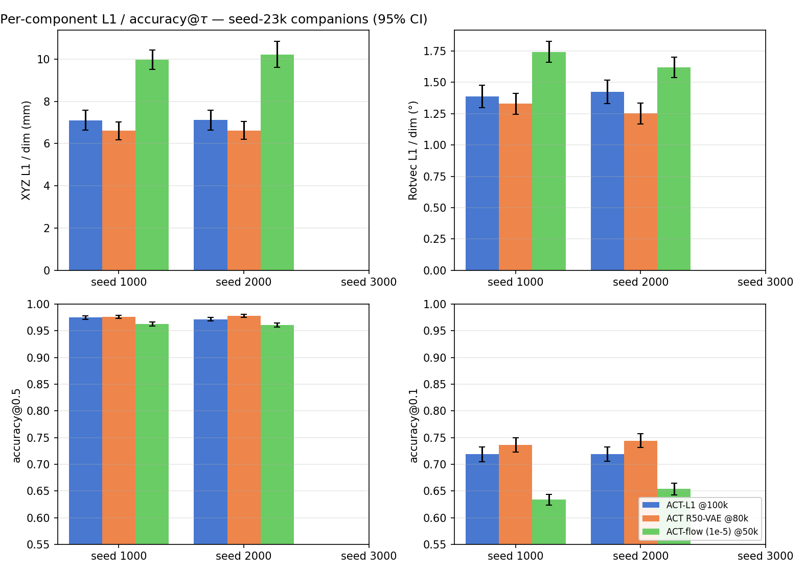

*Fig. 9.2.6-1: Seed-23k salvage companions on the v2 metrics — variant rank order replicates across training seeds at matched partial budgets.*

Read-outs, restricted to matched-step comparisons (budgets differ across the
set, so these rows are not comparable with the seed-1000 100k tables except
where noted):

1. **Variant rank order replicates across training seeds.** In both seeds,
   R50-VAE (ImageNet-V2) < ACT-L1 < ACT-flow on every one of the seven columns. The Q1
   capacity conclusion and the Q2 matched-flow deficit are not seed-1000
   artifacts. ACT-L1 at 100k lands at 23.7–24.3 mm across three seeds
   (seed-1000: 23.69 mm) — cross-seed SD ≈ 0.35 mm against between-variant
   gaps of 8–9 mm.
2. **The dropped multi-seed confirmation would not have changed any
   conclusion.** Training-seed spread (≤0.6 mm L1, ≤0.6 mm flow, ≤0.11 mm R50
   within pairs) is an order of magnitude smaller than every paired variant gap
   the report rests on — retroactively validating the compute-efficiency
   decision and the use of episode-bootstrap intervals.
3. **R50-VAE (ImageNet-V2) at only 80k (22.1–22.2 mm) already matches the best seed-1000
   100k ACT endpoints** (R50-VAE (ImageNet-V1) 22.33 mm, ACT-L1 23.69 mm) — consistent with
   the §9.1.2 capacity attribution, though this is a cross-budget observation.
4. **ACT-flow at 50k sits at 31.4–32.0 mm in both seeds** versus ≈29.6 mm
   derived for seed-1000 at 50k (from the §9.2.1 paired 12.26% endpoint
   improvement to 25.995 mm at 100k): seed-1000 was the favorable draw, and the
   flow-vs-L1 deficit is, if anything, larger in the recovered seeds.
5. **The new metrics reorder nothing**: L1 and per-dim MSE rank the six runs
   identically on both translation and rotation. The MSE:L1 ratio separates the
   families (flow 24–27 vs L1 ≈ 20 vs R50 ≈ 18.4 µm/mm), i.e. flow's errors
   have a heavier tail, consistent with its measured roughness (§9.2).
6. **Acc@ε sharpens the same picture**: at ε=0.5 (motion intent) all
   six runs cluster within 1.7 pp (0.961–0.978) — every variant captures the
   coarse motion — while at ε=0.1 (movement precision) the families separate by
   up to 11 pp (flow 0.634–0.654 vs ACT-L1 0.719 vs R50-VAE (ImageNet-V2) 0.736–0.744).
   Precision, not motion intent, is where the objectives differ — mirroring
   Dyna-2's interpretation of the two thresholds for transfer vs in-domain
   scaling trends.

Driver: `reeval_seed23k_v2metrics.sh` (idempotent, husk-guarded, VRAM-gated at
≥4 GiB free so it ran concurrently with the in-flight h30 chain); per-eval logs
under `reeval_v2metrics/logs/`. Copies of the same ten reports from before
Acc@ε was added are preserved under
`reeval_v2metrics/eval_common_h32_pre_tau/`. The compact
CSV evidence for this section and §9.2.7, plus both figures, are regenerable
via the collector's dedicated v2 pass (`collect_results.py --v2_eval_roots`)
and `plot_v2metrics.py` (§11): the shadow tree needs its own pass because its
runs violate two assumptions of the strict matrix collector by design —
early-stopped companions evaluated below their directory budget (80k/50k
checkpoints under `100000steps` names) and the historical run's
pre-convention naming.

### 9.2.7 Historical production ACT: 30-point budget curve on the v2 metrics

A follow-up question — why Acc@ε covered only three ACT variants — led to
a fresh weights-level audit on 2026-08-17 that re-confirmed the §9.2.6 husk
inventory (27 of 33 `train/` directories empty; exactly six real runs, all
already scored) but found that the **original production run**
`outputs/train/act_umi_identity_rot6d_1459` — the 3M-step R18-VAE model whose
audit motivated this investigation (§3) — is fully intact on the repository
disk, outside the failed artifact mount: all thirty 100k-spaced checkpoints
retain real weights. Every checkpoint from 100k to 3M was therefore evaluated
with the full v2 metric set under the identical fixed 100-episode / 500-query
protocol (driver `eval_historical_act_curve.sh`, launched as a VRAM-gated
backfill alongside the in-flight h30 chain; outputs
`reeval_v2metrics/eval_common_h32/act_umi_identity_rot6d_1459_<step>steps/seed1000/`).
This is the only ACT-family budget curve on the new metrics and the only
surviving model trained past 100k; at 3M steps × batch 8 it has seen 24M
samples (≈171 epochs of the 140,522-frame train set).

| Steps | XYZ end (mm) | Rot end (°) | XYZ L1/dim (mm) | Acc@0.5 | Acc@0.1 |
| ---: | ---: | ---: | ---: | ---: | ---: |
| 100k | 25.57 [23.64, 27.56] | 5.019 | 8.47 | 0.969 | 0.681 [0.667, 0.695] |
| 200k | 24.35 [22.60, 26.19] | 4.977 | 8.06 | 0.972 | 0.693 [0.679, 0.707] |
| 400k | 23.89 [22.19, 25.64] | 4.854 | 7.95 | 0.972 | 0.697 [0.682, 0.712] |
| 600k | 23.87 [22.07, 25.73] | 4.810 | 7.93 | 0.973 | 0.699 [0.685, 0.713] |
| 800k | 23.83 [21.99, 25.70] | 4.761 | 7.82 | 0.973 | 0.705 [0.691, 0.720] |
| 1M | 23.31 [21.53, 25.13] | 4.711 | 7.72 | 0.973 | 0.707 [0.693, 0.722] |
| 1.5M | 23.44 [21.69, 25.24] | 4.579 | 7.68 | 0.974 | 0.713 [0.698, 0.727] |
| 2M | 23.42 [21.62, 25.27] | 4.498 | 7.66 | 0.973 | 0.716 [0.701, 0.731] |
| 2.5M | 23.40 [21.52, 25.30] | 4.511 | 7.71 | 0.974 | 0.715 [0.700, 0.729] |
| 3M | 23.31 [21.45, 25.20] | 4.498 | 7.66 | 0.974 | 0.715 [0.700, 0.731] |

(The table shows ten milestones; Fig. 9.2.7-1 plots all thirty points.
Rotvec L1/dim declines 1.469 → 1.320° over the same range; XYZ MSE/dim
189 → 160 µm².)


*Fig. 9.2.7-1: Historical production ACT 30-point budget curve on the v2 metrics — all thirty milestones plotted; the §9.2.7 table shows ten.*

Read-outs:

1. **Acc@0.5 is budget-blind; Acc@0.1 is the budget-sensitive metric.** Across
   a 30× step range Acc@0.5 moves only 0.969 → 0.975 — less than its own
   interval half-width — while Acc@0.1 rises 0.681 → 0.718 with the 100k and
   ≥1.4M intervals fully disjoint. This is a local, within-recipe confirmation
   of the Dyna-2 threshold interpretation (§2): ε=0.5 saturates at the
   motion-intent level, while ε=0.1 resolves in-domain precision trends.
2. **Precision gains are front-loaded and bounded.** Roughly half of the total
   +3.4pp Acc@0.1 gain arrives by 400k; from 1M on the curve is flat within
   its intervals (0.707–0.718). XYZ endpoint error plateaus at 23.3–23.9 mm
   from 400k — the 100k-vs-3M endpoint intervals even overlap slightly,
   whereas Acc@0.1 separates them cleanly, making Acc@0.1 the more
   sensitive early budget indicator in this family.
3. **Late training trades smoothness for marginal precision.** Within-chunk
   rotation 2nd-diff improves to a 0.7M minimum of 0.037° and then degrades ~45%
   to 0.054° at 3M, replicating the §3 pre-existing audit (best ≈0.036° around
   700k) and reinforcing its warning against training ACT far past the
   endpoint plateau.
4. **Protocol cross-validation.** The new fixed-protocol numbers agree with
   the §3 audit within 0.3–0.6 mm (25.57 vs 25.1 mm at 100k; 23.2 vs 22.9 mm
   at 2.3M), tying the v2-metric series to the historical record.
5. **Capacity beats a 30× budget on precision.** At 100k the historical
   R18-VAE scores Acc@0.1 = 0.681, and even at 3M it never exceeds 0.718 —
   below the R50-VAE (ImageNet-V2) seed-2000/3000 companions at only 80k (0.736–0.744) and
   the ACT-L1 companions at 100k (0.719). A backbone/objective change at
   ≤1× the common budget outperforms a 30× budget range of the original
   recipe — the sharpest single line of evidence that the §9.1 capacity and
   objective results dominate longer training on this task.

### 9.2.8 ACT R50-VAE (ImageNet-V1) long-budget run (1M steps) — complete

That capacity-vs-budget conclusion is cross-budget (R50 companions at 80k vs
an R18 curve). The direct question — does R50 capacity keep compounding with
budget, or does it hit the same ~23 mm / flat-Acc@0.1 plateau the R18 curve
shows from 400k? — needs an R50 budget curve, and every seed-1000 R50
checkpoint was stranded by the disk failures (§9.2.6). A fresh
**`act_r50_v1_vae` seed-1000 run at 1M steps** was therefore launched on the
host on 2026-08-17 17:46 (`run_one.sh act_r50_v1_vae 1000000 1000`,
`UMI_SAVE_FREQ=50000`, 12.9–13.0 steps/s, ETA ≈ 21.5 h; checkpoints every 50k
under `train/act_r50_v1_vae_seed1000_1000000steps/`, log
`logs/act_r50_v1_vae_seed1000_1000000steps.log`). V1 initialization per
§9.1.2: the best-performing ACT at the common 100k budget and the strict
initialization control; the objective/optimizer match the historical R18
production run, so the two budget curves are directly comparable.

**Analysis plan (preregistered).** When training completes, evaluate the
100k-spaced checkpoints (100k–1M) on the fixed 100-episode / 500-query
protocol with the full v2 metric set, mirroring §9.2.7 exactly (driver
patterned on `eval_historical_act_curve.sh`; outputs under
`reeval_v2metrics/eval_common_h32/` in collector-compatible run names).
Comparisons: (a) R50-vs-R18 budget curves on Acc@0.1 and XYZ endpoint — does
the capacity gap persist, shrink, or invert as budget grows; (b) the 100k
point against the stranded seed-1000 R50-VAE (ImageNet-V1) 100k evaluation (22.33 mm / 4.58°,
§9.1.2) as a fresh-run replication check; (c) rot-2nd-diff — whether R50 shows the
same late-training smoothness degradation that penalizes the R18 curve from
700k.

**Status (2026-08-18): complete.** Training finished at 16:16 (22h30m,
13.06 steps/s; final validation loss 0.030712 / L1 0.030696 — the terminal
point is also the run's best, unlike several stochastic runs in this report).
All ten 100k-spaced checkpoints were evaluated at native horizon 30 with the
full v2 metric set under the identical 500-query protocol
(`eval_r50v1_1m_curve.sh`; outputs under `eval_common_h32/
act_r50_v1_vae_1m_seed1000_<step>steps/`, deliberately outside the unified
t+10 tree). Milestones:

| Steps | XYZ end (mm) | Rot end (°) | XYZ L1/dim (mm) | Acc@0.5 | Acc@0.1 | Rot 2nd-diff (°) |
| ---: | ---: | ---: | ---: | ---: | ---: | ---: |
| 100k | 23.24 [21.5, 25.1] | 4.581 | 6.80 | 0.972 | 0.735 [0.722, 0.749] | 0.057 |
| 200k | 22.14 [20.6, 23.7] | 4.445 | 6.84 | 0.972 | 0.738 | 0.043 |
| 300k | 22.28 [20.6, 24.0] | 4.375 | 6.86 | 0.973 | 0.744 | 0.035 |
| 400k | 21.69 [20.0, 23.4] | 4.382 | 6.83 | 0.973 | 0.740 | 0.034 |
| 500k | 21.41 [19.7, 23.1] | 4.376 | 6.89 | 0.973 | 0.739 | 0.031 |
| 600k | 21.22 [19.6, 22.9] | 4.159 | 6.83 | 0.974 | 0.743 | **0.028** |
| 700k | 21.74 [20.1, 23.4] | 4.324 | 6.99 | 0.973 | 0.739 | 0.030 |
| 800k | 22.00 [20.3, 23.7] | 4.293 | 7.03 | 0.973 | 0.739 | 0.031 |
| 900k | 21.51 [19.9, 23.2] | 4.224 | 6.95 | 0.973 | 0.743 | 0.032 |
| 1M | **21.32** [19.7, 22.9] | **4.159** | 6.88 | 0.974 | 0.742 [0.727, 0.757] | 0.032 |

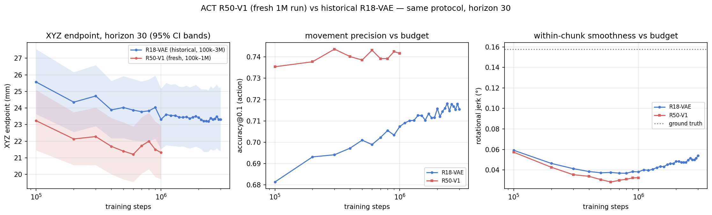

*Fig. 9.2.8-1: ACT R50-VAE (ImageNet-V1) vs historical R18 budget curves — R50@100k already matches the R18@3M plateau and stays ~2 mm ahead through 1M.*

Read-outs, following the preregistered decomposition:

1. **(a) The capacity gap persists at every budget — and R50@100k already
   matches R18@3M.** On XYZ endpoint the fresh R50-VAE (ImageNet-V1) at its *first*
   checkpoint (23.24 mm) is already at the historical R18's 3M plateau
   (23.31 mm), and by 600k–1M it reaches 21.2–21.5 mm — about 2 mm below the
   R18 plateau with CIs only marginally touching (R50@1M [19.7, 22.9] vs
   R18@3M [21.45, 25.20]). On Acc@0.1 the separation is cleaner: R50@1M
   0.742 [0.727, 0.757] vs R18@3M 0.715 [0.700, 0.731] — effectively
   disjoint. The §9.2.6 cross-budget observation (R50-VAE (ImageNet-V2) companions at 80k
   matching R18@3M) is now confirmed by a same-seed, same-protocol budget
   curve: **capacity buys a persistent lead that a 30× budget range cannot
   close**, and the gap neither shrinks meaningfully nor inverts.
2. **(b) The fresh 100k point replicates the stranded §9.1.2 evaluation.**
   Fresh R50-VAE (ImageNet-V1) @100k: 23.24 mm [21.5, 25.1] / 4.581° endpoint rotation vs the
   stranded seed-1000 R50-VAE (ImageNet-V1) @100k: 22.33 mm / 4.584° — the rotation endpoint
   matches to 0.003° and the 0.9 mm endpoint-XYZ difference is well inside
   the episode CI. Two independent training runs of the same config (the
   stranded one predates the disk failure, this one post-dates it) agree;
   the §9.1.2 numbers stand as representative.
3. **(c) R50 does not replicate the R18's late smoothness penalty.** R18's
   rot-2nd-diff bottoms at 0.037° @700k and degrades ~45% to 0.054° @3M; R50
   improves monotonically to 0.028° @600k and drifts only mildly to 0.032°
   @1M (+14%), with XYZ 2nd-diff improving monotonically throughout
   (0.445 → 0.210 mm). The §9.2.7 warning against training ACT far past its
   endpoint plateau is recipe-dependent: at 1M the R50 run is still its
   smoothest self, and both jerks sit near/below ground truth (GT rot 2nd-diff
   ≈ 0.158° at this horizon's queries; GT-matching smoothness also holds at
   t+10, §9.2.9).
4. **Budget behavior flips with scoring horizon.** At t+30 the R50 endpoint
   improves with budget (23.24 → 21.32 mm, best @1M), while at t+10 the same
   checkpoints *degrade* from the 100k optimum (9.20 → 10.61 mm, worst @1M;
   §9.2.9). The additional 600k–900k steps buy far-horizon (late-chunk)
   accuracy at the cost of near-horizon precision — a genuine
   horizon-dependent overfitting signature, not a protocol artifact (same
   checkpoints, same queries, horizon is the only difference). Practically:
   pick the checkpoint at the horizon you will execute; for this task the
   executed chunk is 30 steps, and the final 1M checkpoint is the right
   deployment choice on both accuracy (best t+30 endpoint) and smoothness.
5. **Acc@0.1 remains the budget-sensitive metric here too** (0.735 → 0.744,
   noisy but flat after 200k; Acc@0.5 flat at 0.972–0.974) — but note the
   R50 curve's precision saturates at ~0.74 where the R18's saturates at
   ~0.71: the ceiling itself is recipe-limited, echoing §9.2.7 read-out 5.

### 9.2.9 Unified horizon-10 re-evaluation of every surviving model

The metric set grew during the investigation — per-component L1 / per-dim MSE
were added on 2026-08-16 and Acc@ε on 2026-08-17 — so different tables
carry different columns, several rows predate the additions, and a few re-scores
ran with policy-derived query windows (`[-1,29]`) or the openpi evaluator's own
window instead of the canonical explicit bounds. On top of that, §9.2.4/§9.2.5
established that cross-horizon endpoint numbers are invalid (a 2.2× artifact).
This section therefore re-scores **every model with surviving weights under one
protocol and the full metric set**, with **endpoint pose, L1/MSE, and
Acc@0.5/0.1 treated as co-primary metrics**. Scoring horizon is fixed at
**t+10** — the deepest horizon every surviving model supports (the official
openpi h10 arms predict 10 steps) — so no model is excluded on horizon grounds
and no cross-horizon comparison ever arises. No model is retrained.

**Protocol (fixed for every row).** The canonical 500-query set: 100
validation episodes × 5 evenly spaced query frames per episode, selected by
endpoint-inclusive linspace over the frames where the action-offset bounds
`[-1, 31]` fit (verified to reproduce the recorded frame set of every prior
canonical evaluation exactly; the immutable frame list is tracked at
`repro/query_frames_h10_seed1000.json`, sha256
`6dcb2888fe4f88e7…`). The validation dataset runs at **30 fps** (dt = 1/30 s;
frame timestamps confirmed at 0.0333 s spacing), so the scored t+10 window
spans **0.33 s** of physical time and the full 30-step chunk **1.0 s** —
horizons are ~3× shorter in wall time than a 10 Hz assumption would suggest,
which matters for any physical interpretation of smoothness or horizon.
Prediction and ground truth are both truncated
to the first 10 steps of the chunk before scoring, so *endpoint* means t+10
for every model — h10-native models (openpi arms) score their native last
step, h30-trained models score their first-10-step truncation, all on
identical frames. Deterministic models (ACT family) use inference seed 1000;
stochastic samplers (ACT-flow, π0.5 port, SmolVLA) use inference seeds
1000/2000/3000 averaged within each episode before episodes are averaged;
official openpi serving is inference-seed-invariant (spread 0.002 mm) and runs
once. Open-loop: each query is scored independently from the ground-truth
observation; predictions are decoded to absolute 7D poses through each
checkpoint's saved postprocessor before any metric is computed. Intervals are
95% nonparametric episode bootstrap (10,000 resamples, seed 0). The openpi
evaluator was extended with the canonical query-window flag
(`--query_min/max_action_offset`) so its frames are identical to the LeRobot
evaluator's; both evaluators now record the bounds and `eval_horizon` in every
JSON.

**Metric definitions** (all computed on the truncated H=10 chunks of absolute
decoded poses; `p` = xyz, `R` = orientation, `g` = gripper; `ĥ_t` = prediction
at chunk step t):

- **XYZ endpoint error (mm)** — `‖p̂_{t+10} − p_{t+10}‖₂`, the Euclidean
  distance between predicted and ground-truth end-effector position at the
  last scored step. The deployment-relevant "how far off is the pose I am
  heading to" number.
- **Rotation endpoint error (deg)** — geodesic angle
  `arccos((tr(R̂ᵀ_{t+10} R_{t+10}) − 1)/2)` of the relative rotation at the
  last scored step.
- **Chunk-mean XYZ / rotation (mm / deg)** — mean over the 10 scored steps of
  the per-step position norm / per-step geodesic rotation angle. Average
  tracking quality through the executed window, not just its end.
- **Per-component L1 per dim (mm / deg)** — mean absolute error per
  dimension, averaged over steps × dims: xyz over {x,y,z}; rotation over the
  **raw axis-angle components** (no geodesic correction — this is the
  action-space sense the training objectives regress). Directly comparable to
  an L1 training loss in physical units.
- **Per-dim MSE (µm² / deg²)** — mean squared error per dimension over steps
  × dims, same component split. Weight errors quadratically, exposing
  heavy-tailed behavior that L1 hides (§9.2.6 read-out 5).
- **Per-coordinate normalized within-threshold rate, Acc@ε, evaluated at
  ε = 0.1 and 0.5** — Dyna-2-style thresholded accuracy using OpenPI-style
  q01/q99 normalization: the fraction of (step, dim) entries whose absolute
  per-dim error is ≤ ε in *normalized action units*, where each dim is
  normalized by the protocol-fixed half-range `s_d = (q99 − q01)/2` pooled
  over **this evaluation's own GT chunks** (q01 → −1, q99 → +1). ε=0.5 is the
  motion-intent level, ε=0.1 the movement-precision level (§2). Because the
  query set, horizon, and GT are identical for every row of this section, the
  pooled scales — and therefore Acc@ε — are strictly comparable across all
  models regardless of their training normalization (MIN_MAX vs quantile).
  Views: `action` (all 7 dims), `xyz` (dims 0–2), `rotvec` (dims 3–5).
- **Within-chunk rotational 2nd-diff (deg)** — mean geodesic angle of the second
  difference of orientation across consecutive step pairs (curvature of the
  predicted rotation); **XYZ 2nd-diff (mm)** — mean norm of the second difference
  of positions. Ground-truth 2nd-diff is reported alongside as the reference.
  *Naming correction (2026-08-23):* this metric was labeled "jerk" throughout
  the earlier report and in the JSON keys (`rot_jerk_deg`, `xyz_jerk_m`,
  unchanged for compiler compatibility). It is a **discrete second difference**
  — an unnormalized curvature/acceleration proxy with units deg/step² and
  mm/step², **not** a physical jerk (third derivative) and not divided by
  dt². At the dataset's 30 fps, ×900 converts approximately to deg/s² and
  mm/s². Because every row (and the GT reference) uses the identical formula
  at the identical frame spacing, all cross-model comparisons and
  closest-to-GT statements stand unchanged. True physical-unit
  velocity/acceleration/jerk (third difference at dt = 1/30 s) were added on
  2026-08-23 and are reported in §9.2.13.
- **Gripper endpoint** — `|ĝ_{t+10} − g_{t+10}|`.
- Latency / peak CUDA memory remain recorded as secondary cost columns.

**Inclusion inventory.** Every surviving checkpoint family is included:
historical production ACT (30 checkpoints, 100k–3M), the six seed-23k
companions (ACT-L1 @100k, R50-VAE (ImageNet-V2) @80k, ACT-flow @50k ×2 seeds each), the
fresh ACT R50-VAE (ImageNet-V1) 1M curve (§9.2.8, 100k-spaced), the π0.5 port (650K/700K/1M),
Arm B (port h30-trained under the openpi recipe @20k, adopted from its
conforming t+10 JSONs), SmolVLA both rotation notations @100k, the three
official openpi arms (rot6d/rotvec h10, rot6d h30 scored at t+10), and the
openpi rot6d 1M-budget run's kept 100k checkpoint (§9.2.12). Excluded,
and why: the entire seed-1000 ACT/flow/DP matrix including both
`umi_official` ports — weights stranded by the artifact-disk failures (§8
incident 12; §9.2.6 safetensors audit); the 30k screen variants of surviving
families — superseded by their 100k+ checkpoints. Outputs live under
`reeval_v2metrics/eval_unified_h10/` (host) and are collected by the v2 pass
plus a cross-schema compiler; drivers: `eval_unified_h10_sweep.sh` (host),
`kiwi_eval_unified_h10.sh` (kiwi, K-phase).

**Status: all 92 rows complete (2026-08-23) — the π0.5-port 1M final landed
with K1** (9.00 [8.43, 9.58] mm, flat vs 700K — no overfitting through the
full schedule)**, the SmolVLA rot6d 1M full-width curve (§9.2.10) joined
2026-08-19, the kiwi masked-subspace 1M curve (10 rows, §9.2.10
Option B) joined 2026-08-20, and the openpi rot6d 1M-run's kept 100k
checkpoint joined 2026-08-23 (§9.2.12).** The SmolVLA rows were front-run on
2026-08-18: the two kiwi-trained checkpoints were copied (weights only) to
the host artifact tree and evaluated on the then-idle host GPU with
identical flags (`eval_smolvla_unified_h10_host.sh`) rather than waiting
for the kiwi trainer to free that machine. The π0.5-port **budget curve**
(all 50k-spaced intermediates 50k–900k, three inference seeds each) was
front-run the same way on 2026-08-18/19 by `eval_pi05_curve_h10_host.sh`:
weights-only copies from the still-training kiwi run (no GPU impact there),
evaluated on the host under the canonical flags; the 650K/700K re-scores
here supersede their §9.2.4 t+10 evals, which predate the canonical query
window. The host sweep evaluated the full inventory as a
VRAM-gated backfill alongside the R50 trainer (the final two rows — R50-VAE (ImageNet-V1)
900k/1M — landed when training exited at 16:16); every report passed the
protocol assertions programmatically — canonical bounds `[-1,31]`, horizon 10,
500 queries / 100 episodes, identical Acc@ε normalization scales across
every row (LeRobot and openpi evaluators agree to 5 decimals), and identical
ground-truth 2nd-diff (0.152° / 0.70 mm) in every row. Compilation:
`compile_unified_h10.py` (cross-schema merge of the two evaluators' reports
with the assertions above; LeRobot rows re-derived per-episode →
inference-seed-averaged → bootstrapped, openpi rows taken from the
evaluator's own episode-balanced summary) →
`results/unified_h10_run_summary.csv`; figures via `plot_unified_h10.py`
(the budget and jitter-budget panels now carry the π0.5-port curve as a
third line).
Complete results — every run of the sweep is tabulated below (no
figure-only results: the metrics figure shows a one-per-family subset of
exactly these rows, and every point of the budget figure is one of these
rows). Run names are the artifact-tree names under
`reeval_v2metrics/eval_unified_h10/` (`_seed<k>` = training seed, step =
evaluated checkpoint). CIs are 95% episode bootstrap; the MSE columns are
per-dimension (µm² / deg²):

| Run | step | XYZ end (mm) | Rot end (deg) | XYZ L1/dim (mm) | XYZ MSE/dim (µm²) | Rotvec L1/dim (deg) | Rotvec MSE/dim (deg²) | Acc@0.5 | Acc@0.1 | Rot 2nd-diff (deg) |
| --- | ---: | ---: | ---: | ---: | ---: | ---: | ---: | ---: | ---: | ---: |
| act_r18_flow_u_lr1e5_seed2000_100000steps | 50000 | 15.00 [14.41, 15.63] | 2.53 [2.42, 2.64] | 4.55 | 43.5 | 0.830 | 1.29 | 0.992 | 0.840 [0.833, 0.846] | 0.744 |
| act_r18_flow_u_lr1e5_seed3000_100000steps | 50000 | 15.63 [14.78, 16.50] | 2.30 [2.20, 2.41] | 4.72 | 53.2 | 0.805 | 1.19 | 0.991 | 0.843 [0.836, 0.850] | 0.763 |
| act_r18_l1_seed2000_100000steps | 100000 | 9.59 [9.03, 10.16] | 1.87 [1.76, 1.99] | 2.44 | 15.7 | 0.518 | 0.65 | 0.994 | 0.920 [0.914, 0.925] | 0.036 |
| act_r18_l1_seed3000_100000steps | 100000 | 9.88 [9.32, 10.48] | 1.94 [1.83, 2.06] | 2.57 | 16.6 | 0.535 | 0.68 | 0.993 | 0.916 [0.909, 0.922] | 0.044 |
| act_r50_v1_vae_seed1000_0100000steps | 100000 | 9.20 [8.67, 9.72] | 1.78 [1.67, 1.88] | 2.35 | 14.1 | 0.508 | 0.60 | 0.993 | 0.921 [0.915, 0.927] | 0.043 |
| act_r50_v1_vae_seed1000_0200000steps | 200000 | 9.47 [8.91, 10.05] | 1.78 [1.66, 1.89] | 2.69 | 16.2 | 0.503 | 0.57 | 0.993 | 0.920 [0.913, 0.926] | 0.030 |
| act_r50_v1_vae_seed1000_0300000steps | 300000 | 9.81 [9.21, 10.44] | 1.77 [1.65, 1.89] | 2.43 | 16.8 | 0.493 | 0.59 | 0.994 | 0.919 [0.913, 0.926] | 0.028 |
| act_r50_v1_vae_seed1000_0400000steps | 400000 | 10.03 [9.41, 10.66] | 1.82 [1.70, 1.95] | 2.53 | 17.7 | 0.502 | 0.62 | 0.993 | 0.917 [0.911, 0.924] | 0.028 |
| act_r50_v1_vae_seed1000_0500000steps | 500000 | 10.25 [9.62, 10.88] | 1.82 [1.70, 1.94] | 2.56 | 18.8 | 0.502 | 0.62 | 0.992 | 0.913 [0.907, 0.920] | 0.027 |
| act_r50_v1_vae_seed1000_0600000steps | 600000 | 10.34 [9.76, 10.95] | 1.78 [1.66, 1.90] | 2.53 | 18.4 | 0.492 | 0.60 | 0.993 | 0.914 [0.908, 0.921] | 0.027 |
| act_r50_v1_vae_seed1000_0700000steps | 700000 | 10.59 [9.97, 11.24] | 1.80 [1.67, 1.92] | 2.61 | 19.9 | 0.502 | 0.62 | 0.993 | 0.913 [0.906, 0.919] | 0.029 |
| act_r50_v1_vae_seed1000_0800000steps | 800000 | 10.58 [9.95, 11.21] | 1.81 [1.69, 1.94] | 2.63 | 19.7 | 0.502 | 0.63 | 0.994 | 0.913 [0.906, 0.919] | 0.032 |
| act_r50_v1_vae_seed1000_0900000steps | 900000 | 10.69 [10.04, 11.35] | 1.79 [1.67, 1.91] | 2.64 | 20.3 | 0.495 | 0.61 | 0.993 | 0.913 [0.907, 0.920] | 0.033 |
| act_r50_v1_vae_seed1000_1000000steps | 1000000 | 10.61 [9.98, 11.26] | 1.79 [1.68, 1.91] | 2.64 | 20.3 | 0.500 | 0.62 | 0.993 | 0.912 [0.905, 0.918] | 0.036 |
| act_r50_vae_seed2000_100000steps | 80000 | 9.15 [8.62, 9.68] | 1.84 [1.73, 1.94] | 2.35 | 13.5 | 0.537 | 0.61 | 0.994 | 0.926 [0.920, 0.932] | 0.049 |
| act_r50_vae_seed3000_100000steps | 80000 | 9.18 [8.66, 9.72] | 1.74 [1.65, 1.84] | 2.37 | 14.2 | 0.500 | 0.55 | 0.994 | 0.929 [0.924, 0.934] | 0.059 |
| act_umi_identity_rot6d_1459_0100000steps | 100000 | 13.10 [12.30, 13.92] | 2.02 [1.90, 2.14] | 3.53 | 32.3 | 0.560 | 0.73 | 0.991 | 0.880 [0.873, 0.888] | 0.043 |
| act_umi_identity_rot6d_1459_0200000steps | 200000 | 12.39 [11.64, 13.14] | 2.03 [1.91, 2.15] | 3.25 | 28.5 | 0.554 | 0.75 | 0.991 | 0.888 [0.880, 0.896] | 0.033 |
| act_umi_identity_rot6d_1459_0300000steps | 300000 | 12.28 [11.52, 13.04] | 2.01 [1.89, 2.14] | 3.22 | 27.8 | 0.552 | 0.73 | 0.993 | 0.895 [0.887, 0.902] | 0.032 |
| act_umi_identity_rot6d_1459_0400000steps | 400000 | 12.26 [11.50, 13.02] | 2.05 [1.93, 2.18] | 3.23 | 27.5 | 0.561 | 0.77 | 0.992 | 0.894 [0.886, 0.901] | 0.033 |
| act_umi_identity_rot6d_1459_0500000steps | 500000 | 12.15 [11.41, 12.91] | 1.99 [1.88, 2.12] | 3.09 | 26.8 | 0.543 | 0.73 | 0.992 | 0.899 [0.892, 0.906] | 0.032 |
| act_umi_identity_rot6d_1459_0600000steps | 600000 | 12.40 [11.68, 13.14] | 2.00 [1.88, 2.12] | 3.16 | 27.1 | 0.556 | 0.74 | 0.993 | 0.894 [0.887, 0.901] | 0.036 |
| act_umi_identity_rot6d_1459_0700000steps | 700000 | 12.25 [11.51, 13.01] | 2.00 [1.88, 2.12] | 3.22 | 28.0 | 0.545 | 0.74 | 0.992 | 0.895 [0.888, 0.902] | 0.036 |
| act_umi_identity_rot6d_1459_0800000steps | 800000 | 12.13 [11.38, 12.91] | 1.96 [1.84, 2.09] | 3.10 | 27.0 | 0.542 | 0.73 | 0.991 | 0.899 [0.892, 0.907] | 0.035 |
| act_umi_identity_rot6d_1459_0900000steps | 900000 | 12.25 [11.50, 13.01] | 1.97 [1.84, 2.09] | 3.14 | 27.4 | 0.539 | 0.72 | 0.992 | 0.897 [0.890, 0.904] | 0.037 |
| act_umi_identity_rot6d_1459_1000000steps | 1000000 | 12.11 [11.37, 12.86] | 1.96 [1.85, 2.09] | 3.14 | 27.1 | 0.540 | 0.72 | 0.992 | 0.897 [0.890, 0.905] | 0.039 |
| act_umi_identity_rot6d_1459_1100000steps | 1100000 | 12.10 [11.32, 12.90] | 1.95 [1.84, 2.07] | 3.10 | 27.3 | 0.535 | 0.70 | 0.992 | 0.900 [0.893, 0.907] | 0.042 |
| act_umi_identity_rot6d_1459_1200000steps | 1200000 | 12.08 [11.31, 12.87] | 1.94 [1.83, 2.06] | 3.09 | 27.7 | 0.542 | 0.72 | 0.992 | 0.901 [0.894, 0.908] | 0.042 |
| act_umi_identity_rot6d_1459_1300000steps | 1300000 | 12.11 [11.34, 12.90] | 1.93 [1.81, 2.04] | 3.12 | 28.0 | 0.535 | 0.70 | 0.992 | 0.901 [0.894, 0.908] | 0.043 |
| act_umi_identity_rot6d_1459_1400000steps | 1400000 | 12.16 [11.42, 12.91] | 1.94 [1.82, 2.05] | 3.13 | 27.4 | 0.537 | 0.70 | 0.993 | 0.902 [0.894, 0.909] | 0.047 |
| act_umi_identity_rot6d_1459_1500000steps | 1500000 | 12.03 [11.29, 12.78] | 1.90 [1.79, 2.02] | 3.10 | 27.2 | 0.528 | 0.69 | 0.993 | 0.903 [0.895, 0.910] | 0.045 |
| act_umi_identity_rot6d_1459_1600000steps | 1600000 | 12.18 [11.43, 12.95] | 1.93 [1.81, 2.05] | 3.14 | 27.8 | 0.539 | 0.71 | 0.992 | 0.900 [0.893, 0.907] | 0.049 |
| act_umi_identity_rot6d_1459_1700000steps | 1700000 | 12.08 [11.32, 12.85] | 1.92 [1.81, 2.04] | 3.14 | 27.9 | 0.535 | 0.70 | 0.993 | 0.900 [0.893, 0.907] | 0.051 |
| act_umi_identity_rot6d_1459_1800000steps | 1800000 | 12.12 [11.38, 12.87] | 1.93 [1.81, 2.04] | 3.12 | 27.4 | 0.534 | 0.70 | 0.992 | 0.900 [0.893, 0.907] | 0.051 |
| act_umi_identity_rot6d_1459_1900000steps | 1900000 | 12.13 [11.37, 12.90] | 1.91 [1.80, 2.03] | 3.15 | 28.1 | 0.533 | 0.69 | 0.993 | 0.899 [0.891, 0.906] | 0.052 |
| act_umi_identity_rot6d_1459_2000000steps | 2000000 | 11.98 [11.25, 12.72] | 1.88 [1.77, 2.00] | 3.10 | 27.2 | 0.528 | 0.68 | 0.992 | 0.902 [0.894, 0.908] | 0.053 |
| act_umi_identity_rot6d_1459_2100000steps | 2100000 | 12.12 [11.40, 12.85] | 1.92 [1.81, 2.04] | 3.15 | 27.5 | 0.537 | 0.71 | 0.993 | 0.899 [0.891, 0.905] | 0.055 |
| act_umi_identity_rot6d_1459_2200000steps | 2200000 | 11.96 [11.21, 12.72] | 1.90 [1.78, 2.02] | 3.10 | 27.2 | 0.532 | 0.70 | 0.993 | 0.901 [0.894, 0.908] | 0.056 |
| act_umi_identity_rot6d_1459_2300000steps | 2300000 | 11.98 [11.23, 12.74] | 1.90 [1.79, 2.01] | 3.11 | 27.3 | 0.537 | 0.68 | 0.993 | 0.903 [0.895, 0.910] | 0.054 |
| act_umi_identity_rot6d_1459_2400000steps | 2400000 | 12.06 [11.30, 12.83] | 1.87 [1.76, 1.99] | 3.14 | 27.7 | 0.531 | 0.68 | 0.993 | 0.901 [0.894, 0.909] | 0.055 |
| act_umi_identity_rot6d_1459_2500000steps | 2500000 | 12.08 [11.32, 12.84] | 1.91 [1.80, 2.02] | 3.20 | 28.5 | 0.539 | 0.69 | 0.993 | 0.900 [0.893, 0.907] | 0.057 |
| act_umi_identity_rot6d_1459_2600000steps | 2600000 | 11.95 [11.21, 12.71] | 1.90 [1.79, 2.02] | 3.12 | 27.5 | 0.537 | 0.69 | 0.993 | 0.903 [0.895, 0.910] | 0.060 |
| act_umi_identity_rot6d_1459_2700000steps | 2700000 | 11.98 [11.23, 12.73] | 1.88 [1.77, 2.00] | 3.13 | 27.4 | 0.527 | 0.67 | 0.993 | 0.905 [0.897, 0.911] | 0.058 |
| act_umi_identity_rot6d_1459_2800000steps | 2800000 | 12.05 [11.29, 12.81] | 1.89 [1.77, 2.00] | 3.16 | 28.1 | 0.529 | 0.68 | 0.993 | 0.899 [0.892, 0.907] | 0.059 |
| act_umi_identity_rot6d_1459_2900000steps | 2900000 | 11.94 [11.19, 12.70] | 1.88 [1.77, 2.00] | 3.12 | 27.2 | 0.528 | 0.67 | 0.993 | 0.902 [0.895, 0.909] | 0.061 |
| act_umi_identity_rot6d_1459_3000000steps | 3000000 | 11.99 [11.22, 12.76] | 1.90 [1.78, 2.02] | 3.15 | 27.9 | 0.536 | 0.69 | 0.993 | 0.901 [0.893, 0.908] | 0.063 |
| pi05_lora_sroi_rot6d_h30_seed1000_0020000steps | 20000 | 10.09 [9.54, 10.66] | 1.81 [1.71, 1.91] | 2.90 | 18.9 | 0.530 | 0.61 | 0.994 | 0.918 [0.912, 0.923] | 0.161 |
| pi05_lora_sroi_rot6d_seed1000_0020000steps | 20000 | 10.66 [10.05, 11.28] | 1.80 [1.70, 1.89] | 2.95 | 20.5 | 0.518 | 0.58 | 0.993 | 0.919 [0.913, 0.925] | 0.157 |
| pi05_lora_sroi_rotvec_seed1000_0020000steps | 20000 | 11.00 [10.31, 11.68] | 1.65 [1.56, 1.74] | 2.97 | 22.5 | 0.489 | 0.53 | 0.993 | 0.920 [0.914, 0.926] | 0.200 |
| pi05_openpi1m_seed1000_0100001steps | 100001 | 10.77 [10.22, 11.34] | 1.76 [1.67, 1.85] | 3.04 | 21.9 | 0.496 | 0.57 | 0.994 | 0.915 [0.909, 0.920] | 0.143 |
| pi05_port_openpi_recipe_seed1000_020000steps | 20000 | 9.57 [9.07, 10.08] | 1.81 [1.73, 1.89] | 2.42 | 15.3 | 0.482 | 0.54 | 0.993 | 0.920 [0.914, 0.925] | 0.086 |
| pi05_port_seed1000_0050000steps | 50000 | 9.61 [9.10, 10.13] | 1.82 [1.75, 1.89] | 2.43 | 15.3 | 0.500 | 0.56 | 0.992 | 0.920 [0.914, 0.924] | 0.117 |
| pi05_port_seed1000_0100000steps | 100000 | 9.12 [8.64, 9.61] | 1.73 [1.66, 1.81] | 2.30 | 13.8 | 0.465 | 0.50 | 0.994 | 0.926 [0.921, 0.931] | 0.183 |
| pi05_port_seed1000_0150000steps | 150000 | 9.20 [8.68, 9.72] | 1.66 [1.58, 1.74] | 2.29 | 14.1 | 0.449 | 0.46 | 0.992 | 0.928 [0.923, 0.933] | 0.153 |
| pi05_port_seed1000_0200000steps | 200000 | 8.89 [8.39, 9.41] | 1.64 [1.56, 1.72] | 2.23 | 13.3 | 0.434 | 0.46 | 0.992 | 0.929 [0.924, 0.934] | 0.084 |
| pi05_port_seed1000_0250000steps | 250000 | 8.87 [8.38, 9.38] | 1.69 [1.60, 1.77] | 2.19 | 13.3 | 0.447 | 0.48 | 0.993 | 0.930 [0.925, 0.935] | 0.086 |
| pi05_port_seed1000_0300000steps | 300000 | 8.95 [8.42, 9.48] | 1.61 [1.53, 1.70] | 2.21 | 13.7 | 0.430 | 0.45 | 0.992 | 0.930 [0.925, 0.935] | 0.139 |
| pi05_port_seed1000_0350000steps | 350000 | 8.94 [8.40, 9.48] | 1.64 [1.56, 1.71] | 2.20 | 13.3 | 0.430 | 0.44 | 0.993 | 0.931 [0.926, 0.936] | 0.099 |
| pi05_port_seed1000_0400000steps | 400000 | 8.82 [8.26, 9.38] | 1.63 [1.54, 1.72] | 2.19 | 13.0 | 0.434 | 0.45 | 0.992 | 0.931 [0.926, 0.936] | 0.082 |
| pi05_port_seed1000_0450000steps | 450000 | 9.04 [8.50, 9.59] | 1.65 [1.56, 1.73] | 2.23 | 13.4 | 0.429 | 0.46 | 0.993 | 0.931 [0.926, 0.936] | 0.084 |
| pi05_port_seed1000_0500000steps | 500000 | 8.90 [8.37, 9.44] | 1.66 [1.57, 1.75] | 2.19 | 13.3 | 0.437 | 0.47 | 0.992 | 0.931 [0.926, 0.936] | 0.089 |
| pi05_port_seed1000_0550000steps | 550000 | 8.84 [8.27, 9.40] | 1.61 [1.52, 1.69] | 2.18 | 13.4 | 0.424 | 0.44 | 0.992 | 0.931 [0.926, 0.936] | 0.076 |
| pi05_port_seed1000_0600000steps | 600000 | 8.94 [8.38, 9.52] | 1.64 [1.55, 1.73] | 2.20 | 13.7 | 0.434 | 0.46 | 0.992 | 0.930 [0.925, 0.935] | 0.090 |
| pi05_port_seed1000_0650000steps | 650000 | 9.07 [8.48, 9.66] | 1.63 [1.55, 1.72] | 2.23 | 14.2 | 0.430 | 0.45 | 0.992 | 0.930 [0.924, 0.935] | 0.076 |
| pi05_port_seed1000_0700000steps | 700000 | 9.03 [8.47, 9.59] | 1.63 [1.54, 1.72] | 2.22 | 13.9 | 0.432 | 0.46 | 0.992 | 0.930 [0.925, 0.935] | 0.073 |
| pi05_port_seed1000_0750000steps | 750000 | 9.02 [8.42, 9.62] | 1.65 [1.56, 1.73] | 2.23 | 14.0 | 0.435 | 0.46 | 0.992 | 0.930 [0.924, 0.935] | 0.077 |
| pi05_port_seed1000_0800000steps | 800000 | 9.00 [8.42, 9.59] | 1.64 [1.55, 1.73] | 2.22 | 14.1 | 0.433 | 0.46 | 0.992 | 0.930 [0.924, 0.935] | 0.078 |
| pi05_port_seed1000_0850000steps | 850000 | 8.89 [8.31, 9.48] | 1.65 [1.56, 1.74] | 2.20 | 13.8 | 0.434 | 0.47 | 0.992 | 0.929 [0.924, 0.935] | 0.073 |
| pi05_port_seed1000_0900000steps | 900000 | 9.00 [8.43, 9.57] | 1.65 [1.56, 1.75] | 2.22 | 14.0 | 0.437 | 0.47 | 0.991 | 0.930 [0.924, 0.935] | 0.085 |
| pi05_port_seed1000_1000000steps | 1000000 | 9.00 [8.43, 9.58] | 1.66 [1.57, 1.75] | 2.22 | 13.9 | 0.438 | 0.47 | 0.992 | 0.929 [0.923, 0.935] | 0.074 |
| smolvla_axis_angle_seed1000_100000steps | 100000 | 9.18 [8.71, 9.66] | 1.68 [1.61, 1.76] | 2.28 | 13.1 | 0.459 | 0.45 | 0.993 | 0.931 [0.927, 0.936] | 0.492 |
| smolvla_rot6d_seed1000_0100000steps | 100000 | 10.51 [9.95, 11.06] | 1.74 [1.66, 1.81] | 3.13 | 20.1 | 0.531 | 0.54 | 0.992 | 0.919 [0.914, 0.923] | 1.042 |
| smolvla_rot6d_seed1000_0200000steps | 200000 | 10.30 [9.79, 10.82] | 1.86 [1.78, 1.94] | 3.10 | 18.4 | 0.676 | 0.76 | 0.992 | 0.909 [0.904, 0.913] | 0.870 |
| smolvla_rot6d_seed1000_0300000steps | 300000 | 9.63 [9.17, 10.09] | 1.84 [1.77, 1.91] | 2.67 | 15.1 | 0.561 | 0.59 | 0.993 | 0.924 [0.920, 0.929] | 1.176 |
| smolvla_rot6d_seed1000_0400000steps | 400000 | 9.34 [8.86, 9.82] | 1.76 [1.68, 1.84] | 2.46 | 14.2 | 0.522 | 0.53 | 0.993 | 0.929 [0.924, 0.933] | 0.705 |
| smolvla_rot6d_seed1000_0500000steps | 500000 | 9.37 [8.86, 9.89] | 1.81 [1.74, 1.89] | 2.49 | 14.4 | 0.542 | 0.56 | 0.993 | 0.923 [0.918, 0.928] | 0.522 |
| smolvla_rot6d_seed1000_0600000steps | 600000 | 9.35 [8.83, 9.88] | 1.76 [1.69, 1.84] | 2.59 | 14.8 | 0.519 | 0.53 | 0.993 | 0.927 [0.922, 0.931] | 0.523 |
| smolvla_rot6d_seed1000_0700000steps | 700000 | 9.27 [8.78, 9.78] | 1.71 [1.63, 1.79] | 2.36 | 13.8 | 0.497 | 0.49 | 0.993 | 0.931 [0.927, 0.935] | 0.485 |
| smolvla_rot6d_seed1000_0800000steps | 800000 | 9.28 [8.75, 9.82] | 1.71 [1.63, 1.79] | 2.30 | 13.8 | 0.458 | 0.46 | 0.993 | 0.930 [0.926, 0.935] | 0.432 |
| smolvla_rot6d_seed1000_0900000steps | 900000 | 9.08 [8.57, 9.59] | 1.69 [1.62, 1.77] | 2.24 | 13.1 | 0.453 | 0.45 | 0.993 | 0.933 [0.928, 0.937] | 0.430 |
| smolvla_rot6d_seed1000_1000000steps | 1000000 | 9.06 [8.56, 9.56] | 1.68 [1.60, 1.76] | 2.22 | 13.0 | 0.450 | 0.45 | 0.993 | 0.933 [0.929, 0.937] | 0.428 |
| smolvla_rot6d_seed1000_100000steps | 100000 | 9.08 [8.62, 9.57] | 1.66 [1.59, 1.74] | 2.26 | 12.9 | 0.455 | 0.45 | 0.993 | 0.931 [0.927, 0.935] | 0.552 |

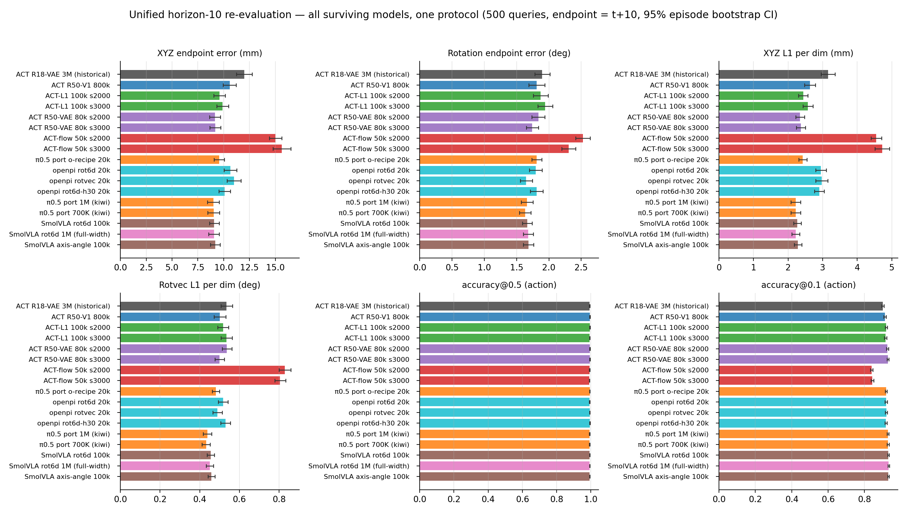

*Fig. 9.2.9-1: Unified horizon-10 metrics across all surviving models — one representative per family on the six co-primary metrics, 95% episode-bootstrap CIs.*


*Fig. 9.2.9-2: Unified horizon-10 budget curves — 30 historical R18 points, 10 fresh R50-VAE (ImageNet-V1) points, and the 18-point π0.5-port curve (fast to a 8.82–9.07 mm plateau ~200k, then flat through 900k); the §9.2.12 openpi 100k star sits at the tie-band top (10.77 mm, flat vs its 20k arm).*


*Fig. 9.2.9-3: Unified horizon-10 within-chunk 2nd-diff — every run of the sweep, log scale, dashed = ground truth (0.152° / 0.70 mm).*


*Fig. 9.2.9-4: Unified horizon-10 2nd-diff vs training steps — R18 degrades 0.043°→0.063° (100k→3M) while R50-VAE (ImageNet-V1) improves to 0.027–0.036°; ACT-flow sits 5–25× above every other family; the π0.5-port curve holds 0.073–0.09° (≈half of GT) from 200k onward.*

Host-side read-outs (kiwi rows will extend, not re-rank, these):

1. **Protocol integrity is machine-checked, not assumed.** Every admitted
   row carries bounds `[-1,31]`, horizon 10, 500 queries, and — because the
   query set, horizon, and GT are common — identical Acc@ε normalization
   scales and identical GT 2nd-diff. Cross-evaluator comparability (LeRobot
   PyTorch vs openpi JAX decoding paths) is asserted at compile time to 5
   decimals on the ε scales and 1e-6 on GT 2nd-diff.
2. **At matched horizon the ACT capacity/objective family ties the 3B
   flow-VLMs.** R50-VAE (ImageNet-V1) @100k (9.20 mm, Acc@0.1 0.921), the R50-VAE (ImageNet-V2)
   companions @80k (9.15–9.18 mm, 0.926–0.929), and ACT-L1 @100k
   (9.59–9.88 mm, 0.916–0.920) and SmolVLA @100k (9.08–9.18 mm, 0.931)
   all land inside or at the edge of the openpi/Arm-B interval band
   (9.57–11.00 mm, 0.918–0.920) — the §9.2.4/§9.2.5 tie now extends to
   both the ACT side and the 450M SmolVLA: what separates models at t+10 is
   capacity and objective recipe, not parameter count or stack. SmolVLA's
   Acc@0.1 point estimate (0.931) is nominally the table's best, but its
   interval overlaps the R50-VAE (ImageNet-V2) companions' (0.929) — tied, not ahead. The historical R18
   production model sits visibly above the pack (12.0–13.1 mm, 0.88–0.90)
   even at 30× budget.
3. **Near-horizon budget behavior differs by family — and the π0.5 port
   shows no overfitting at all.** The historical R18
   improves slowly and monotonically (13.10 → 11.99 mm, Acc@0.1
   0.880 → 0.901 over 100k→3M); the fresh R50-VAE (ImageNet-V1) *degrades* from its 100k
   point (9.20 → 10.61 mm, 0.921 → 0.912 by 1M; the loss saturates after
   ~500k and the 100k-vs-1M Acc@0.1 intervals are disjoint) — near-horizon
   overfitting — while its smoothness keeps improving (rot-2nd-diff
   0.043 → 0.033). The h30 companion evaluation (§9.2.8 read-out 4) answers
   the flip: on the same checkpoints, budget *improves* t+30 endpoint
   (23.24 → 21.32 mm) while degrading t+10 — the budget optimum is
   horizon-dependent. The 18-point π0.5-port curve adds the third regime:
   fast then **flat** — 9.61 mm @50k, 9.12 @100k, and a 8.82–9.07 mm
   plateau from 200k through 900k with every interval overlapping its
   neighbors; Acc@0.1 rises 0.920 → 0.931 by 350k and then stops. The port
   is fully converged on t+10 metrics by ~1/5 of its 1M schedule (matching
   §9.2.5's Arm-B sample-efficiency result), shows none of the ACT families'
   late-training drift, and the 2026-08-16 700K resume segment (650K→900K)
   is continuous with the pre-resume curve — the continuation did not
   perturb the operating point.
4. **The matched-ACT-flow deficit is horizon-independent.** ACT-flow
   @50k is worst on every co-primary metric at t+10 too (15.0–15.6 mm,
   Acc@0.1 0.840–0.843, MSE:L1 tail ratio 9.6–11.3 µm/mm vs ≈6 for the
   others), and its rot-2nd-diff (0.74–0.76°) is 5–25× rougher than every other
   family. SmolVLA is the second-roughest (0.49–0.55° ≈ 3.3× GT) — the only
   surviving families above ground-truth 2nd-diff are SmolVLA, the openpi arms
   (0.157–0.200°), and ACT-flow. The π0.5-port curve shows the opposite
   extreme: rot-2nd-diff sits at 0.073–0.09° (≈half of GT) from 200k onward —
   its smoothness is established early and budget-stable, like its accuracy.
   The Q2 conclusion (ACT-transformer denoiser/conditioning recipe,
   not flow matching itself) survives the horizon change unaltered.
5. **Acc@0.5 is saturated for every surviving model** (0.991–0.994, spread
   below the interval half-widths): motion-intent precision is solved
   across the board; only Acc@0.1 separates families — the Dyna-2 threshold
   interpretation
   finding of §9.2.7 generalized to every stack in the inventory.
6. **The rotation-notation tie holds under the canonical protocol in both
   stacks**: SmolVLA axis-angle vs rot6d tie on endpoint (9.18 vs 9.08 mm,
   overlapping intervals) and Acc@0.1 (0.931 both), with axis-angle again
   smoother in rotation (0.49° vs 0.55° — the §9.2.3 direction); openpi
   rotvec vs rot6d tie on Acc@0.1 (0.920 vs 0.919) and rotvec is even
   better on rotation endpoint (1.65° vs 1.80°, disjoint), while rot6d is
   better on XYZ endpoint — no notation lever in either stack.
7. **The SmolVLA 1M full-width curve (§9.2.10) reaches the top of the h10
   pack only at full budget.** At 100k it sits above every mature family
   (10.51 mm vs port 9.12, R50-VAE (ImageNet-V1) 9.20); by 1M it ties the port plateau
   (9.06 [8.56, 9.56] vs 9.00) and passes R50-VAE (ImageNet-V1)@1M (10.61), with Acc@0.1
   0.933 — the table's best point estimate — and rot-2nd-diff halved to 0.43°.
   SmolVLA needs ~7× the port's steps to reach the same t+10 operating
   point (sample-efficiency gap), and unlike the ACT families its t+10
   endpoint keeps improving through 1M with no overfitting.

### 9.2.10 SmolVLA rot6d at 1M budget — flow-matching padding-mode A/B

User-directed 2026-08-19: "after kiwi gpu free, launch a same 1M smolvla but
with mask valid training on kiwi. do add into report and evaluate as others
after finish." The §9.2.3 notation runs established SmolVLA's 100k-budget
operating point; this section gives the family a full 1M budget curve under
the identical recipe (fresh seed 1000, checkpoints every 100k, flow-matching
padding `openpi_full_width` — Option A) and pairs it with a masked-subspace
arm (Option B, `--policy.flow_matching_padding_mode=masked_subspace`,
trained on the kiwi RTX 5080 after the π0.5 exit) to test whether the
strawberry-dataset padding finding (Option A fixes the mixed-formulation
within-chunk jitter at 1M budget, `OPENPI_FULL_WIDTH_FLOW_MATCHING.md`)
holds for this task at matched budget. Both arms are evaluated exactly like
every other model: 10 checkpoints × 3 inference seeds × both protocols
(unified h10 §9.2.9 + native h30 §9.2.11), canonical 500-query window,
deterministic-free flow sampling at seeds 1000/2000/3000 averaged within
episode, 95% episode bootstrap.

**Status: both arms complete. Option A (host full-width) 2026-08-19 —
training 20:14:56 @1M, 60/60 evals, 0 failures. Option B (kiwi masked)
2026-08-20 — training 14:00:14 @1M (28h46m, final flow loss 0.0421 on real
dims with exactly 0.0000 on padded dims — the mask does what it claims),
60/60 evals, 0 failures. A/B verdict below: endpoint-tie at every budget;
masking buys only a small late-budget smoothness edge.**

Unified horizon-10 rows (§9.2.9 protocol):

| Run | step | XYZ end (mm) | Rot end (deg) | XYZ L1/dim (mm) | XYZ MSE/dim (µm²) | Rotvec L1/dim (deg) | Rotvec MSE/dim (deg²) | Acc@0.5 | Acc@0.1 | Rot 2nd-diff (deg) |
| --- | ---: | ---: | ---: | ---: | ---: | ---: | ---: | ---: | ---: | ---: |
| smolvla_rot6d_seed1000_0100000steps | 100000 | 10.51 [9.95, 11.06] | 1.74 [1.66, 1.81] | 3.13 | 20.1 | 0.531 | 0.54 | 0.992 | 0.919 [0.914, 0.923] | 1.042 |
| smolvla_rot6d_seed1000_0200000steps | 200000 | 10.30 [9.79, 10.82] | 1.86 [1.78, 1.94] | 3.10 | 18.4 | 0.676 | 0.76 | 0.992 | 0.909 [0.904, 0.913] | 0.870 |
| smolvla_rot6d_seed1000_0300000steps | 300000 | 9.63 [9.17, 10.09] | 1.84 [1.77, 1.91] | 2.67 | 15.1 | 0.561 | 0.59 | 0.993 | 0.924 [0.920, 0.929] | 1.176 |
| smolvla_rot6d_seed1000_0400000steps | 400000 | 9.34 [8.86, 9.82] | 1.76 [1.68, 1.84] | 2.46 | 14.2 | 0.522 | 0.53 | 0.993 | 0.929 [0.924, 0.933] | 0.705 |
| smolvla_rot6d_seed1000_0500000steps | 500000 | 9.37 [8.86, 9.89] | 1.81 [1.74, 1.89] | 2.49 | 14.4 | 0.542 | 0.56 | 0.993 | 0.923 [0.918, 0.928] | 0.522 |
| smolvla_rot6d_seed1000_0600000steps | 600000 | 9.35 [8.83, 9.88] | 1.76 [1.69, 1.84] | 2.59 | 14.8 | 0.519 | 0.53 | 0.993 | 0.927 [0.922, 0.931] | 0.523 |
| smolvla_rot6d_seed1000_0700000steps | 700000 | 9.27 [8.78, 9.78] | 1.71 [1.63, 1.79] | 2.36 | 13.8 | 0.497 | 0.49 | 0.993 | 0.931 [0.927, 0.935] | 0.485 |
| smolvla_rot6d_seed1000_0800000steps | 800000 | 9.28 [8.75, 9.82] | 1.71 [1.63, 1.79] | 2.30 | 13.8 | 0.458 | 0.46 | 0.993 | 0.930 [0.926, 0.935] | 0.432 |
| smolvla_rot6d_seed1000_0900000steps | 900000 | 9.08 [8.57, 9.59] | 1.69 [1.62, 1.77] | 2.24 | 13.1 | 0.453 | 0.45 | 0.993 | 0.933 [0.928, 0.937] | 0.430 |
| smolvla_rot6d_seed1000_1000000steps | 1000000 | 9.06 [8.56, 9.56] | 1.68 [1.60, 1.76] | 2.22 | 13.0 | 0.450 | 0.45 | 0.993 | 0.933 [0.929, 0.937] | 0.428 |

Native-h30 milestones (full 10-row table in §9.2.11):

| step | XYZ end h10 (mm) | XYZ end h30 (mm) | Acc@0.1 h10 | Acc@0.1 h30 | Rot 2nd-diff h10 (deg) | Rot 2nd-diff h30 (deg) |
| ---: | ---: | ---: | ---: | ---: | ---: | ---: |
| 100k (notation run §9.2.3) | 9.08 | 27.29 | 0.931 | 0.714 | 0.552 | 0.924 |
| 100k | 10.51 | 28.50 | 0.919 | 0.695 | 1.042 | 1.391 |
| 300k | 9.63 | 27.16 | 0.924 | 0.711 | 1.176 | 1.512 |
| 500k | 9.37 | 26.85 | 0.923 | 0.714 | 0.522 | 0.730 |
| 700k | 9.27 | 26.27 | 0.931 | 0.724 | 0.485 | 0.717 |
| 1M | 9.06 | 26.26 | 0.933 | 0.729 | 0.428 | 0.656 |

Read-outs (Option A):

1. **Replication check: fresh-100k does NOT match notation-100k at t+10.**
   10.51 [9.95, 11.06] vs 9.08 [8.62, 9.57] mm — disjoint intervals, ~1.4 mm
   apart (at t+30 the comparison only overlaps: 28.50 [26.90, 30.12] vs
   27.29 [25.72, 28.87]). The runs share recipe and seed but differ in
   *schedule position*: the notation run's LR cosine completed at its 100k
   final checkpoint, while the 1M run's 100k checkpoint is mid-cosine — the
   same short-schedule-vs-mid-long-schedule gap that separates the
   §9.2.6 companions from budget-curve points at equal steps. The §9.2.3
   notation numbers therefore remain the correct 100k-budget reference, and
   mid-curve checkpoints must not be read as budget-matched replicates.
2. **Budget improves BOTH horizons — no ACT-style flip.** t+10 10.51 →
   9.06 mm (plateau from ~700k) and t+30 28.50 → 26.26 mm (still creeping
   down at 1M); Acc@0.1 0.919 → 0.933 and 0.695 → 0.729. Contrast
   §9.2.8 read-out 4, where R50-VAE (ImageNet-V1)'s t+10 *degrades* with budget while t+30
   improves: the horizon trade is a property of the ACT-VAE family, not of
   training long per se — both flow families here (SmolVLA, π0.5 port)
   improve monotonically or stay flat at both horizons.
3. **At 1M SmolVLA ties the top of the h10 pack but stays the worst
   chunk-30 family.** 9.06 vs port 9.00 mm at t+10 (both ahead of
   R50-VAE (ImageNet-V1)@1M 10.61) versus 26.26 vs port 21.75 / R50-VAE (ImageNet-V1) 21.32 / ACT-L1
   23.31 mm at t+30: ten-fold budget closes the near-horizon gap entirely
   and the far-horizon gap only partly (~1.2 of ~4 mm vs ACT-L1). The
   family's far-horizon deficit is architectural/recipe-level, not a
   budget artifact.
4. **Training budget halves SmolVLA's jitter — the "SmolVLA is jittery"
   reputation is partly a budget artifact.** h10 rot-2nd-diff 1.04 → 0.43°
   (2.8× GT 0.152°) and h30 1.39 → 0.66° (4.2× GT 0.158°); the 100k
   notation reference (0.55°/0.92°) sits mid-way. Even at 1M the family
   remains the least smooth of the survivors and never approaches GT —
   budget mitigates but does not resolve the flow-expert jitter.
5. **The tail ratio is port-like** (MSE:L1 ≈ 5.9 µm/mm at 1M t+10 vs the
   port's ≈6.3): with adequate budget the flow objective's error tail
   behaves like the port's, not like matched-ACT-flow's (§9.2.9 read-out 4).

The budget figures (`figures/unified_h10_budget.png`,
`figures/unified_h30_budget.png`, `*_jitter_budget.png`) carry both
curves — full-width as the fourth line, masked as the fifth.

Option B (masked-subspace) unified horizon-10 rows (§9.2.9 protocol):

| Run | step | XYZ end (mm) | Rot end (deg) | XYZ L1/dim (mm) | XYZ MSE/dim (µm²) | Rotvec L1/dim (deg) | Rotvec MSE/dim (deg²) | Acc@0.5 | Acc@0.1 | Rot 2nd-diff (deg) |
| --- | ---: | ---: | ---: | ---: | ---: | ---: | ---: | ---: | ---: | ---: |
| smolvla_masked_seed1000_0100000steps | 100000 | 10.71 [10.15, 11.26] | 1.75 [1.67, 1.83] | 3.40 | 22.8 | 0.545 | 0.58 | 0.992 | 0.909 [0.903, 0.914] | 1.289 |
| smolvla_masked_seed1000_0200000steps | 200000 | 10.43 [9.94, 10.92] | 1.70 [1.62, 1.78] | 3.59 | 22.3 | 0.578 | 0.59 | 0.992 | 0.911 [0.906, 0.916] | 0.762 |
| smolvla_masked_seed1000_0300000steps | 300000 | 9.38 [8.91, 9.87] | 1.69 [1.60, 1.77] | 2.68 | 15.0 | 0.494 | 0.50 | 0.993 | 0.930 [0.925, 0.934] | 0.831 |
| smolvla_masked_seed1000_0400000steps | 400000 | 9.05 [8.55, 9.54] | 1.71 [1.63, 1.80] | 2.43 | 13.4 | 0.533 | 0.55 | 0.993 | 0.930 [0.925, 0.935] | 0.813 |
| smolvla_masked_seed1000_0500000steps | 500000 | 9.21 [8.72, 9.70] | 1.78 [1.70, 1.85] | 2.42 | 13.8 | 0.517 | 0.53 | 0.993 | 0.926 [0.921, 0.930] | 0.489 |
| smolvla_masked_seed1000_0600000steps | 600000 | 9.55 [9.02, 10.07] | 1.78 [1.70, 1.86] | 2.67 | 15.4 | 0.568 | 0.58 | 0.993 | 0.925 [0.920, 0.930] | 0.455 |
| smolvla_masked_seed1000_0700000steps | 700000 | 9.18 [8.70, 9.66] | 1.68 [1.60, 1.76] | 2.33 | 13.7 | 0.494 | 0.49 | 0.993 | 0.931 [0.926, 0.936] | 0.443 |
| smolvla_masked_seed1000_0800000steps | 800000 | 9.28 [8.75, 9.82] | 1.63 [1.56, 1.71] | 2.31 | 14.0 | 0.444 | 0.44 | 0.993 | 0.932 [0.927, 0.936] | 0.403 |
| smolvla_masked_seed1000_0900000steps | 900000 | 9.17 [8.65, 9.70] | 1.64 [1.56, 1.72] | 2.22 | 13.4 | 0.456 | 0.45 | 0.993 | 0.933 [0.928, 0.938] | 0.401 |
| smolvla_masked_seed1000_1000000steps | 1000000 | 9.15 [8.63, 9.67] | 1.63 [1.55, 1.71] | 2.22 | 13.3 | 0.441 | 0.44 | 0.993 | 0.933 [0.929, 0.938] | 0.398 |

Option B native-h30 milestones (full 10-row table in §9.2.11):

| step | XYZ end h10 (mm) | XYZ end h30 (mm) | Acc@0.1 h10 | Acc@0.1 h30 | Rot 2nd-diff h10 (deg) | Rot 2nd-diff h30 (deg) |
| ---: | ---: | ---: | ---: | ---: | ---: | ---: |
| 100k | 10.71 | 29.07 | 0.909 | 0.699 | 1.289 | 1.582 |
| 300k | 9.38 | 26.45 | 0.930 | 0.723 | 0.831 | 1.093 |
| 500k | 9.21 | 25.84 | 0.926 | 0.724 | 0.489 | 0.718 |
| 700k | 9.18 | 26.21 | 0.931 | 0.733 | 0.443 | 0.639 |
| 1M | 9.15 | 26.15 | 0.933 | 0.736 | 0.398 | 0.595 |

**Padding-mode A/B verdict (matched 1M budget, identical recipe and seed):**

1. **Endpoint: statistical tie at every budget, both horizons.** t+10:
   masked 10.71→9.15 mm vs full-width 10.51→9.06 — intervals overlap at
   all ten steps (1M gap 0.09 mm, CIs ±0.5). t+30: 29.07→26.15 vs
   28.50→26.26, likewise overlapping everywhere (masked's best mid-curve
   point 25.84 @500k sits inside A's CI). Neither the plateau level
   (~9.1 mm t+10 / ~26.2 mm t+30, from ~400k) nor the plateau onset
   moves.
2. **Near-horizon accuracy: tie.** Acc@0.1 t+10 identical to the third
   decimal at 1M (0.933 both); t+30 masked edges ahead 0.736 vs 0.729 —
   inside the ±0.011 CI overlap.
3. **Smoothness: the one real (small) difference — masking is ~7–9%
   smoother at convergence and reaches the smooth regime earlier.** h10
   rot-2nd-diff @1M 0.398 vs 0.428°; h30 0.595 vs 0.656°. The h30 gap is
   visible through the mid-curve: 200k 0.97 vs 1.09°, 300k 1.09 vs A's
   1.51° spike, 700k 0.64 vs 0.72°. At 100k the picture briefly
   reverses (masked 1.29/1.58 vs A 1.04/1.39°) — masking does not buy
   a faster start.
4. **The strawberry-dataset padding pathology does not reproduce here.**
   `OPENPI_FULL_WIDTH_FLOW_MATCHING.md` found full-width padding decisive
   for within-chunk jitter at 1M on strawberry; on this task the two
   modes are near-interchangeable (endpoint tie, ≤9% 2nd-diff gap) — the
   padding sensitivity is task-dependent, not a universal recipe rule.
   Consistent with the §9.2.4 note that a 1M-step padding-loss A/B
   already found full-width ≈ masked; and for §9.2.3's notation question
   this confirms rot6d SmolVLA's behavior is padding-robust.
5. **Practical default unchanged.** With endpoint tied and the smoothness
   edge small, `openpi_full_width` (the library default, Option A) stays
   the recommended recipe; `masked_subspace` is a safe drop-in where the
   padded-dim loss term is undesirable (e.g. exact-loss accounting), at
   no measured endpoint cost.

### 9.2.11 Unified native-h30 (full-chunk) evaluation of every chunk-30 model

User-directed 2026-08-19: "for all the models that support chunk30, also do
the full eval on h30." The §9.2.9 protocol with the horizon inverted —
every model whose action chunk supports 30 steps is scored over the FULL
chunk under the canonical 500-query window (bounds [-1,31], endpoint = t+30,
deterministic ACT at seed 1000, stochastic flow models at 3 inference seeds
averaged within episode, 95% episode bootstrap). Openpi's h10-trained arms
(chunk 10) are out of scope by construction; the h30-trained openpi arm
(rot6d, 20k steps) is included as an optional row — its canonical-window
native-h30 score was re-run on the freed host GPU on 2026-08-19 (23.20
[21.56, 24.91] mm / Acc@0.1 0.725 / rot-2nd-diff 0.178°, single inference seed
like its §9.2.9 siblings, consistent with the old-window §9.2.5 Arm-A
value 23.83 / 0.702 / 0.181). The tree is the shared `reeval_v2metrics/eval_common_h32/`
holding the §9.2.7 historical curve, the §9.2.8 R50-VAE (ImageNet-V1) curve, the §9.2.6
companions, and — new — the π0.5-port h30 curve (`pi05_port_<STEP>_h30_v2`
runs; host front-run 50k–900k minus 650k/700k via
`eval_pi05_curve_h30_host.sh`, kiwi K2 owns 650K/700K/1M).

**Status: all rows complete (88 total; 2026-08-20); the full π0.5-port h30
curve (19 points, 50k–1M), the SmolVLA notation h30 pair, the SmolVLA 1M
full-width h30 curve (10 points, §9.2.10), the openpi h30-trained arm, and
the kiwi masked-subspace 1M h30 curve (10 points, §9.2.10) are in.** Every
admitted row passed the compiler's assertions — canonical bounds,
full-chunk scoring, 500 queries/100 episodes, identical Acc@ε scales
(within-tree), and identical GT 2nd-diff (0.158° / 0.67 mm — the full-chunk
GT invariants, slightly different from the t+10 values as expected).

| Run | step | XYZ end (mm) | Rot end (deg) | XYZ L1/dim (mm) | XYZ MSE/dim (µm²) | Rotvec L1/dim (deg) | Rotvec MSE/dim (deg²) | Acc@0.5 | Acc@0.1 | Rot 2nd-diff (deg) |
| --- | ---: | ---: | ---: | ---: | ---: | ---: | ---: | ---: | ---: | ---: |
| act_r18_flow_u_lr1e5_seed2000_100000steps | 50000 | 31.41 [29.70, 33.18] | 5.70 [5.39, 6.02] | 9.97 | 236.6 | 1.743 | 6.49 | 0.963 | 0.634 [0.623, 0.644] | 0.772 |
| act_r18_flow_u_lr1e5_seed3000_100000steps | 50000 | 31.97 [29.88, 34.09] | 5.45 [5.14, 5.80] | 10.21 | 273.6 | 1.620 | 5.81 | 0.961 | 0.654 [0.643, 0.665] | 0.818 |
| act_r18_l1_seed2000_100000steps | 100000 | 24.33 [22.46, 26.29] | 4.83 [4.48, 5.19] | 7.10 | 144.5 | 1.387 | 4.62 | 0.975 | 0.719 [0.705, 0.733] | 0.055 |
| act_r18_l1_seed3000_100000steps | 100000 | 23.73 [21.94, 25.61] | 4.87 [4.51, 5.24] | 7.11 | 141.1 | 1.424 | 4.84 | 0.972 | 0.719 [0.705, 0.733] | 0.052 |
| act_r50_v1_vae_1m_seed1000_0100000steps | 100000 | 23.24 [21.46, 25.09] | 4.58 [4.23, 4.95] | 6.80 | 132.1 | 1.314 | 4.26 | 0.975 | 0.735 [0.722, 0.749] | 0.057 |
| act_r50_v1_vae_1m_seed1000_0200000steps | 200000 | 22.14 [20.58, 23.75] | 4.45 [4.10, 4.81] | 6.84 | 127.7 | 1.288 | 4.02 | 0.977 | 0.738 [0.724, 0.752] | 0.043 |
| act_r50_v1_vae_1m_seed1000_0300000steps | 300000 | 22.28 [20.61, 24.04] | 4.38 [4.00, 4.77] | 6.86 | 135.3 | 1.267 | 4.05 | 0.978 | 0.744 [0.729, 0.758] | 0.035 |
| act_r50_v1_vae_1m_seed1000_0400000steps | 400000 | 21.69 [20.04, 23.41] | 4.38 [4.02, 4.77] | 6.83 | 131.8 | 1.274 | 4.03 | 0.977 | 0.740 [0.726, 0.755] | 0.034 |
| act_r50_v1_vae_1m_seed1000_0500000steps | 500000 | 21.41 [19.73, 23.13] | 4.38 [4.02, 4.75] | 6.89 | 135.0 | 1.265 | 4.00 | 0.976 | 0.739 [0.724, 0.753] | 0.031 |
| act_r50_v1_vae_1m_seed1000_0600000steps | 600000 | 21.22 [19.59, 22.91] | 4.16 [3.81, 4.53] | 6.83 | 132.7 | 1.225 | 3.73 | 0.977 | 0.743 [0.729, 0.758] | 0.028 |
| act_r50_v1_vae_1m_seed1000_0700000steps | 700000 | 21.74 [20.07, 23.44] | 4.32 [3.96, 4.70] | 6.99 | 138.4 | 1.256 | 3.96 | 0.977 | 0.739 [0.724, 0.754] | 0.030 |
| act_r50_v1_vae_1m_seed1000_0800000steps | 800000 | 22.00 [20.34, 23.70] | 4.29 [3.93, 4.67] | 7.03 | 139.3 | 1.255 | 3.96 | 0.978 | 0.739 [0.724, 0.754] | 0.031 |
| act_r50_v1_vae_1m_seed1000_0900000steps | 900000 | 21.51 [19.89, 23.17] | 4.22 [3.86, 4.60] | 6.95 | 136.5 | 1.238 | 3.83 | 0.977 | 0.743 [0.728, 0.757] | 0.032 |
| act_r50_v1_vae_1m_seed1000_1000000steps | 1000000 | 21.32 [19.74, 22.94] | 4.28 [3.92, 4.66] | 6.88 | 133.8 | 1.249 | 3.89 | 0.977 | 0.742 [0.726, 0.757] | 0.032 |
| act_r50_vae_seed2000_100000steps | 80000 | 22.21 [20.60, 23.84] | 4.52 [4.19, 4.86] | 6.61 | 121.9 | 1.330 | 4.10 | 0.976 | 0.736 [0.723, 0.749] | 0.075 |
| act_r50_vae_seed3000_100000steps | 80000 | 22.10 [20.46, 23.77] | 4.23 [3.91, 4.57] | 6.62 | 121.8 | 1.252 | 3.70 | 0.978 | 0.744 [0.731, 0.757] | 0.074 |
| act_umi_identity_rot6d_1459_0100000steps | 100000 | 25.57 [23.64, 27.56] | 5.02 [4.67, 5.39] | 8.47 | 189.1 | 1.469 | 5.13 | 0.969 | 0.681 [0.667, 0.695] | 0.059 |
| act_umi_identity_rot6d_1459_0200000steps | 200000 | 24.35 [22.60, 26.19] | 4.98 [4.61, 5.36] | 8.06 | 173.4 | 1.445 | 5.03 | 0.972 | 0.693 [0.679, 0.707] | 0.046 |
| act_umi_identity_rot6d_1459_0300000steps | 300000 | 24.72 [22.94, 26.59] | 4.95 [4.58, 5.35] | 8.12 | 173.7 | 1.444 | 4.96 | 0.972 | 0.694 [0.680, 0.708] | 0.041 |
| act_umi_identity_rot6d_1459_0400000steps | 400000 | 23.89 [22.19, 25.64] | 4.85 [4.49, 5.24] | 7.95 | 166.6 | 1.437 | 4.98 | 0.972 | 0.697 [0.682, 0.712] | 0.038 |
| act_umi_identity_rot6d_1459_0500000steps | 500000 | 24.03 [22.21, 25.90] | 4.80 [4.43, 5.19] | 7.92 | 168.6 | 1.416 | 4.77 | 0.972 | 0.701 [0.687, 0.715] | 0.037 |
| act_umi_identity_rot6d_1459_0600000steps | 600000 | 23.87 [22.07, 25.73] | 4.81 [4.44, 5.20] | 7.93 | 168.5 | 1.412 | 4.80 | 0.973 | 0.699 [0.685, 0.713] | 0.038 |
| act_umi_identity_rot6d_1459_0700000steps | 700000 | 23.78 [22.01, 25.60] | 4.81 [4.44, 5.20] | 7.89 | 167.1 | 1.400 | 4.70 | 0.973 | 0.702 [0.688, 0.716] | 0.037 |
| act_umi_identity_rot6d_1459_0800000steps | 800000 | 23.83 [21.99, 25.70] | 4.76 [4.40, 5.15] | 7.82 | 165.9 | 1.387 | 4.66 | 0.973 | 0.705 [0.691, 0.720] | 0.037 |
| act_umi_identity_rot6d_1459_0900000steps | 900000 | 24.04 [22.18, 25.91] | 4.77 [4.39, 5.16] | 7.88 | 166.8 | 1.387 | 4.68 | 0.973 | 0.703 [0.689, 0.718] | 0.038 |
| act_umi_identity_rot6d_1459_1000000steps | 1000000 | 23.31 [21.53, 25.13] | 4.71 [4.34, 5.10] | 7.72 | 159.9 | 1.371 | 4.59 | 0.973 | 0.707 [0.693, 0.722] | 0.038 |
| act_umi_identity_rot6d_1459_1100000steps | 1100000 | 23.61 [21.78, 25.50] | 4.67 [4.31, 5.06] | 7.75 | 163.9 | 1.362 | 4.49 | 0.973 | 0.709 [0.695, 0.723] | 0.040 |
| act_umi_identity_rot6d_1459_1200000steps | 1200000 | 23.55 [21.73, 25.39] | 4.66 [4.30, 5.05] | 7.73 | 162.4 | 1.358 | 4.48 | 0.974 | 0.710 [0.696, 0.725] | 0.040 |
| act_umi_identity_rot6d_1459_1300000steps | 1300000 | 23.55 [21.72, 25.43] | 4.59 [4.23, 4.98] | 7.72 | 163.7 | 1.342 | 4.38 | 0.973 | 0.710 [0.696, 0.724] | 0.041 |
| act_umi_identity_rot6d_1459_1400000steps | 1400000 | 23.45 [21.66, 25.27] | 4.60 [4.23, 4.99] | 7.71 | 160.7 | 1.350 | 4.41 | 0.974 | 0.713 [0.698, 0.727] | 0.042 |
| act_umi_identity_rot6d_1459_1500000steps | 1500000 | 23.44 [21.69, 25.24] | 4.58 [4.22, 4.96] | 7.68 | 160.4 | 1.335 | 4.34 | 0.974 | 0.713 [0.698, 0.727] | 0.043 |
| act_umi_identity_rot6d_1459_1600000steps | 1600000 | 23.46 [21.65, 25.33] | 4.59 [4.22, 4.98] | 7.71 | 161.0 | 1.347 | 4.42 | 0.974 | 0.710 [0.696, 0.725] | 0.043 |
| act_umi_identity_rot6d_1459_1700000steps | 1700000 | 23.38 [21.57, 25.19] | 4.57 [4.19, 4.97] | 7.67 | 159.1 | 1.337 | 4.40 | 0.974 | 0.713 [0.698, 0.728] | 0.045 |
| act_umi_identity_rot6d_1459_1800000steps | 1800000 | 23.44 [21.62, 25.29] | 4.58 [4.20, 4.98] | 7.69 | 160.1 | 1.343 | 4.42 | 0.973 | 0.711 [0.697, 0.726] | 0.046 |
| act_umi_identity_rot6d_1459_1900000steps | 1900000 | 23.51 [21.68, 25.38] | 4.59 [4.22, 4.99] | 7.72 | 162.2 | 1.339 | 4.40 | 0.974 | 0.712 [0.696, 0.727] | 0.046 |
| act_umi_identity_rot6d_1459_2000000steps | 2000000 | 23.42 [21.62, 25.27] | 4.50 [4.12, 4.90] | 7.66 | 159.8 | 1.316 | 4.29 | 0.973 | 0.716 [0.701, 0.731] | 0.048 |
| act_umi_identity_rot6d_1459_2100000steps | 2100000 | 23.30 [21.54, 25.09] | 4.58 [4.20, 4.97] | 7.69 | 159.6 | 1.339 | 4.42 | 0.974 | 0.712 [0.697, 0.727] | 0.048 |
| act_umi_identity_rot6d_1459_2200000steps | 2200000 | 23.22 [21.37, 25.12] | 4.54 [4.17, 4.94] | 7.62 | 159.4 | 1.328 | 4.35 | 0.974 | 0.714 [0.700, 0.729] | 0.047 |
| act_umi_identity_rot6d_1459_2300000steps | 2300000 | 23.21 [21.37, 25.10] | 4.50 [4.13, 4.90] | 7.62 | 158.4 | 1.325 | 4.32 | 0.974 | 0.716 [0.701, 0.731] | 0.048 |
| act_umi_identity_rot6d_1459_2400000steps | 2400000 | 23.20 [21.40, 25.06] | 4.48 [4.11, 4.87] | 7.64 | 159.0 | 1.309 | 4.25 | 0.974 | 0.718 [0.703, 0.733] | 0.048 |
| act_umi_identity_rot6d_1459_2500000steps | 2500000 | 23.40 [21.52, 25.30] | 4.51 [4.14, 4.90] | 7.71 | 161.9 | 1.323 | 4.30 | 0.974 | 0.715 [0.700, 0.729] | 0.050 |
| act_umi_identity_rot6d_1459_2600000steps | 2600000 | 23.31 [21.48, 25.17] | 4.45 [4.08, 4.85] | 7.63 | 159.7 | 1.315 | 4.23 | 0.974 | 0.718 [0.703, 0.733] | 0.052 |
| act_umi_identity_rot6d_1459_2700000steps | 2700000 | 23.36 [21.50, 25.26] | 4.51 [4.13, 4.91] | 7.66 | 160.2 | 1.316 | 4.30 | 0.974 | 0.717 [0.702, 0.732] | 0.050 |
| act_umi_identity_rot6d_1459_2800000steps | 2800000 | 23.49 [21.62, 25.40] | 4.47 [4.10, 4.85] | 7.69 | 162.0 | 1.310 | 4.24 | 0.974 | 0.715 [0.700, 0.731] | 0.050 |
| act_umi_identity_rot6d_1459_2900000steps | 2900000 | 23.31 [21.48, 25.18] | 4.44 [4.07, 4.84] | 7.61 | 158.6 | 1.304 | 4.21 | 0.975 | 0.718 [0.703, 0.733] | 0.052 |
| act_umi_identity_rot6d_1459_3000000steps | 3000000 | 23.31 [21.45, 25.20] | 4.50 [4.12, 4.89] | 7.66 | 160.1 | 1.320 | 4.30 | 0.974 | 0.715 [0.700, 0.731] | 0.054 |
| pi05_lora_sroi_rot6d_h30_seed1000_0020000steps | 20000 | 23.20 [21.56, 24.91] | 4.68 [4.36, 5.03] | 6.99 | 123.7 | 1.328 | 4.13 | 0.977 | 0.725 [0.712, 0.736] | 0.178 |
| pi05_port_0050000_h30_v2 | 50000 | 24.75 [23.29, 26.27] | 4.70 [4.45, 4.97] | 7.15 | 139.0 | 1.325 | 4.16 | 0.971 | 0.714 [0.705, 0.724] | 0.124 |
| pi05_port_0100000_h30_v2 | 100000 | 23.05 [21.60, 24.58] | 4.43 [4.16, 4.71] | 6.76 | 123.8 | 1.254 | 3.70 | 0.977 | 0.730 [0.720, 0.740] | 0.170 |
| pi05_port_0150000_h30_v2 | 150000 | 23.31 [21.77, 24.96] | 4.43 [4.13, 4.74] | 6.80 | 126.2 | 1.233 | 3.63 | 0.974 | 0.733 [0.722, 0.744] | 0.140 |
| pi05_port_0200000_h30_v2 | 200000 | 22.52 [20.88, 24.24] | 4.34 [4.03, 4.64] | 6.61 | 121.9 | 1.207 | 3.54 | 0.975 | 0.737 [0.725, 0.749] | 0.086 |
| pi05_port_0250000_h30_v2 | 250000 | 22.16 [20.64, 23.75] | 4.27 [3.98, 4.56] | 6.53 | 117.3 | 1.206 | 3.50 | 0.979 | 0.744 [0.733, 0.756] | 0.087 |
| pi05_port_0300000_h30_v2 | 300000 | 22.09 [20.52, 23.73] | 4.27 [3.98, 4.58] | 6.56 | 120.7 | 1.183 | 3.42 | 0.975 | 0.744 [0.732, 0.755] | 0.131 |
| pi05_port_0350000_h30_v2 | 350000 | 21.86 [20.32, 23.46] | 4.31 [3.99, 4.63] | 6.51 | 116.2 | 1.202 | 3.52 | 0.977 | 0.741 [0.729, 0.752] | 0.093 |
| pi05_port_0400000_h30_v2 | 400000 | 21.82 [20.21, 23.47] | 4.27 [3.96, 4.59] | 6.44 | 115.7 | 1.189 | 3.45 | 0.974 | 0.744 [0.732, 0.756] | 0.083 |
| pi05_port_0450000_h30_v2 | 450000 | 21.56 [20.01, 23.15] | 4.30 [3.98, 4.63] | 6.50 | 114.4 | 1.200 | 3.51 | 0.978 | 0.742 [0.729, 0.754] | 0.086 |
| pi05_port_0500000_h30_v2 | 500000 | 21.84 [20.31, 23.41] | 4.33 [4.00, 4.66] | 6.49 | 116.2 | 1.206 | 3.56 | 0.975 | 0.743 [0.731, 0.755] | 0.089 |
| pi05_port_0550000_h30_v2 | 550000 | 21.75 [20.18, 23.36] | 4.27 [3.95, 4.59] | 6.44 | 115.1 | 1.179 | 3.39 | 0.976 | 0.744 [0.732, 0.757] | 0.079 |
| pi05_port_0600000_h30_v2 | 600000 | 21.83 [20.26, 23.46] | 4.30 [3.97, 4.63] | 6.49 | 116.5 | 1.195 | 3.49 | 0.975 | 0.743 [0.730, 0.755] | 0.087 |
| pi05_port_0650000_h30_v2 | 650000 | 21.97 [20.33, 23.67] | 4.32 [3.99, 4.66] | 6.56 | 119.6 | 1.194 | 3.52 | 0.975 | 0.743 [0.730, 0.755] | 0.078 |
| pi05_port_0700000_h30_v2 | 700000 | 21.77 [20.17, 23.45] | 4.25 [3.92, 4.58] | 6.51 | 117.3 | 1.188 | 3.44 | 0.977 | 0.743 [0.730, 0.755] | 0.072 |
| pi05_port_0750000_h30_v2 | 750000 | 21.76 [20.12, 23.44] | 4.24 [3.92, 4.57] | 6.52 | 118.3 | 1.186 | 3.43 | 0.976 | 0.744 [0.731, 0.757] | 0.077 |
| pi05_port_0800000_h30_v2 | 800000 | 21.78 [20.17, 23.44] | 4.27 [3.95, 4.60] | 6.50 | 117.0 | 1.187 | 3.44 | 0.976 | 0.743 [0.730, 0.756] | 0.081 |
| pi05_port_0850000_h30_v2 | 850000 | 21.70 [20.06, 23.41] | 4.26 [3.93, 4.59] | 6.46 | 116.5 | 1.189 | 3.47 | 0.976 | 0.744 [0.731, 0.757] | 0.073 |
| pi05_port_0900000_h30_v2 | 900000 | 21.76 [20.16, 23.41] | 4.28 [3.95, 4.61] | 6.50 | 116.8 | 1.193 | 3.48 | 0.976 | 0.743 [0.730, 0.756] | 0.091 |
| pi05_port_1000000_h30_v2 | 1000000 | 21.75 [20.14, 23.42] | 4.29 [3.96, 4.62] | 6.49 | 116.4 | 1.195 | 3.50 | 0.976 | 0.743 [0.730, 0.756] | 0.077 |
| smolvla_axis_angle_seed1000_100000steps | 100000 | 27.57 [26.10, 29.04] | 4.86 [4.60, 5.13] | 7.45 | 153.9 | 1.324 | 4.15 | 0.974 | 0.715 [0.706, 0.723] | 0.847 |
| smolvla_rot6d_1m_seed1000_0100000steps | 100000 | 28.50 [26.90, 30.12] | 4.77 [4.55, 5.01] | 8.11 | 172.2 | 1.343 | 4.03 | 0.971 | 0.695 [0.686, 0.703] | 1.391 |
| smolvla_rot6d_1m_seed1000_0200000steps | 200000 | 28.13 [26.43, 29.88] | 4.58 [4.35, 4.83] | 7.99 | 163.1 | 1.370 | 3.97 | 0.975 | 0.704 [0.695, 0.713] | 1.092 |
| smolvla_rot6d_1m_seed1000_0300000steps | 300000 | 27.16 [25.51, 28.81] | 4.67 [4.45, 4.90] | 7.55 | 151.5 | 1.349 | 4.00 | 0.975 | 0.711 [0.702, 0.719] | 1.512 |
| smolvla_rot6d_1m_seed1000_0400000steps | 400000 | 27.06 [25.48, 28.67] | 4.73 [4.48, 4.99] | 7.37 | 147.0 | 1.340 | 4.06 | 0.976 | 0.711 [0.702, 0.721] | 0.938 |
| smolvla_rot6d_1m_seed1000_0500000steps | 500000 | 26.85 [25.14, 28.63] | 4.58 [4.33, 4.83] | 7.36 | 149.9 | 1.329 | 3.88 | 0.975 | 0.714 [0.704, 0.724] | 0.730 |
| smolvla_rot6d_1m_seed1000_0600000steps | 600000 | 26.41 [24.65, 28.22] | 4.46 [4.22, 4.70] | 7.31 | 148.4 | 1.290 | 3.74 | 0.976 | 0.724 [0.714, 0.734] | 0.750 |
| smolvla_rot6d_1m_seed1000_0700000steps | 700000 | 26.27 [24.59, 27.96] | 4.40 [4.16, 4.65] | 7.25 | 147.0 | 1.265 | 3.64 | 0.975 | 0.724 [0.715, 0.734] | 0.717 |
| smolvla_rot6d_1m_seed1000_0800000steps | 800000 | 26.84 [25.05, 28.67] | 4.47 [4.23, 4.72] | 7.32 | 154.1 | 1.271 | 3.73 | 0.975 | 0.723 [0.714, 0.733] | 0.650 |
| smolvla_rot6d_1m_seed1000_0900000steps | 900000 | 26.43 [24.71, 28.18] | 4.42 [4.18, 4.67] | 7.18 | 148.5 | 1.251 | 3.62 | 0.976 | 0.728 [0.718, 0.737] | 0.649 |
| smolvla_rot6d_1m_seed1000_1000000steps | 1000000 | 26.26 [24.54, 28.02] | 4.41 [4.17, 4.66] | 7.15 | 146.7 | 1.247 | 3.62 | 0.976 | 0.729 [0.719, 0.738] | 0.656 |
| smolvla_rot6d_seed1000_100000steps | 100000 | 27.29 [25.72, 28.87] | 4.68 [4.45, 4.92] | 7.35 | 150.6 | 1.296 | 3.95 | 0.974 | 0.714 [0.705, 0.723] | 0.924 |
| smolvla_masked_1m_seed1000_0100000steps | 100000 | 29.07 [27.36, 30.74] | 4.70 [4.45, 4.96] | 8.22 | 178.1 | 1.314 | 3.93 | 0.971 | 0.699 [0.690, 0.708] | 1.582 |
| smolvla_masked_1m_seed1000_0200000steps | 200000 | 26.44 [24.88, 28.00] | 4.44 [4.19, 4.71] | 7.84 | 149.1 | 1.297 | 3.73 | 0.977 | 0.717 [0.709, 0.726] | 0.966 |
| smolvla_masked_1m_seed1000_0300000steps | 300000 | 26.45 [24.70, 28.21] | 4.52 [4.27, 4.79] | 7.36 | 145.2 | 1.273 | 3.70 | 0.976 | 0.723 [0.714, 0.732] | 1.093 |
| smolvla_masked_1m_seed1000_0400000steps | 400000 | 26.22 [24.57, 27.91] | 4.43 [4.17, 4.71] | 7.15 | 141.2 | 1.277 | 3.73 | 0.976 | 0.728 [0.718, 0.738] | 1.026 |
| smolvla_masked_1m_seed1000_0500000steps | 500000 | 25.84 [24.14, 27.61] | 4.51 [4.24, 4.80] | 7.15 | 142.7 | 1.291 | 3.77 | 0.975 | 0.724 [0.714, 0.734] | 0.718 |
| smolvla_masked_1m_seed1000_0600000steps | 600000 | 26.27 [24.43, 28.11] | 4.44 [4.16, 4.73] | 7.37 | 150.2 | 1.287 | 3.73 | 0.975 | 0.726 [0.716, 0.736] | 0.653 |
| smolvla_masked_1m_seed1000_0700000steps | 700000 | 26.21 [24.41, 28.03] | 4.37 [4.09, 4.67] | 7.17 | 148.8 | 1.243 | 3.60 | 0.975 | 0.733 [0.723, 0.744] | 0.639 |
| smolvla_masked_1m_seed1000_0800000steps | 800000 | 26.74 [24.81, 28.74] | 4.40 [4.11, 4.69] | 7.28 | 156.9 | 1.222 | 3.57 | 0.974 | 0.732 [0.722, 0.743] | 0.586 |
| smolvla_masked_1m_seed1000_0900000steps | 900000 | 26.30 [24.45, 28.22] | 4.36 [4.08, 4.65] | 7.15 | 150.9 | 1.220 | 3.53 | 0.975 | 0.734 [0.723, 0.745] | 0.596 |
| smolvla_masked_1m_seed1000_1000000steps | 1000000 | 26.15 [24.31, 28.05] | 4.35 [4.07, 4.64] | 7.13 | 149.3 | 1.213 | 3.54 | 0.975 | 0.736 [0.725, 0.746] | 0.595 |

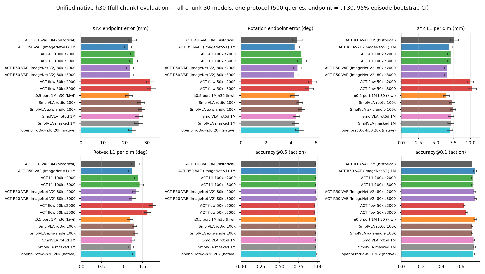

*Fig. 9.2.11-1: Unified native-h30 (full-chunk) metrics across chunk-30 models — six co-primary metrics, 95% CIs.*


*Fig. 9.2.11-2: Unified native-h30 budget curves for historical R18-VAE (30 checkpoints), fresh R50-VAE (ImageNet-V1) (10), the π0.5-port h30 curve (19), and the two SmolVLA padding curves (10 each), across the same six co-primary metrics as Fig. 9.2.11-1: XYZ/rotation endpoint error, XYZ/rotation L1 per dimension, Acc@0.5, and Acc@0.1. Stars are single-budget reference models.*


*Fig. 9.2.11-3: Unified native-h30 within-chunk 2nd-diff — every run of the sweep, log scale, dashed = ground truth (0.158° / 0.67 mm).*

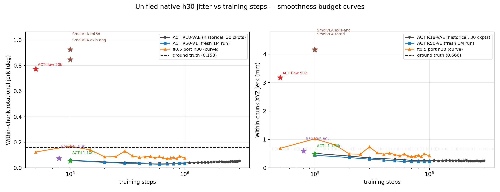

*Fig. 9.2.11-4: Unified native-h30 2nd-diff vs training steps — the h10 budget-jitter dynamics carried to the native chunk horizon.*

Read-outs (extended as the pending rows land):

1. **The horizon-10 tie does NOT carry to the native chunk horizon.** At
   t+30 the endpoint errors are ~2.3× the t+10 values across every family
   (R50-VAE (ImageNet-V1) 21.3 mm vs 9.4–10.6; R18 23.3 vs 12.0; ACT-L1 23.7–24.3 vs
   9.6–9.9), and the family ordering changes: the fresh R50-VAE (ImageNet-V1) curve is
   clearly the best ACT family at full chunk (21.2–23.2 mm vs the
   historical R18's 23.2–25.6 over the same budgets), consistent with the
   §9.2.8 budget-flip finding. Acc@0.1 drops from the 0.88–0.93 t+10 range
   to 0.63–0.75 — t+30 accuracy is the hard, unsolved regime.
2. **The two ACT budget regimes now have full-chunk curves.** R18 improves
   slowly and monotonically (25.57 → 23.31 mm, Acc@0.1 0.681 → 0.715 over
   100k→3M); R50-VAE (ImageNet-V1) improves faster and plateaus (23.24 → 21.32 mm by 1M,
   best 21.22 @600k, Acc@0.1 0.735 → 0.742) — at t+30 the fresh run is
   better at EVERY budget, not just early (contrast §9.2.9 read-out 3
   where R50-VAE (ImageNet-V1) *degrades* at t+10: the budget optimum is horizon-dependent
   in the opposite direction — more budget helps the far horizon).
3. **Smoothness ordering is horizon-independent.** ACT-flow remains 10–15×
   rougher than every other family (rot-2nd-diff 0.77–0.82° vs 0.03–0.08 for
   the ACT/VAE families); the VAE/L1 ACT families improve from ~0.06° at
   their early checkpoints to 0.03–0.05°, all well under the 0.158° GT.
   The π0.5-port h30 curve lands at 0.073–0.091° — between the ACT families
   and GT, mirroring its h10 position. The SmolVLA 1M full-width curve
   (§9.2.10) halves with budget (1.39 → 0.66°) but stays 4× GT — the least
   smooth family at every checkpoint; the masked curve lands with its
   sweep.
4. **MSE:L1 tail ratio separates the objective families at t+30 too**
   (ACT-flow ≈ 24–27 µm/mm vs ≈19–20 for the VAE/L1 families) — the
   heavy-tail penalty of the unweighted flow objective grows with horizon,
   matching the §9.2.6 diagnosis.
5. **The π0.5-port full-chunk curve ties R50-VAE (ImageNet-V1) at every mature budget**
   (19 points, 50k–1M; kiwi owns 650k/700k/1M). The port reaches its
   21.7–21.9 mm / Acc@0.1 0.741–0.744 plateau by ~350k and stays flat
   through 1M (21.75 mm) — no overfitting, mirroring its h10 curve
   (§9.2.9). Against R50-VAE (ImageNet-V1) over the same budgets the endpoint CIs overlap
   everywhere (port 21.70–21.84 vs R50-VAE (ImageNet-V1) 21.22–21.74 mm at ≥600k; Acc@0.1
   0.743 vs 0.742–0.743), so the h10 ACT-vs-port tie carries to t+30.
   What does NOT carry is the early-budget sample-efficiency edge: at h30
   port@100k is only 23.05 vs R50-VAE (ImageNet-V1)'s 23.24 mm — a 0.2 mm gap versus the
   clear §9.2.5 h10 lead — i.e. most of the port's apparent h10 early
   advantage is a near-horizon artifact; at full chunk the two families
   learn at nearly the same rate. The port remains mid-pack on smoothness
   (0.073–0.091° rot-2nd-diff vs ACT's 0.03–0.05°).
6. **The SmolVLA rotation-notation tie persists at full chunk — but the
   family drops to last place on endpoint error.** rot6d 27.29
   [25.72, 28.87] vs axis_angle 27.57 [26.10, 29.04] mm at 100k: CIs
   overlap, exactly the §9.2.3 h10 result (9.08 vs 9.17 mm). What changes
   with horizon is the family's position: SmolVLA is the WORST chunk-30
   endpoint family (~27.4 mm vs ACT-L1 23.7, R50-VAE (ImageNet-V1) 23.2, port 23.05 at
   the same 100k budget) and by far the least smooth at t+30 (rot-2nd-diff
   0.85–0.92° vs GT 0.158°) — its §9.2.9 h10 "ties everything" profile is
   a near-horizon artifact of the same kind as the port's early edge.
7. **Budget moves the SmolVLA far-horizon deficit but does not close it.**
   The full-width 1M curve improves 28.50 → 26.26 mm / Acc@0.1
   0.695 → 0.729 over 100k→1M — yet at every budget it remains above every
   other chunk-30 family's *same-budget* point, and its 1M endpoint still
   trails ACT-L1's 100k budget (23.31 mm). Read with §9.2.10 read-out 3:
   near-horizon parity at full budget, far-horizon deficit that survives
   10× budget — the only family for which this is true.
8. **The openpi h30-trained arm lands mid-pack at 2% of the port's
   budget.** 23.20 [21.56, 24.91] mm / Acc@0.1 0.725 at just 20k steps —
   already at the ACT-L1@100k level (23.7) and ~1.7 mm from the mature
   port/R50-VAE (ImageNet-V1) plateau, with GT-level smoothness (rot-2nd-diff 0.178° vs GT
   0.158°). The §9.2.5 sample-efficiency conclusion (the openpi recipe
   learns ~9× faster than the ACT path) carries to the canonical-window
   full-chunk protocol: the JAX arm is the most budget-efficient chunk-30
   controller in the inventory, with the caveat of its 20k training budget
   (§9.2.5 showed h30 training costs ~15% near-horizon precision vs h10
   training — visible here as its absence from the t+10 leaders).

### 9.2.12 openpi rot6d 1M-budget run: stopped at 111k — the kept 100k checkpoint under the unified h10 protocol

User-directed 2026-08-20: extend the official-openpi rot6d recipe
(`pi05_lora_sroi_rot6d_1m`) to a 1M-step budget — identical model / data /
LoRA / bs16 to the §9.2.4 rot6d arm, with only the schedule stretched
(warmup 10k, cosine 2.5e-5 → 2.5e-6 over the full 1M) and 100k-spaced
checkpoints kept for a budget curve under the unified protocols. Wall-clock
settled at ~2.4 s/it (bs16 on the host 4090, ~150 ms/sample), putting the
full 1M at ~27 days; on 2026-08-23 the user stopped the run at **111k steps**
and directed an evaluation of what it kept. The trainer's rotation policy
retained exactly one permanent checkpoint — `run1/100000` (with train_state,
so the run remains resumable via `--resume`; the rolling 25k-spaced
intermediates were rotated out by design) — evaluated here.

**Status: complete (2026-08-23) — one row (`pi05_openpi1m_seed1000_0100001steps`),
§9.2.9 protocol (canonical 500-query window, t+10, 3 inference seeds); the
run itself is stopped-at-111k, not schedule-converged.** Openpi serving is
inference-seed-invariant as before — the three seeds land at 10.77 / 10.78 /
10.77 mm endpoint (0.01 mm spread); the row reports the seed-1000 report
exactly as in §9.2.4/§9.2.5.

| Run | step | XYZ end (mm) | Rot end (deg) | XYZ L1/dim (mm) | XYZ MSE/dim (µm²) | Rotvec L1/dim (deg) | Rotvec MSE/dim (deg²) | Acc@0.5 | Acc@0.1 | Rot 2nd-diff (deg) |
| --- | ---: | ---: | ---: | ---: | ---: | ---: | ---: | ---: | ---: | ---: |
| pi05_openpi1m_seed1000_0100001steps | 100001 | 10.77 [10.22, 11.34] | 1.76 [1.67, 1.85] | 3.04 | 21.9 | 0.496 | 0.57 | 0.994 | 0.915 [0.909, 0.920] | 0.143 |

Read-outs:

1. **Endpoint is budget-flat within the openpi recipe — 5× steps bought
   nothing at t+10.** 10.77 [10.22, 11.34] mm at 100k steps (1.6M samples)
   vs the §9.2.4 20k arm's 10.66 [10.05, 11.28] mm (320k samples): CIs
   overlap almost entirely and Acc@0.1 is flat (0.915 vs 0.919). The openpi
   recipe enters the §9.2.9 tie band by 20k and stays at its top edge
   through 100k — mirroring the §9.2.10 finding that budget stops buying
   endpoint early in every flow family.
2. **At matched 100k steps the PyTorch port and ACT R50-VAE (ImageNet-V1) lead on
   endpoint.** port@100k 9.12 [8.64, 9.61] mm (bs4, 400k samples) and
   R50-VAE (ImageNet-V1)@100k 9.20 [8.67, 9.72] mm both sit below openpi's 10.77 with
   disjoint CIs, and the port's 50k row (9.61 [9.10, 10.13] mm, 200k
   samples) already matches openpi's 100k-steps endpoint with 8× fewer
   samples. The openpi recipe's early-budget sample-efficiency edge
   (§9.2.5, carried to h30 in §9.2.11 read-out 8) therefore does not
   appear as an endpoint lead at t+10 in this range: at h10 the port's
   budget curve is ahead at every matched step count ≥50k.
3. **What budget does buy is motion texture: closest-to-GT h10 row in the
   inventory.** Rot-2nd-diff 0.143° vs GT 0.152° — 94% of ground truth,
   tightened from the 20k arm's 0.157°, with XYZ-2nd-diff 0.87 mm vs GT 0.70
   (1.25×). For reference the ACT/VAE families and the mature port
   over-smooth (rot-2nd-diff 0.03–0.09°, well under GT) while SmolVLA sits
   ~7× over (1.04°); the openpi rows remain the only family that tracks
   the GT 2nd-diff level.
4. **Caveats.** (a) The 100k checkpoint sits at 10% of its 1M cosine
   (LR ≈ 2.3e-5, still near peak) — the flat 20k→100k endpoint is a
   mid-schedule observation, not the schedule's converged endpoint, and
   whether the long cosine tail unlocks further endpoint gains remains
   open. (b) The run is resumable: `run1/100000` retains train_state
   (~900k steps ≈ 25 days remain if ever resumed). (c) One permanent
   checkpoint exists, so this is a single point plotted as the §9.2.12
   star in the h10 budget figures — not a curve.

### 9.2.13 Physical-unit dynamics re-evaluation: true velocity / acceleration / jerk at 30 fps — complete

Closes the metric-naming critique raised against §9.2.9 on 2026-08-23: the
legacy "jerk" columns are unnormalized within-chunk second differences
(renamed in place; §9.2.9 definition note), and the report's earlier "10 Hz"
statement was wrong — the dataset is 30 fps (dt = 1/30 s; h10 ≈ 0.33 s,
full 30-step chunk ≈ 1.0 s). This section re-scores every torch row of the
§9.2.9 inventory with **physical-unit derivatives at dt = 1/30 s**.

**Definition (true jerk and its ladder).** For one chunk of absolute poses
(x_t, R_t), t = 0…9 — the 10 predicted (or ground-truth) poses of the h10
window, x_t ∈ ℝ³ translation, R_t ∈ SO(3) rotation — with dt = 1/30 s:

- **Translation.** v_t = (x_{t+1} − x_t)/dt (9 samples); a_t = (v_{t+1} −
  v_t)/dt = (x_{t+2} − 2x_{t+1} + x_t)/dt² (8 samples); **j_t = (a_{t+1} −
  a_t)/dt = (x_{t+3} − 3x_{t+2} + 3x_{t+1} − x_t)/dt³ (7 samples) — the
  jerk, i.e. the rate of change of acceleration (third time-derivative of
  position), estimated by the third finite difference.** Reported: mean ‖v‖
  (mm/s), mean ‖a‖ (mm/s²), mean ‖j‖ (mm/s³) over the chunk.
- **Rotation.** S_t = R_tᵀ R_{t+1} is the inter-step relative rotation with
  geodesic angle θ(S) = arccos((tr S − 1)/2)·180/π; the scalar angular
  speed is ω_t = θ(S_t)/dt (9 samples), α_t = (ω_{t+1} − ω_t)/dt (8), and
  the **angular jerk j_t = (α_{t+1} − α_t)/dt (7)**. Reported: mean ω
  (deg/s), mean |α| (deg/s²), mean |j| (deg/s³). The chain is scalar —
  angular-speed magnitude only, so axis-direction changes are not detected;
  |·| at acceleration and jerk means adjacent samples cannot cancel.
- **Aggregation.** Per-chunk mean → per-episode mean (5 queries) →
  episode-balanced mean over 100 episodes, with a 95% bootstrap CI (10k
  resamples, seed 0). The GT reference row applies the identical
  computation to the ground-truth future chunk (identical across all rows
  by protocol invariance).
- **Contrast with the legacy columns.** The renamed §9.2.9 columns are the
  same idea *without* dt normalization: XYZ 2nd-diff = mean ‖x_{t+2} −
  2x_{t+1} + x_t‖ (mm); rot 2nd-diff = mean θ(S_tᵀ S_{t+1}) (deg) — a
  curvature proxy in mm/step² and deg/step², an unnormalized acceleration
  stand-in, not a jerk.

**Status: complete (2026-08-23).** All 88 torch rows (ACT curves, flow/L1/
VAE companions, π0.5 port budget curve, SmolVLA arms) were re-evaluated on
the kiwi GPU directly against the archived report checkpoints
(`report_ckpts/`, the only checkpoint copy) over the bit-identical
validation dataset — canonical §9.2.9 protocol (500 queries, episode-
balanced, seed 1000, bounds [-1, 31], t+10). Fidelity of the re-eval: max
|Δ| vs the archived §9.2.9 numbers is 2.5e-5 m endpoint / 0.005° rotation /
0.0018° 2nd-diff — sub-0.1%, i.e. the re-eval reproduces the archived tree.
The π0.5-port openpi-recipe 20k checkpoint needed a shadow copy with the
`scheduler_auto_scale` config key stripped (host-only training-schedule
flag, inference-inert; archive untouched). The four JAX openpi rows
(§9.2.4/§9.2.5/§9.2.12) are carried from §9.2.9 legacy metrics and remain
**physical-pending** — their re-eval needs the host GPU, which is occupied
by the h30 bs4 1M run until ~09-01; to be appended then.

Ground-truth reference over the same 500-query window (episode-balanced):
**rot 8.25 deg/s · 65.9 deg/s² · 2,793 deg/s³; xyz 73.5 mm/s · 628 mm/s² ·
29,521 mm/s³.** Representative rows (full 88-row table:
`results_physical_jerk/physical_jerk_h10.csv`; ratios to GT in parens). The
CSV and companion Markdown now carry matched 95% episode-bootstrap CI columns
for **velocity, acceleration, and jerk** in both rotation and translation,
and repository snapshots are tracked as `repro/physical_dynamics_h10.{csv,md}`.
The compact table below keeps point estimates for readability:

| Run | step | Rot vel (deg/s) | Rot accel (deg/s²) | Rot jerk (deg/s³) | XYZ vel (mm/s) | XYZ accel (mm/s²) | XYZ jerk (mm/s³) |
| --- | ---: | ---: | ---: | ---: | ---: | ---: | ---: |
| GT reference | — | 8.25 | 65.9 | 2,793 | 73.5 | 628 | 29,521 |
| ACT R18-VAE 3M (hist) | 3M | 6.26 (0.76) | 34.0 (0.52) | 903 [846, 962] (0.32) | 57.4 (0.78) | 251 (0.40) | 5,261 [5,065, 5,458] (0.18) |
| ACT R50-VAE (ImageNet-V1) 800k | 800k | 5.32 (0.64) | 19.1 (0.29) | 459 [437, 483] (0.16) | 58.9 (0.80) | 194 (0.31) | 4,445 [4,269, 4,624] (0.15) |
| ACT-L1 100k s2000 | 100k | 4.65 (0.56) | 25.0 (0.38) | 1,272 [1,191, 1,360] (0.46) | 63.2 (0.86) | 313 (0.50) | 15,732 [14,963, 16,546] (0.53) |
| ACT R50-VAE (ImageNet-V2) 80k s2000 | 80k | 5.29 (0.64) | 31.7 (0.48) | 1,553 [1,452, 1,661] (0.56) | 64.8 (0.88) | 352 (0.56) | 16,982 [16,241, 17,745] (0.58) |
| ACT-flow 50k s2000 | 50k | 14.59 (1.77) | 212 (3.2) | 11,043 [10,600, 11,494] (3.95) | 83.6 (1.14) | 2,747 (4.4) | 148,903 [145,143, 152,738] (5.04) |
| π0.5 port o-recipe 20k | 20k | 6.31 (0.76) | 40.2 (0.61) | 1,889 [1,804, 1,979] (0.68) | 63.3 (0.86) | 452 (0.72) | 21,827 [21,283, 22,373] (0.74) |
| π0.5 port 700K | 700k | 5.61 (0.68) | 34.3 (0.52) | 1,335 [1,282, 1,386] (0.48) | 61.4 (0.84) | 334 (0.53) | 14,423 [14,010, 14,840] (0.49) |
| π0.5 port 1M | 1M | 5.66 (0.69) | 35.1 (0.53) | 1,389 [1,328, 1,450] (0.50) | 61.8 (0.84) | 340 (0.54) | 14,703 [14,266, 15,158] (0.50) |
| SmolVLA rot6d 100k | 100k | 11.83 (1.43) | 178 (2.7) | 9,192 [8,773, 9,620] (3.29) | 78.1 (1.06) | 2,163 (3.4) | 114,806 [111,413, 118,168] (3.89) |
| SmolVLA axis-angle 100k | 100k | 10.88 (1.32) | 162 (2.5) | 8,285 [7,937, 8,639] (2.97) | 78.5 (1.07) | 2,160 (3.4) | 114,502 [111,147, 117,847] (3.88) |
| SmolVLA rot6d 1M | 1M | 10.21 (1.24) | 149 (2.3) | 7,821 [7,435, 8,231] (2.80) | 70.3 (0.96) | 1,622 (2.6) | 86,311 [83,458, 89,198] (2.92) |
| SmolVLA masked 1M (§9.2.10 B) | 1M | 9.57 (1.16) | 135 (2.1) | 7,059 [6,768, 7,356] (2.53) | 68.2 (0.93) | 1,555 (2.5) | 82,466 [80,083, 84,927] (2.79) |
| openpi JAX rows (4) | 20k–100k | — | — | **physical-pending** (host re-eval after h30 training) | — | — | — |

Figures (this section):

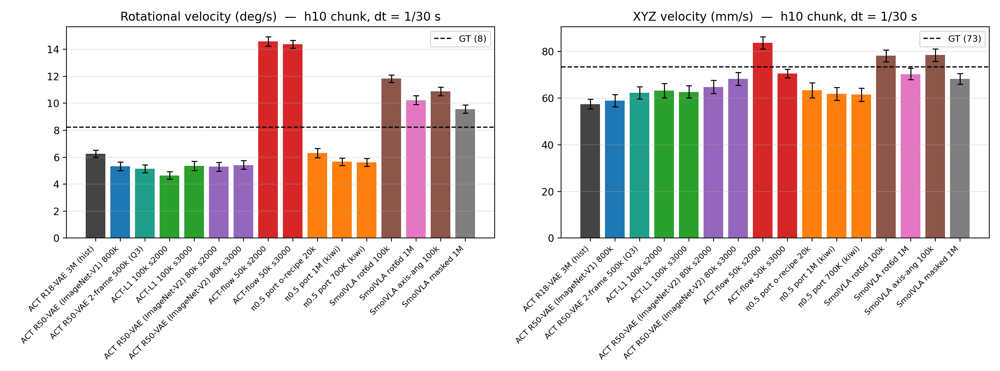

*Fig. 9.2.13-1: Physical rot/XYZ velocity (deg/s, mm/s) at dt = 1/30 s for every representative — 95% episode-bootstrap CIs, dashed = demonstrated velocity.*

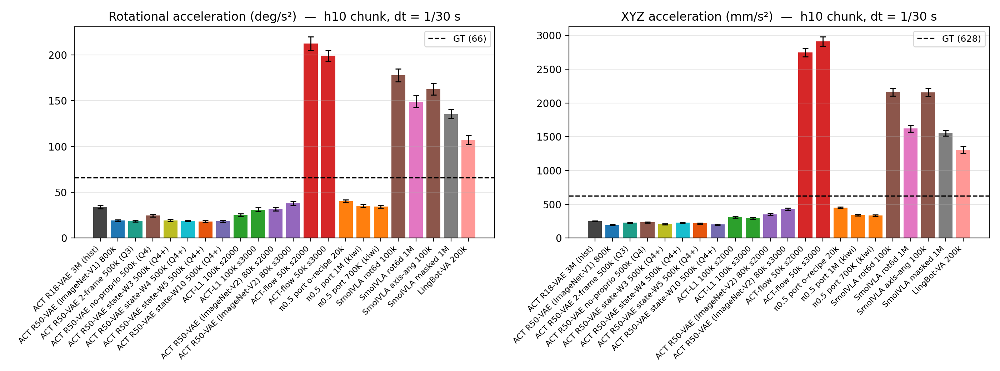

*Fig. 9.2.13-2: Physical rot/XYZ acceleration (deg/s², mm/s²), in the same representative/CIs/GT format as velocity and jerk.*

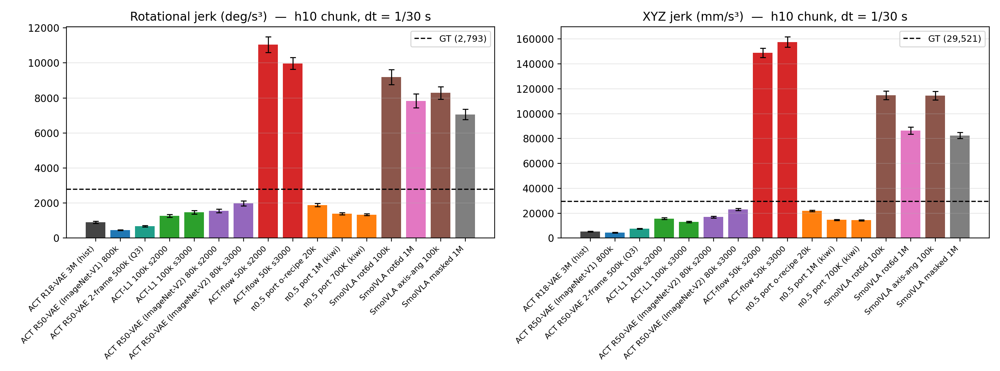

*Fig. 9.2.13-3: Physical rot/XYZ jerk (deg/s³, mm/s³), completing the matched first-/second-/third-derivative representative suite.*

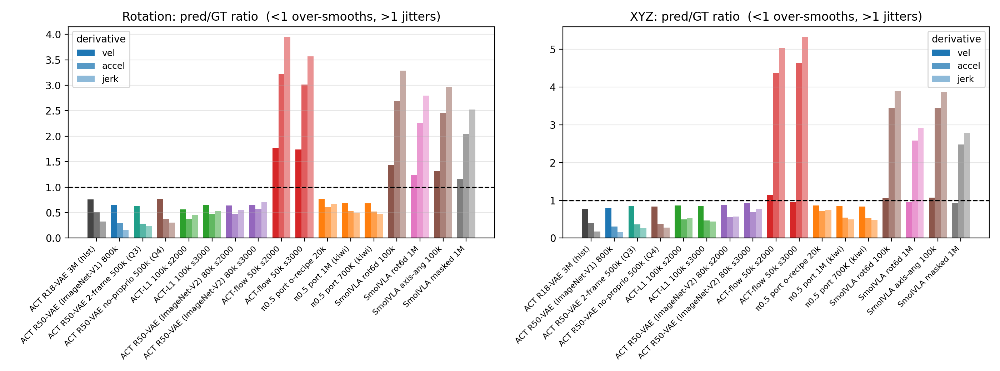

*Fig. 9.2.13-4: Pred/GT ratio ladder across velocity → acceleration → jerk (<1 over-smooths, >1 jitters) — where in the derivative stack each family's signature appears. Each grouped triplet is one fixed checkpoint, not a training trajectory.*

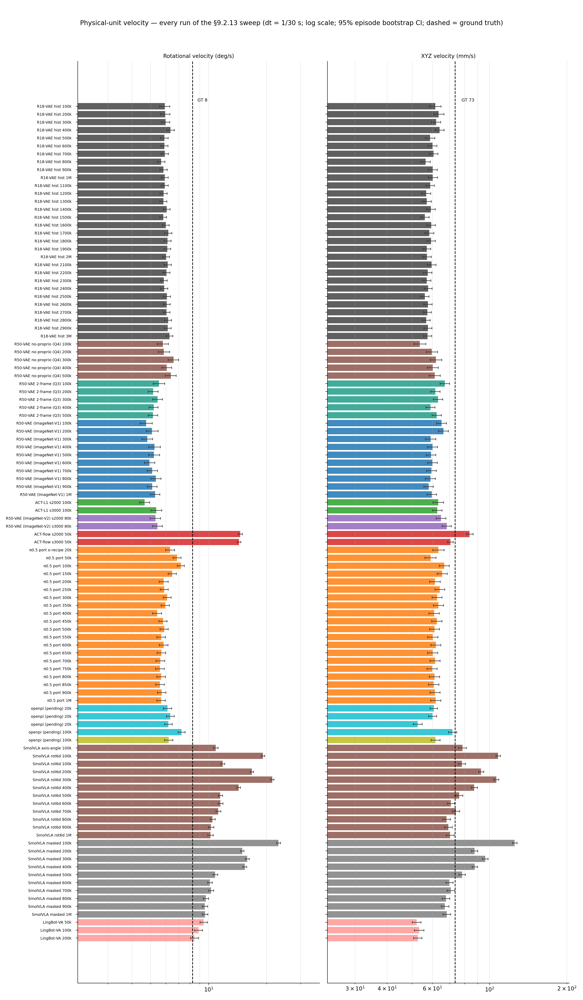

*Fig. 9.2.13-5: True velocity for EVERY run (log scale, 95% episode-bootstrap CIs, dashed = demonstrated), using the same ordering and visual grammar as acceleration and jerk.*

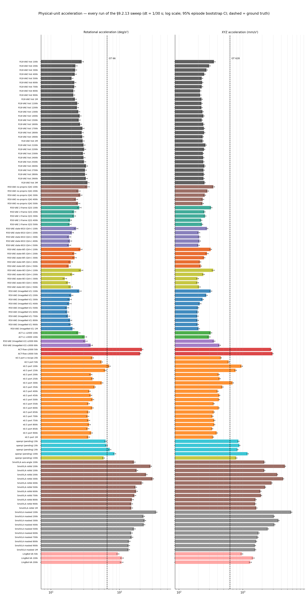

*Fig. 9.2.13-6: True acceleration for EVERY run, matched to the velocity/jerk all-run format.*

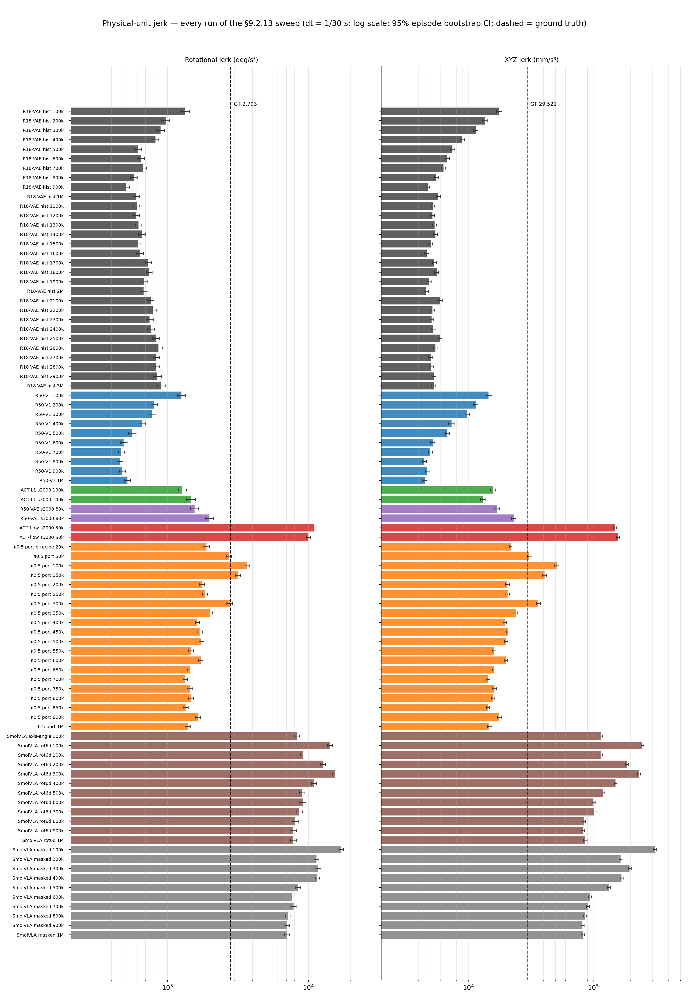

*Fig. 9.2.13-7: True jerk for EVERY run — the physical-unit counterpart of the §9.2.9 within-chunk second-difference figure.*

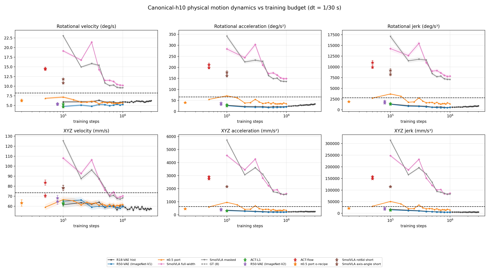

*Fig. 9.2.13-8: All canonical-h10 physical motion dynamics in one matched 2×3 budget view: rotational velocity/acceleration/jerk across the top and translational XYZ velocity/acceleration/jerk across the bottom. Lines and confidence bands connect checkpoints from the same training trajectory, dashed lines are demonstrated references, and stars are single-budget or independent companion runs.*

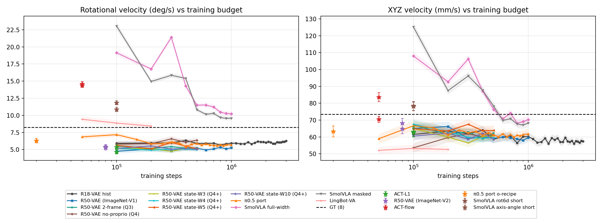

*Fig. 9.2.13-9: Physical velocity vs training steps, with demonstrated references. Lines and confidence bands connect checkpoints from the same training trajectory; stars are single-budget or independent companion runs.*

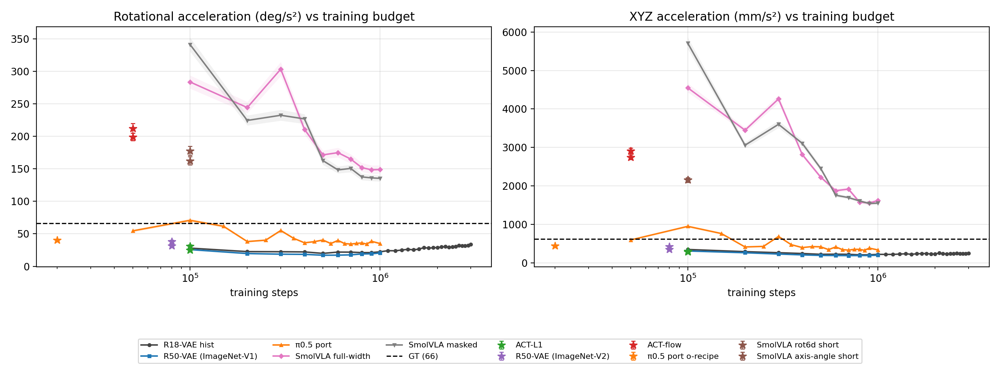

*Fig. 9.2.13-10: Physical acceleration vs training steps, in the same budget-curve format. Lines and confidence bands connect checkpoints from the same training trajectory; stars are single-budget or independent companion runs.*

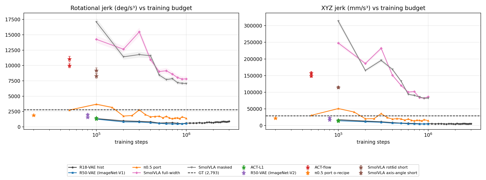

*Fig. 9.2.13-11: Physical jerk vs training steps, completing the matched derivative-order budget suite. Lines and confidence bands connect checkpoints from the same training trajectory; stars are single-budget or independent companion runs. Across Figs. 8–11, historical R18-VAE becomes smoother with budget, R50-VAE (ImageNet-V1) remains deepest below GT, the π0.5 port approaches GT from above, SmolVLA remains high-frequency, and under-trained ACT-flow bounds the rough failure mode.*

Read-outs:

1. **Every §9.2.9 over/under-GT smoothness call survives in true physical
   jerk.** The second-difference proxy was directionally faithful
   throughout: ACT/VAE families over-smooth (rot jerk 0.15–0.56× GT),
   SmolVLA jitters (2.5–3.3×), the π0.5 port sits mid-band (0.48–0.68×),
   and under-trained ACT-flow is the worst row in the inventory at 4.0×
   rot / 5.0× XYZ — its 50k budget is not a fair smoothness comparison but
   it bounds the flow-from-scratch failure mode in physical units.
2. **The ladder localizes each signature.** All families track GT *speed*
   within 0.56–1.77× (most within ±40%); the family differences amplify
   with derivative order. ACT's collapse is curvature-specific — velocity
   ≈ 0.8× GT but acceleration ≈ 0.3–0.5× and jerk ≈ 0.16–0.56× — while
   SmolVLA amplifies at *every* order (1.4× vel → 2.7× accel → 3.3× jerk,
   rotation). The π0.5 port is the closest GT-tracker across the whole
   stack (≈0.7× vel, ≈0.53× accel, ≈0.50× jerk at 1M), and its o-recipe
   20k row is the single closest rot-jerk row of any torch model (0.68×).
3. **Translation is where ACT over-smoothing is most extreme.** GT teleop
   translation is very jerky (29.5k mm/s³); the deployed ACT families sit
   at 0.15–0.18× GT XYZ jerk — 2–3× further below GT than their rotation
   jerk (0.16–0.32×). A near-minimum on the legacy 2nd-diff column is now
   quantitatively confirmed to mean near-stationary translation curvature,
   not faithful-but-calm motion: R50-VAE (ImageNet-V1)'s 0.15× is the deepest under-GT
   row in the table.
4. **Budget moves the two flow stacks in opposite directions.** The
   historical ACT *departs* from GT dynamics as it trains (rot jerk
   1,340 → 903 deg/s³ from 100k → 3M, i.e. 0.48× → 0.32× — more training,
   more over-smoothing), while the π0.5 port *converges toward* GT from
   above (3,682 → 1,389 deg/s³ from 100k → 1M, crossing GT ≈ 200k and
   settling at ≈ 0.5× by 700k–1M). SmolVLA's 1M arms improve on their 100k
   selves (3.3× → 2.8× rot, 3.9× → 2.9× XYZ) but never approach GT. The
   §9.2.10 padding A/B verdict is unchanged in physical units: masked 1M
   (7,059 / 82,466) sits slightly *below* full-width 1M (7,821 / 86,311)
   — the same few-percent smoothness edge, now in deg/s³ and mm/s³.
5. **Endpoint leader ≈ dynamics leader.** The port@1M row — best §9.2.9
   endpoint family at 8.98 mm — is also the closest torch family to GT
   dynamics across all six physical metrics; no family achieves top
   endpoint while being far from GT motion, and none of the over-smoothed
   ACT rows buys endpoint accuracy with its smoothness (R50-VAE (ImageNet-V1)'s endpoint
   lead over hist ACT comes with the deepest under-GT jerk instead).
6. **Caveats.** (a) The h10 window is 0.33 s — the third derivative has
   only 7 samples per 10-pose chunk (9 velocity / 8 acceleration / 7
   jerk; see the definition above), so jerk estimates are noisier than
   endpoint/velocity (CIs in the table absorb this).
   (b) Rotation is a scalar angular-speed chain (magnitude only — no
   axis-direction change detection). (c) The four JAX openpi rows are
   pending (host GPU occupied by the §9.2.14 h30 run); their legacy
   2nd-diff values (§9.2.12: 0.143° vs GT 0.152°, the closest of any
   family) suggest they will land near the port, but this is unverified
   until scored. (d) All physical metrics are means over the scored
   window — per-episode distributions are preserved in
   `repro/per_episode/` (88 compact files, §11).

### 9.2.15 Recovered seed-1000 matrix re-scored under the unified protocol — complete

(§9.2.14 is reserved for the in-flight openpi h30 bs4 1M run.) After the
2026-08-24 salvage (§8 incident 12 addendum, §9.2.6 recovery addendum) put
the recovered weights back on kiwi, all 28 salvaged training runs were
scored on 2026-08-24 under the §9.2.9 protocol with the §9.2.13 physical
metric set: 500 queries (100 episodes × 5, bounds [-1, 31]), eval horizon
10, inference seed 1000, episode-balanced means + 95% bootstrap CIs, on the
kiwi RTX 5080 (three parallel workers; ~20 min wall for the whole set).
The evaluator is the same extended `eval_open_loop_dataset.py`; protocol
invariants are enforced at compile time. These rows have no §9.2.9-tree
counterpart to cross-validate against (that tree predates the recovery), so
the compile checks protocol constants only; per-episode evidence is in
`repro/per_episode_salvage/` (28 compact files) and the eval tree is synced
to `reeval_v2metrics/eval_salvage_h10/`.

Checkpoint caveats, all from the disk-death moment: `act_r50_v1_vae`
s3000's 30k `model.safetensors` is a torn write (truncated at exactly
60 MiB of 259 MiB) — scored at its newest intact checkpoint (20k);
`act_r50_v1_vae` s2000 scored at its last complete checkpoint (70k);
`diffusion_r18` s3000 is budget-stopped at 30k; the ACT-flow s2000/s3000
retrains (§9.2.6, scored at 50k) are not budget-matched to the recovered
s1000 100k row. Environment deltas vs the §9.2.13 sweep, all
inference-side: `diffusers==0.35.2` and `timm==1.0.27` (host-matched) were
installed into the kiwi eval venv for the diffusion-head/DP rows, and the
`vit_base_patch16_clip_224.openai` timm backbone was seeded from the host
HF cache for the two released-UMI rows.

| Run | step | XYZ end (mm) | rot jerk (deg/s³) [95% CI] | ×GT | xyz jerk (mm/s³) | ×GT |
|---|---|---|---|---|---|---|
| act_r18_l1_seed1000 | 100k | 9.85 | 1421 [1332, 1512] | 0.51 | 14 664 | 0.50 |
| act_r18_l1_seed1000 | 30k | 13.19 | 1743 [1660, 1829] | 0.62 | 22 302 | 0.76 |
| act_r18_vae_seed1000 | 100k | 12.65 | 1375 [1298, 1453] | 0.49 | 21 075 | 0.71 |
| act_r18_vae_seed1000 | 30k | 14.15 | 2640 [2456, 2822] | 0.95 | 30 473 | 1.03 |
| act_r18_vae_seed2000 | 100k | 9.56 | 1247 [1172, 1324] | 0.45 | 15 525 | 0.53 |
| act_r18_vae_seed3000 | 100k | 9.99 | 1539 [1435, 1648] | 0.55 | 15 873 | 0.54 |
| act_r34_vae_seed1000 | 30k | 13.45 | 2901 [2659, 3163] | 1.04 | 31 666 | 1.07 |
| act_r50_large_seed1000 | 30k | 10.16 | 2507 [2353, 2671] | 0.90 | 24 628 | 0.83 |
| act_r50_vae_seed1000 | 100k | 9.39 | 1495 [1402, 1591] | 0.54 | 19 902 | 0.67 |
| act_r50_vae_seed1000 | 30k | 10.70 | 2474 [2338, 2614] | 0.89 | 32 108 | 1.09 |
| **act_r50_v1_vae_seed1000** | **100k** | **9.46** | 1185 [1118, 1251] | 0.42 | 14 045 | 0.48 |
| act_r50_v1_vae_seed1000 | 30k | 10.17 | 2597 [2419, 2786] | 0.93 | 29 936 | 1.01 |
| act_r50_v1_vae_seed2000 | 70k | 9.71 | 1791 [1700, 1883] | 0.64 | 19 066 | 0.65 |
| act_r50_v1_vae_seed3000 | 20k† | 11.95 | 2228 [2098, 2361] | 0.80 | 28 402 | 0.96 |
| act_r18_flow_u_lr1e5_seed1000 | 100k | 10.86 | 8788 [8464, 9115] | 3.15 | 131 539 | 4.46 |
| act_r18_flow_u_lr1e5_seed1000 | 30k | 13.36 | 14 564 [13 984, 15 188] | 5.21 | 227 142 | 7.69 |
| act_r18_flow_u_lr1e4_seed1000 | 30k | 26.16 | 17 315 [16 442, 18 190] | 6.20 | 267 380 | 9.06 |
| act_r18_flow_beta_lr1e4_seed1000 | 30k | 22.71 | 16 748 [16 031, 17 521] | 6.00 | 282 658 | 9.57 |
| act_r18_diffusion_lr1e5_seed1000 | 100k | 14.17 | 6387 [6142, 6643] | 2.29 | 73 453 | 2.49 |
| act_r18_diffusion_lr1e5_seed1000 | 30k | 17.90 | 14 268 [13 541, 15 024] | 5.11 | 187 889 | 6.36 |
| act_r18_diffusion_lr1e5_seed2000 | 100k | 14.56 | 11 023 [10 530, 11 504] | 3.95 | 155 608 | 5.27 |
| act_r18_diffusion_lr1e5_seed3000 | 100k | 14.12 | 6606 [6330, 6884] | 2.37 | 67 906 | 2.30 |
| diffusion_r18_seed1000 | 100k | 9.23 | 4038 [3828, 4255] | 1.45 | 36 784 | 1.25 |
| diffusion_r18_seed1000 | 30k | 10.33 | 8316 [7714, 8950] | 2.98 | 97 130 | 3.29 |
| diffusion_r18_seed2000 | 100k | 9.05 | 4109 [3906, 4324] | 1.47 | 40 187 | 1.36 |
| diffusion_r18_seed3000 | 30k | 14.11 | 16 738 [15 167, 18 445] | 5.99 | 220 834 | 7.48 |
| umi_official_dp_seed1000 | 30k | 10.01 | 5664 [5368, 5983] | 2.03 | 58 346 | 1.98 |
| umi_official_transformer_dp_seed1000 | 30k | 9.58 | 3917 [3679, 4195] | 1.40 | 35 117 | 1.19 |

GT references (§9.2.13): rot 2 793 deg/s³, XYZ 29 521 mm/s³. † = torn 30k
checkpoint, scored at the newest intact one.

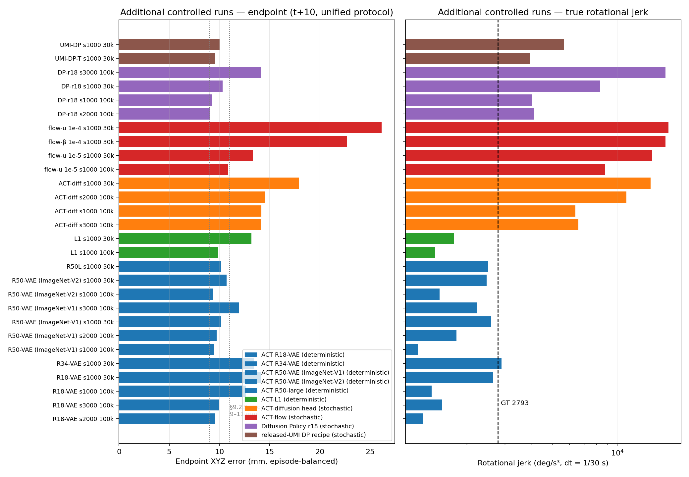

*Fig. 9.2.15-1: All 28 recovered runs — endpoint XYZ (left, dotted = the §9.2.9 9–11 mm pack) and true rotational jerk (right, log scale, dashed = GT 2,793 deg/s³), colored by head type.*

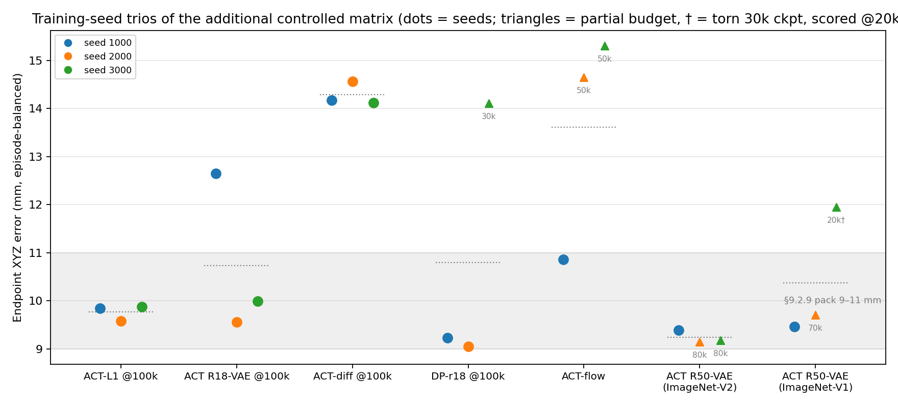

*Fig. 9.2.15-2: Training-seed trios of the recovered matrix at (near-)matched budget — recovered seed-1000 rows combined with the §9.2.6/§9.2.13 retrain rows; triangles mark partial budgets († = torn 30k checkpoint, scored at 20k).*

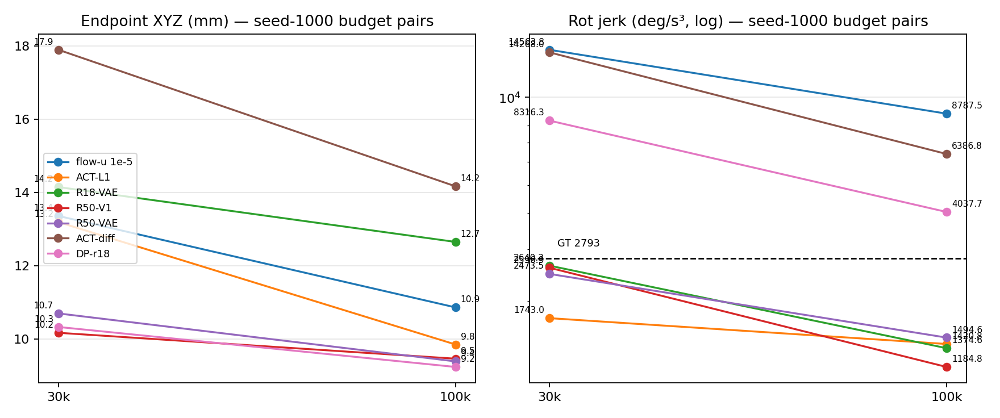

*Fig. 9.2.15-3: 30k→100k budget pairs at seed 1000 — endpoint (left) and rotational jerk (right, log scale, dashed = GT).*

Read-outs:

1. **The §9.2.4/§9.2.6 horizon-10 gap is closed: ACT R50-VAE (ImageNet-V1) seed-1000 at
   100k scores 9.46 mm** — inside the §9.2.9 pack (9–11 mm), and 0.26 mm
   from the fresh 1M-run's 100k checkpoint (9.20 mm, §9.2.8) across two
   independent trainings of the same recipe. The original screen's R50-VAE (ImageNet-V1)
   promotion is confirmed at matched scoring rather than inferred.
2. **Seed trios at matched 100k budget**: ACT-L1 9.59/9.85/9.88 (spread
   0.30 mm), ACT-diff 14.12/14.17/14.56 (0.44), DP-r18 9.05/9.23, and
   R18-VAE 9.56/9.99/12.65 (**3.09 mm**). Family rank order replicates
   within every trio, but the R18-VAE spread shows single-seed 100k
   endpoint comparisons *near the pack boundary* are seed-noise-limited:
   the original s1000 VAE sits above the pack its retrain siblings land
   in (and next to the historical 3M production R18-VAE, §9.2.7, which
   trained on from the same lineage). §9.2.6's "unlikely to reverse rank
   order" holds for head-type gaps (deterministic vs stochastic, 3–5×)
   but not for adjacent-deterministic-family gaps at this budget.
3. **Budget 30k→100k (seed 1000, seven families)**: endpoint improves in
   every family and rotational jerk tightens ~2× in every family; the
   deterministic families move from ≈GT-level jerk (0.89–1.04×) at 30k to
   clearly over-smoothed (0.42–0.55×) at 100k — budget buys smoothness in
   the deterministic head, extending §9.2.8's late-budget observation to
   the original matrix.
4. **The §9.2.13 family signatures reproduce on independent trainings.**
   Deterministic heads over-smooth at 100k (rot 0.42–0.55× GT, XYZ as low
   as 0.48×); the stochastic ACT-stack heads jitter (ACT-flow 3.15×, ACT-
   diffusion 2.29–3.95× rot at 100k); DP-r18 (1.45–1.47×) and the
   released-UMI transformer recipe (1.40×) are the closest-to-GT
   stochastic rows.
5. **The released-UMI recipes reach the pack at 30k** (U-Net 10.01,
   transformer 9.58 mm) — consistent with the ~9× sample-efficiency
   advantage of the UMI-openpi recipe family (§9.2.5) and the o-recipe
   20k row (10.77 mm, §9.2.12), here replicated in the original ACT-era
   DP implementations.

### 9.2.19 Cross-query prediction stability: overlap disagreement between re-queried chunks — complete

(§9.2.14 remains reserved for the openpi h30 bs4 1M run; §9.2.16–§9.2.18
are reserved for the in-flight LingBot-VA 200k, Q3 two-frame 500k, and Q4
no-proprioception 500k sections.) This section closes a blind spot of the
canonical §9.2.9 protocol: its 500 queries are **sparsely spaced and each
prediction is scored in isolation**, so it cannot see whether a policy
*changes its plan* when re-queried about a future it has already predicted —
the consistency an async-replanning deployment actually executes (the
within-chunk smoothness of §9.2.13 and this cross-query stability are
orthogonal: a policy can be smooth inside each chunk yet flip its plan on
every re-query, and vice versa).

**Definition.** For each anchor t and re-query interval k ∈ {1, 5, 10}
frames (30 fps; k=1 is the async-replan regime, k≈10 one full
execution-chunk replan), the policy is queried at t and at t+k with the
**same inference seed** — so stochastic heads share their sampler
realization and the disagreement isolates the conditioning change, not
noise luck. The two decoded chunks are aligned on their overlapping future
timestamps (predicted[i] is the pose for t+1+i, so chunk_a[k:] aligns with
chunk_b[:30−k]) and scored by mean and endpoint XYZ distance (mm) and SO(3)
geodesic disagreement (deg). 5 anchors/episode × 100 episodes = 500 pairs
per interval; episode-balanced means + 95% bootstrap CIs (10k resamples,
seed 0); full processor/policy reset per query (independent queries, no
cross-chunk state). Evaluator: `eval_open_loop_dataset.py --stability_eval`
(commit e0520535; the canonical protocol and its output files are
untouched).

**Status: complete (2026-08-25).** 17 representative rows covering every
family — the historical ACT 3M, R50-V1 100k/1M, the fresh Q3 two-frame 500k,
ACT-L1/R50-VAE/ACT-flow/ACT-diffusion, DP-r18, the released UMI-DP 30k, the
π0.5 port (o-recipe 20k, 100k, 1M), and four SmolVLA arms — evaluated on
the kiwi GPU against the archived checkpoints over the bit-identical
validation set. The π0.5-port rows required a serial retry (the 2-worker
sweep OOM'd exactly when the ~4G VLM loaded) and the o-recipe shadow needed
its post-reorg symlinks repointed; all 17 rows passed the compile-time
protocol assertions (mode, intervals, 500 anchors/interval, bounds
[-1, 31], fps 30). XYZ disagreement (episode-balanced, 95% CI; rotation in
deg — full table `results_stability_h10/stability_h10.csv`):

| Run | k=1 XYZ (mm) | k=1 rot (deg) | k=10 XYZ (mm) | k=10 rot (deg) |
| --- | ---: | ---: | ---: | ---: |
| ACT R18-VAE 3M (hist) | 2.93 [2.78, 3.10] | 0.55 | 15.29 | 2.49 |
| ACT R50-V1 100k | 4.21 [3.92, 4.52] | 0.72 | 15.38 | 2.63 |
| ACT R50-V1 1M | 3.08 [2.91, 3.26] | 0.56 | 14.67 | 2.37 |
| ACT R50-V1 2-frame 500k (Q3) | 3.31 [3.14, 3.48] | 0.60 | 14.96 | 2.47 |
| ACT-L1 100k s2000 | 4.28 [4.05, 4.51] | 0.77 | 15.98 | 2.79 |
| ACT R50-VAE 80k s2000 | 4.53 [4.26, 4.81] | 0.80 | 15.66 | 2.63 |
| ACT-flow 50k s2000 | 4.68 [4.49, 4.88] | 0.85 | 18.95 | 3.26 |
| ACT-diffusion 100k | 4.17 [3.95, 4.40] | 0.71 | 17.60 | 2.95 |
| Diffusion Policy r18 100k | 4.19 [3.90, 4.52] | 0.69 | 16.03 | 2.94 |
| released UMI-DP 30k | 5.03 [4.69, 5.40] | 0.89 | 18.24 | 3.36 |
| π0.5 port o-recipe 20k | 5.21 [4.87, 5.57] | 0.94 | 16.90 | 2.93 |
| π0.5 port 100k | 4.49 [4.24, 4.76] | 0.80 | 15.73 | 2.68 |
| π0.5 port 1M | 3.66 [3.48, 3.85] | 0.59 | 14.53 | 2.42 |
| SmolVLA rot6d 100k | 6.94 [6.58, 7.34] | 1.24 | 18.38 | 3.11 |
| SmolVLA rot6d 1M | 6.75 [6.44, 7.07] | 1.35 | 17.33 | 2.95 |
| SmolVLA axis-angle 100k | 7.05 [6.66, 7.48] | 1.28 | 18.89 | 3.16 |
| SmolVLA masked 1M | 6.34 [6.07, 6.62] | 1.26 | 17.18 | 2.91 |

Figures (this section):

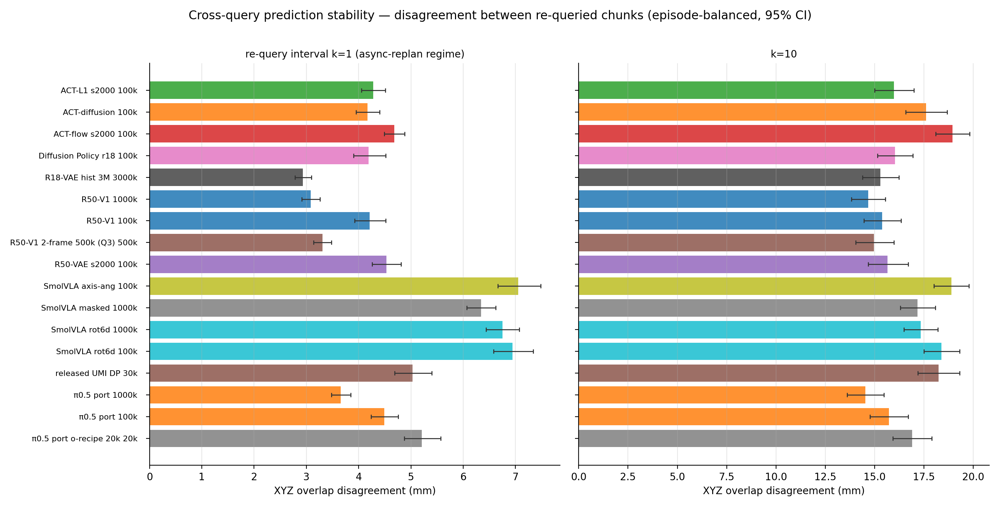

*Fig. 9.2.19-1: Cross-query disagreement at k=1 (async-replan regime) and k=10 — all 17 representative runs, episode-balanced, 95% bootstrap CIs. SmolVLA (all four arms) separates cleanly from the pack at k=1; the historical ACT and the mature R50-V1/port rows are the most re-query-consistent.*

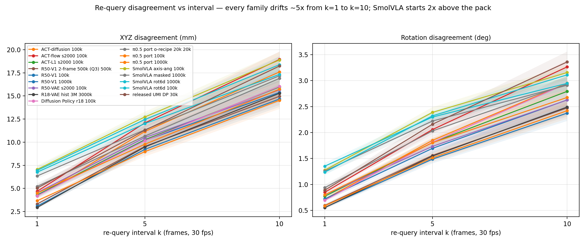

*Fig. 9.2.19-2: Disagreement vs re-query interval with CI bands — every family drifts ~5× from k=1 to k=10 (re-planning a nearly-executed future is genuinely different), but the ordering set at k=1 persists.*

Read-outs:

1. **SmolVLA is the only family that is re-query-unstable, and it is not
   sampler noise.** All four SmolVLA arms sit at 6.3–7.1 mm at k=1 —
   ~2× every other family (pack 2.9–5.2 mm) — with non-overlapping CIs
   against every non-SmolVLA row. Because both members of a pair share one
   inference seed, the sampler realization is held fixed: this is the
   policy genuinely producing a different plan from a nearly identical
   observation. The §9.2.13 jitter signature (2.5–3.3× GT within-chunk
   jerk) and this plan-flipping are two views of the same input
   hypersensitivity, and 1M steps of training do not fix it (6.9 → 6.8 mm).
2. **The π0.5 port is NOT plan-unstable** — 3.66 mm at k=1 (1M), better
   than most ACT rows and second only to the historical 3M ACT and R50-V1
   1M. The perceived shakiness of the deployed port is therefore not
   prediction inconsistency; the async-inference evidence (latency vs
   control rate, Part II of the low-level-control analysis) remains the
   supported explanation.
3. **Budget buys stability in every ACT/port family** — R50-V1
   4.21 → 3.08 mm from 100k → 1M, port 4.49 → 3.66, historical ACT best
   overall at 2.93 (3M) — while SmolVLA stays flat. Stability improves in
   lock-step with the §9.2.8 capacity story, and the under-trained rows
   (ACT-flow 50k 4.68, UMI-DP 30k 5.03, o-recipe 20k 5.21) are the weakest
   of their stacks, as expected for early-budget checkpoints.
4. **The Q3 two-frame arm ties 1-frame here too** (3.31 mm @500k vs 3.08 @
   1M on the same curve) — a second independent metric where temporal-frame
   stacking changes nothing (endpoint §9.2.15-era ties, dynamics ties,
   stability ties).
5. **k=1 is small for every mature policy relative to execution error** —
   the best rows re-plan within ~3 mm, an order below the k=10 drift
   (~15 mm) and comparable to the endpoint-error pack (9–11 mm): in the
   async-replan regime a mature policy's successive plans mostly agree,
   and the risk concentrates in under-trained or hypersensitive
   (SmolVLA) stacks.
6. **Caveats.** (a) Deterministic policies (ACT-L1/VAE) make the k=1
   disagreement a pure function of the observation pair; stochastic heads
   share the sampler draw by construction (see the definition) — the two
   regimes are comparable but not identical. (b) Rows are representative
   checkpoints, not full budget curves (the driver is manifest-driven and
   idempotent; extending to every §9.2.9 row is a re-run away). (c) The
   JAX openpi rows are outside this sweep (as in §9.2.13). (d) This is
   open-loop plan consistency — closed-loop, the executed trajectory
   interleaves these flips with real observations.

### 9.3 Answers and promotion decision after stage one

**Q1:** the completed screen shows that the ACT R50-VAE (ImageNet-V2) recipe is the strongest
tested ACT improvement over the fresh 1459 control. ResNet-34-V1 is a smaller
positive step; the 145M widened transformer is not worthwhile at the tested
LR/budget. Because the R50 comparison also changed ImageNet initialization,
“capacity alone improves ACT” remains a hypothesis rather than a completed
attribution. R50-VAE (ImageNet-V1), R50-VAE (ImageNet-V2), and R18-VAE
(ImageNet-V1) are promoted to the longer/multi-seed comparison before
recommending replacement of the multi-million-step historical checkpoint.

**Q2:** no single explanation fits. Matched ACT-flow and same-architecture
ACT-DP are both significantly worse than ACT-L1, so simply swapping velocity
flow for epsilon diffusion does not fix this ACT-transformer generative path.
But vanilla temporal-U-Net DP without a VLM is competitive with ACT and better
on chunk translation, so flow/diffusion itself is not the fundamental problem.
Denoiser architecture, conditioning, optimizer/sampler design, VLM fine-tuning,
and trajectory smoothness are separate axes; the existing π0.5 result further
indicates that the VLM path can work. ACT-L1, uniform flow 1e-5,
architecture-matched ACT-DP, and standard DP are promoted with R18, R50-VAE (ImageNet-V1),
and R50-VAE (ImageNet-V2) to determine whether these conclusions persist at the full 100k
budget (single training seed; variability quantified by per-episode bootstrap).

Stage two therefore trains fresh 100k runs (not scheduler-incompatible resumes)
for ACT R18 VAE, ACT R50-VAE (ImageNet-V2), ACT R18 L1, uniform ACT-flow 1e-5, and
Diffusion R18; the newly identified R50-VAE (ImageNet-V1) and architecture-matched ACT-DP
controls are inserted as separate 30k/100k successors before evaluation. Fresh
runs are required because Diffusion Policy's cosine scheduler was
constructed for 30k steps and had already reached its floor; extending that
optimizer state to 100k would not be equivalent to a 100k schedule. After the
100k screen, the surviving comparison was to be repeated at training seeds 2000
and 3000 to capture training-seed variability that the per-episode bootstrap
cannot measure. That multi-seed confirmation was started but ultimately **dropped
for compute efficiency** after two artifact-disk failures (§8, incident 12)
stranded the seed-2000/3000 checkpoints (those checkpoints — and the seed-1000
weights — were later recovered from the revived disk, §8 incident 12 addendum;
the drop decision stands); the final recommendation therefore
rests on the single seed-1000 matrix with per-episode bootstrap intervals,
strengthened by the independently-trained π0.5 650K/700K flow-VLM reference
(§9.2.2), which is stable to ±0.17 mm endpoint XYZ across three inference seeds.
A future seed-2000/3000 iteration would tighten the intervals but is unlikely to
reverse the rank order given the size of the seed-1000 gaps and the consistency
of the π0.5 reference — a prediction the §9.2.6 partial-budget salvage check
subsequently confirmed directly: two recovered seeds each for ACT-L1, R50-VAE (ImageNet-V2),
and matched flow replicated the rank order on every metric, with cross-seed
spreads an order of magnitude smaller than the variant gaps.

**Final recommendation (seed-1000 basis).** Endpoint-pose accuracy at matched
100k budgets ranks: ACT-L1 ≈ ACT R50-VAE (ImageNet-V1) (best of the ACT/diffusion family,
~22 mm endpoint; R50-VAE (ImageNet-V1)'s gain over R18 survives the strict V1-initialization
control, so ResNet-50 capacity — not the torchvision V2 weights — is the cause)
> ACT R50-VAE (ImageNet-V2) > standard temporal-U-Net Diffusion Policy > matched ACT-flow >
ACT-DP (worst). The matched ACT-flow and ACT-DP deficits are attributable to
the ACT-transformer denoiser/conditioning recipe, **not** to flow/diffusion per
se: standard DP is competitive with ACT, and a well-trained π0.5 flow-VLM
(§9.2.2, 21.8 mm endpoint, smoother than ground truth) is the strongest
controller of all — confirming flow matching is sound when paired with a
capable denoiser and sufficient training budget (π0.5 used 6.5–7× the ACT
budget, so training budget is a first-order variable the matched 100k
comparison does not control). Practical defaults: **ACT-L1** as the lightweight
deterministic controller (lowest inference cost, smoothest ACT trajectory);
**ACT R50-VAE (ImageNet-V1)** when the extra ~25% latency is acceptable for a small pose
gain; and the **flow-VLM path (π0.5 / openpi)** when VLM inference cost is
justified by its clear accuracy and smoothness lead — with two corrections from
the horizon-matched re-scoring (§9.2.4): at equal 10-step scoring the π0.5 port,
official openpi, and even SmolVLA are **statistically tied at 9–10 mm endpoint**
(the earlier cross-model endpoint spreads were a horizon artifact), so the VLM
path's advantage on this task is **smoothness and sample efficiency, not final
endpoint accuracy** — the port is the smoothest controller measured (0.072°
rot-2nd-diff vs GT 0.153°) and official openpi reaches the shared operating point
with ~9× fewer samples. Rotation parameterization,
by contrast, is **not** a lever worth spending on: the SmolVLA rot6d-vs-axis-angle
ablation (§9.2.3) found endpoint accuracy statistically tied, and the
official-openpi replication (§9.2.4) reproduced that tie on a second stack —
with the small jitter differences flipping sign between stacks, confirming they
are stack interactions rather than representation properties. rotvec/axis-angle
(7D) remains the practical default for its smaller action dimension. Note
finally that ACT
trajectory smoothness (rotational 2nd-diff 0.056°–0.091°) is comparable to or below
the ground-truth 2nd-diff (0.158°), so the iterative generative samplers' roughness
is not a reason to avoid ACT's deterministic path here.

The stage-two sequence was launched on the host RTX 4090 at 2026-08-11 20:41
Asia/Taipei in tmux session `umi_arch_stage2_20260811`. Its first run,
`act_r18_vae_seed1000_100000steps`, initialized successfully at about 26.7
steps/s. Checkpoints/logs were originally under
`/media/zfei/Glowat512/projects/lerobot-arch-exp` and, after that disk failed
twice, live under `/mnt/data1/projects/lerobot-arch-exp` (§8, incident 12). This was an active long-run
confirmation at launch and is not mixed into the completed 30k table above;
its later completion is recorded below.

At the 2026-08-11 22:40 progress check, fresh ACT R18 had completed 100k in
1h08m20s. Its validation total/L1 at 90k was the run-best
0.035114/0.034751; the final 100k values were 0.035413/0.035243, showing a
small late fluctuation rather than continued monotonic improvement. Fresh ACT
R50 was then at 36.6k/100k (about 12.6–13.0 steps/s). Its 10k/20k/30k total
validation losses were 0.043859/0.038979/0.034967, with corresponding L1
0.036001/0.036323/0.033306. Thus R50 at 30k is already below R18's best 100k
total and L1 validation values. This is encouraging convergence evidence only;
the common decoded evaluation is deferred until the final 100k checkpoint.

At the 2026-08-11 23:21 check, R50 reached 67k without NaNs, OOMs, or dataloader
failures, sustaining about 12.6–13.0 steps/s. Its 40k, 50k, and 60k validation
total/L1 values were 0.033985/0.033025, 0.032902/0.032421, and
0.033020/0.032475. The small 50k→60k fluctuation does not erase the large gap
to R18. The two official UMI candidates did not contend with this job. They
were initially scheduled after the existing five-run stage-two sequence; the
wrapper interruption described below changed the realized ordering while
preserving single-GPU execution.

At the 2026-08-12 00:06 check, R50 had in fact completed all 100k updates and
saved a valid final checkpoint. Its validation total/L1 values at 70k, 80k,
90k, and 100k were 0.031453/0.030956, 0.031671/0.031365,
0.031066/0.030817, and 0.031239/0.031060. The 90k point is the minimum on
both measures, and the final checkpoint remains substantially below the R18
100k control. The original `set -e` stage-two wrapper nevertheless terminated
between the child's `End of training` message and its wrapper completion
marker, so the remaining three promoted runs did not start. The final R50
checkpoint was independently verified on disk and is retained as complete. It
was later reloaded for a successful host-GPU decoded query and a complete common
500-query evaluation, after which the log received a clearly labelled
recovered-complete marker rather than pretending the original wrapper returned
success. The matching R18 100k checkpoint was evaluated the same way; their
decoded comparison is reported in Section 9.1.1.

The first official U-Net attempt then passed a real two-update batch-64 smoke
test and trained normally through update 2,195 (approximately 4.9 updates/s).
At 2026-08-12 00:15:09 the host kernel recorded a segmentation fault for that
Python process in `libc.so.6`. There was no preceding traceback, non-finite
loss, CUDA error, NVIDIA Xid, or out-of-memory event; host memory still had
about 50 GiB available. The machine does not provide `coredumpctl`, so a native
stack trace could not be recovered. Because PyAV decoding and multiprocessing
are the principal native CPU path that differs from pure model computation,
the conservative retry sets `num_workers=0` and disables persistent workers.
This is a reliability intervention, not a model/hyperparameter change, and the
interrupted attempt is timestamp-archived rather than overwritten.

The single-process retry subsequently passed the exact earlier failure point:
the same Python PID that started at 08:05:21 reached update 2,232 without a
restart, exceeding the interrupted run's update 2,195. A contemporaneous kernel
check contained no new segfault, OOM, NVIDIA Xid, or CUDA event. This is direct
evidence that removing multiprocessing changed the observed failure behavior;
it does not by itself prove that the entire 30k run will complete, so the
supervisor and bounded retries remain active.

At the 2026-08-12 10:10 check, the same retry PID had advanced to update
8,518/30,000 (28.4%) at approximately 1.14 updates/s, with a log age below one
second. The independent five-minute monitor reported 12,405 MiB allocated GPU
memory, 64°C, 97% utilization at its latest sample, and about 337 GiB free on
the artifact mount. No restart or new failure signature occurred. The first
held-out validation is scheduled at update 10,000; until it is emitted, this is
health/progress evidence only, not model-quality evidence.

The retry crossed that first validation boundary without restarting. At update
10,000 it reported held-out epsilon-prediction loss **0.018457**; the nearby
training windows were approximately 0.021–0.022, gradient norm had declined to
about 0.109, and throughput remained approximately 1.14 updates/s. At the
2026-08-12 10:38 check it had reached 10,273/30,000. This is favorable
within-run convergence/stability evidence. It is deliberately not compared
numerically with ACT L1, ACT flow velocity MSE, or the other DP recipes because
their objectives, timestep distributions, and loss scales differ. Decoded
physical metrics remain the cross-policy decision endpoint.

To prevent a second child failure from silently stopping the study,
`supervise_remaining.sh` now records every child exit status, preserves failed
attempts under the external artifact root's `interrupted/` directory, retries
each full job up to three times, smoke-tests official candidates at batch sizes
64/32/16/8, and advances past an exhausted job. It queues the two official
30k candidates first, followed by the still-missing ACT-L1, matched ACT-flow,
and ResNet-18 Diffusion Policy 100k runs. Only one foreground child uses the
host GPU at a time.

A non-contending `supervise_capacity_control.sh` successor first waits for that
training tmux session, then trains R50-VAE (ImageNet-V1) and architecture-matched ACT-DP at
30k and 100k for seed 1000 with the
same bounded retry/single-process fallback. A refreshed
`supervise_evaluations.sh` watchdog waits for this capacity-control session
before touching the GPU. It evaluates completed 100k ACT R18/R50-VAE (ImageNet-V2)/R50-VAE (ImageNet-V1)/
ACT-L1 checkpoints once, evaluates R50-VAE (ImageNet-V1) at 30k, and evaluates stochastic
ACT-flow, ACT-DP, and Diffusion Policy checkpoints with seeds 1000/2000/3000.
It applies the same three-seed
protocol to both official 30k UMI candidates, and archives/retries interrupted
evaluation seeds independently. It then runs result collection and figure
generation. Thus an evaluation failure cannot discard completed training or
prevent later candidates from being measured.

`insert_capacity_control_chain.sh` performs the live insertion defensively. It
requires the main training supervisor to exist, requires evaluation and both
confirmation sessions to contain their exact expected waiting messages, and
refuses to touch any non-idle successor. Only then does it remove successors in
reverse dependency order, rebuild capacity-control → evaluation → confirmation
training → confirmation evaluation, refresh the monitor, and verify all six
sessions. This prevents a rewire from accidentally killing active GPU work.

At 2026-08-12 10:11, the three successor panes were rechecked and still
contained the exact expected idle wait messages. The guarded insertion was then
requested, but the execution environment rejected host mutation *before the
script started* because the workspace had exhausted approval credits. No tmux
session or GPU process changed. The original main-training → evaluation →
confirmation-training → confirmation-evaluation chain therefore remained live;
the additional-control scripts were staged and tested but were not yet in that
live dependency graph. Using an indirect command path to evade that boundary
would have made the safety audit meaningless and was not attempted.

After explicit continuation approval, the same guarded script succeeded at
2026-08-12 10:38:25. It did not touch the active main-training session. A
read-back verified all six live sessions and every dependency message:
capacity control waits for main training, evaluation waits for capacity
control, confirmation training waits for evaluation, and confirmation
evaluation waits for confirmation training. The refreshed monitor also saw all
five workload/dependency sessions on its first heartbeat. Its lifecycle list
now includes the later extended-candidate session, so telemetry does not stop
when the core confirmation chain exits while SmolVLA or LingBot is still
training. R50-VAE (ImageNet-V1) and ACT-DP are
therefore genuinely in the live queue before evaluation, not merely represented
in launcher source.

Independent training-seed confirmation is also encoded as a non-contending
successor rather than mixed into the screen. After all seed-1000 evaluations,
`supervise_confirmation_training.sh` trains the seven promoted controlled
variants at seeds 2000 and 3000 with the same 100k budget, preserving and
retrying incomplete attempts. `supervise_confirmation_evaluations.sh` then
applies one inference seed to deterministic ACT variants and three inference
seeds to each generative variant. This yields three independent training seeds
for the Q1 R18/R50-VAE (ImageNet-V1)/R50-VAE (ImageNet-V2) comparison and for the Q2
ACT-L1/ACT-flow/ACT-DP/standard-DP
comparison while keeping sampler variability nested inside training runs. A
first attempt uses the established four-worker path; after any child failure,
later attempts switch to single-process decoding (`num_workers=0`, no persistent
workers), so a repeat does not exercise the same PyAV multiprocessing boundary
that caused the official U-Net native crash.

`monitor_experiment_chain.sh` independently records five-minute heartbeats for
the six-session chain: live dependency sessions, relevant process count,
latest-log age, artifact-disk headroom, and GPU temperature/power/memory/use.
It warns after 20 minutes without a training/evaluation log update or below
50 GiB free, but deliberately never kills a process; recovery and forward
progress remain owned by the bounded-retry supervisors above.

## 10. Throughput intervention and concurrent scheduling

At 2026-08-12 11:53, the first official UMI U-Net run was at step 15,465/30,000.
It was definitely training on CUDA with PyAV, but used `num_workers=0` after the
earlier four-worker PyAV attempt segfaulted at step 2,195. Its stable timing was
approximately `data_s=0.685--0.690` and `updt_s=0.190`, or only 1.14--1.16
steps/s. The long idle intervals were therefore serialized video decoding, not
CPU model execution and not TorchCodec: both the failed and surviving commands
explicitly selected `dataset.video_backend=pyav`. Merely uninstalling
TorchCodec would not alter that selected code path and would remove a useful
future decoder control, so it was retained.

Because this experiment did not save intermediate weights, restarting it
necessarily discarded about 15.5k optimization steps (roughly 3.8 hours). The
10k validation observation, loss 0.018457, remains in the archived log as
provenance but is not treated as a checkpoint result. Before restarting, the
launcher was changed to permit an explicit save interval and the official
queue was configured to save at 10k, 20k, and 30k. Two PyAV workers were chosen
as the conservative middle point between the unstable four-worker setting and
the slow zero-worker fallback.

The first restart smoke exposed an in-progress LingBot integration error:
`ConstantWithWarmupSchedulerConfig` was referenced but absent from this
branch. This happened before any optimization step. A registered linear-warmup
then constant scheduler was added, its LingBot import was tested, and the
supervisor was relaunched. This is an important operational lesson: optional
policy modules must remain import-safe because factory registration can affect
unrelated policies even when that candidate is not selected.

The repaired real run began at 11:56:40 with batch 64, CUDA, PyAV, and two
workers. At step 200 it measured `data_s=0.063`, `updt_s=0.227`, and 3.73
steps/s: data latency fell by about 90.8% and end-to-end throughput improved
about 3.3x. This directly isolates loader concurrency as the utilization fix.
With the GPU still having about 12 GiB free, the missing architecture-matched
ACT diffusion control (`act_r18_diffusion_lr1e5`, seed 1000, 30k) was started
concurrently. Combined allocation stabilized near 15.5/24.6 GB and 100% GPU
utilization. Under contention the official run remained near 2.97 steps/s,
while ACT-DP ran near 11.4--12.2 steps/s; aggregate progress increased without
OOM. This companion is expendable if memory pressure appears, while the
official run remains the protected primary job.

Retry policy now follows a measured 4 -> 2 -> 0 worker ladder where relevant,
rather than jumping directly from maximum multiprocessing to serialized
decoding. The scientific and operational conclusions are distinct: decoder
workers change throughput, not the policy objective, while concurrent training
changes wall-clock scheduling and must never be used to compare raw per-step
speed between models.

At 21:02 on 2026-08-12, the same measured-headroom rule was applied to the
capacity-control queue: R50-VAE (ImageNet-V1) 100k was using about 4.5 GiB CUDA and the card
had over 19 GiB free, so an independent R18-VAE seed-2000 confirmation was
started rather than leaving the device mostly idle. After startup the two
trainers together allocated about 7.6 GiB, reached 100% device utilization at
about 363 W, and retained more than 16 GiB free. R50-VAE (ImageNet-V1) was at 13.4k/100k and
R18 seed-2000 at 1.8k/100k at the latest check; both had finite losses and no
CUDA, PyAV, or native-worker errors. R50 slowed from roughly 13 to 7 steps/s
under contention, while R18 remained near 12--13 steps/s. This is an
intentional throughput/wall-clock trade-off, not a change to either scientific
configuration. Completion predicates prevent the later confirmation supervisor
from retraining this seed.

At 22:23 on 2026-08-12, the measured-headroom rule was extended to front-run the
seed-2000 half of the confirmation matrix while the confirmation supervisor
remains gated hours behind capacity control and evaluation. With R50-VAE (ImageNet-V1) 100k
(the protected primary) at ~46k/100k using ~4.6 GiB, the existing R18-VAE
seed-2000 companion at ~60k/100k using ~2.7 GiB, and ~14 GiB free, two
additional companion queues were launched through a new `run_companion.sh`
wrapper that mirrors `supervise_remaining.sh`'s recovery contract (bounded
4→2→0 worker retry, interrupted-attempt preservation, and
`recover_training_completion`). Queue A trains `act_r18_l1` then
`act_r18_flow_u_lr1e5`; queue B trains `act_r18_diffusion_lr1e5` then
`diffusion_r18` (the temporal U-Net retains its two-worker setting). Each writes
to the canonical `train/<variant>_seed2000_100000steps` path, so the
confirmation supervisor's completion predicate will skip whatever finishes
first. Combined allocation stabilized near 13.0/24.6 GiB at 100% utilization
with ~11 GiB free; the four jobs sustained finite losses with no CUDA or
native-worker errors. Under four-way contention the R18-class companions ran at
~6--7 step/s (versus ~12--13 solo) and the protected R50-VAE (ImageNet-V1) primary slowed from
~7 to ~3.9 step/s. This is an acceptable total-throughput trade-off because the
~41 GPU-hour confirmation phase is the dominant cost and is now overlapping the
~8 GPU-hour seed-1000 finish; the contention also eases naturally once the
R18-VAE seed-2000 companion completes (~60k/100k at launch). The R50
Q1 companions (`act_r50_vae`, `act_r50_v1_vae`) were deliberately deferred until
the R50-VAE (ImageNet-V1) primary frees the card, to avoid double-R50 contention on the
protected seed-1000 milestone. This front-running reorders wall-clock
scheduling only; it changes no scientific configuration, and the
~35-hour confirmation phase now overlaps the seed-1000 completion phase rather
than following it serially.

The front-running was then generalized to cover the entire confirmation matrix
through five self-backfilling companion queues (`run_companion.sh` with a new
`wait_for_slot` gate). The gate bounds total concurrent training jobs — counted
as distinct `job_name=` values, since PyAV dataloader workers inherit the
parent command line — to four (the GPU saturation point) and requires ≥4 GiB
free VRAM before starting another, so several waiting queues cannot
oversubscribe the card or OOM the protected primary. As soon as any in-flight
job finishes, the next waiting queue starts within 30 s, closing idle gaps
without manual launch timing. The five lanes partition all 14 confirmation runs
disjointly: existing R18-VAE s2000; queue A `act_r18_l1`/`act_r18_flow_u_lr1e5`
s2000; queue B `act_r18_diffusion_lr1e5`/`diffusion_r18` s2000; queue C the four
R50 runs (`act_r50_vae`, `act_r50_v1_vae` × seeds 2000/3000); queue D the five
R18 seed-3000 runs. Each writes the canonical path, so the confirmation
supervisor's completion predicate skips whatever a companion finishes first. To
prevent the eventual confirmation supervisor from archiving an in-progress
companion directory and starting a conflicting run, `supervise_confirmation_training.sh`
gained an `is_running` guard: before archiving or training any run it waits (up
to a 12 h valve) for any live process already training that exact run, then
re-checks completion — so the supervisor inherits a companion's result rather
than overwriting it. The parked confirmation-training session was restarted to
load this guarded script; its dependency wiring (waits for evaluation, is waited
on by confirmation-evaluation) is unchanged. This changes only wall-clock
scheduling and queue coordination; no scientific configuration is altered.

### SmolVLA rotation-notation control

The SmolVLA comparison holds the pretrained checkpoint, action expert, flow
objective, optimizer, state representation, chunk length, and padded-action
strategy fixed. The only intended action-space difference is `rot6d` (10D:
xyz + two rotation-matrix rows + gripper) versus axis-angle (7D: xyz + a
rotation vector + gripper). Both use the same chunk-start transform
`inverse(T_start) @ T_target`; both retain the shared 20D rot6d state bridge.

Axis-angle cannot be normalized independently per coordinate without changing
its geometry: the vector direction is the rotation axis, so three different
MIN_MAX slopes shear that axis. The implementation therefore computes one
scalar bound equal to the largest absolute training-set rotation-vector
coordinate and assigns `[-bound, +bound]` to all three rotation dimensions.
Normalization is then a scalar multiplication and preserves both the axis and
relative component ratios. Position and gripper retain dataset-derived
per-coordinate statistics. Focused tests cover the 7D SE(3) round trip,
processor selection and chunk reference, serialized horizons, and the shared
symmetric bound; the combined SmolVLA/LingBot/UMI processor suite currently has
32 passing CPU tests after also covering evaluator sampler-field selection and
the non-UMI LingBot identity-denormalization path.

A later host audit re-ran the 21 tests most directly tied to this extension:
the reversible UMI processors, symmetric axis-angle statistics, SmolVLA
notation configuration, LingBot 7D-to-30D bridge/configuration, and resumable
asset-integrity gate all passed. The ordinary repository invocation initially
reported zero collected tests because globally installed ROS Kilted pytest
entry-point plugins imported an unrelated hardware module whose optional
`deepdiff` dependency was absent. Re-running with third-party plugin autoload
disabled collected the intended files and produced `21 passed`; the earlier
zero-test exit is not counted as validation evidence. This invocation isolates
the test harness only and does not modify the shared training environment.

The guarded extension queue trains both SmolVLA notations at seed 1000 for 30k
and at seeds 1000/2000/3000 for 100k, followed by three inference seeds per
checkpoint. This is deliberately paired: same dataset queries, initialization,
training budget, and model width allow the notation effect to be estimated
without attributing a VLM change to rotation representation.

### LingBot-VA candidate and interpretation boundary

LingBot-VA is included as a pretrained VLA/world-model candidate, not as the
answer to the architecture-matched flow-isolation question. Its fixed latent
action tensor has 30 channels, but this single-arm dataset maps exactly seven
active channels `[0..6]` to relative xyz, relative axis-angle, and gripper;
unused channels remain zero and are action-masked in the loss. Raw dataset
actions remain absolute 7D poses and are reversibly converted by the same
chunk-start bridge used in the SmolVLA axis-angle condition.

Small Hub-manifest inspection changed the initialization choice before the
10.2 GB transformer download. `lerobot/lingbot_va_base` is a 3-camera,
14-active-action, 256x320 checkpoint. `lerobot/lingbot_va_libero_long` is the
released 2-camera single-arm checkpoint with exactly channels 0..6,
128x128 images, four actions per video frame, and four latent frames per chunk.
The latter is therefore the closest defensible initialization for one-camera
strawberry adaptation. Training overrides only the camera list to
`observation.images.camera`, disables the LIBERO-specific horizontal flip,
uses flex attention, and applies rank-8 LoRA; frozen Wan VAE and UMT5 weights
remain outside the optimizer. The first predicted chunk contains 12 executable
actions because LingBot treats latent frame zero as observed conditioning;
subsequent chunks contain 16. The postprocessor serializes separate 12-step
initial and 16-step subsequent chunk references so queued actions are composed
against the correct absolute pose.

This candidate has major confounds relative to ACT: a 5B pretrained video-action
DiT, pretrained text/video features, a different executable horizon, and
world-model latent loss. A better result would demonstrate useful transfer, not
that generic flow matching is intrinsically superior; a worse result could be
caused by the one-camera/domain shift, optimization or memory constraints, or
the objective. The ACT-L1/ACT-flow/ACT-DP trio remains the causal Q2 control.

Because this is the largest and least certain candidate, its supervised stage
now runs before the eight long SmolVLA notation jobs rather than after them.
That changes latency to evidence, not the comparison matrix: both SmolVLA
representations and all planned seeds remain queued. LingBot first waits for a
shared structural predicate to verify the >9 GB trainable file, VAE and text
encoder configs plus materialized weights, tokenizer, and absence of every
`.incomplete` shard. It then runs a two-update, batch-1, worker-0 host-GPU
preflight with checkpoint saving disabled. Only a successful flex-attention,
LoRA, camera/action-layout, forward/backward/optimizer pass promotes the 30k
run; failed smoke artifacts are retained and evaluation is skipped. Tests cover
both a complete fake asset set and rejection after adding an incomplete shard.

### Shared-environment dependency incident

At 12:12 on 2026-08-12, an attempt to add LingBot dependencies with a narrow
`uv sync --extra lingbot_va --extra umi-official-dp` pruned 134 packages not in
that selected environment, including PyAV, datasets, and test tools. Already
loaded training workers continued temporarily, but both live runs failed when
validation spawned fresh workers: the partially removed PyAV package raised
`ModuleNotFoundError: av.subtitles`. ACT-DP reached exactly step 10,000 before
the failure; at that time its launcher did not yet save until 30k, so those
weights were not recoverable. The official run also had no completed recovery
checkpoint before its validation boundary.

The full dataset/training/SmolVLA/LingBot/test/development environment was
restored, `import av, av.subtitles` was explicitly verified, and both runs were
restarted with two PyAV workers and 10k save intervals. Broken TorchCodec 0.11.1
was then removed from the repository virtual environment: it could not load
against PyTorch 2.11 and the host FFmpeg/libgcc combination, while every
experiment command explicitly selects PyAV. Post-recovery measurements returned
to roughly 2.94 steps/s for the contended official job and 11.5--12.1 steps/s
for ACT-DP at about 15.3 GB combined VRAM.

The recovered ACT-DP run entered its step-10,000 validation at 12:41:40 with
two PyAV workers and completed at 12:42:34 with
`loss=diffusion_loss=0.020295`. The 139,010,496-byte model file plus optimizer,
RNG, processor, and config state were independently verified under checkpoint
`010000`, and training resumed beyond step 11k. This demonstrates that fresh
validation workers now import and decode correctly and, unlike the failed
attempt, leaves a durable recovery point. To reduce the blast radius of any
later host or validation failure, `run_one.sh` now defaults every run longer
than 10k steps to 10k recovery checkpoints (while retaining an explicit
environment override).

The same recovered ACT-DP run completed its second validation at step 20,000
with `loss=diffusion_loss=0.018327`, improving 9.70% from the 10k value. A
second complete model/optimizer/RNG checkpoint was verified under `020000`.
This is still an intermediate training-curve observation; the causal comparison
uses the common decoded evaluation of the final promoted checkpoint.

At step 30,000 the recovered ACT-DP run completed validation with
`loss=diffusion_loss=0.014094`, a 30.55% reduction from its 10k value and
23.09% from 20k. The trainer then wrote full checkpoint `030000` and logged
`End of training`. The outer shell pipeline nevertheless returned status 2
without a traceback and therefore omitted its usual completion marker. This
was not treated as success by assertion: the complete checkpoint inventory was
verified and the saved policy was independently loaded for a real host-GPU
decoded validation smoke (one episode/query), which succeeded. The original
status-2 line remains in the log, followed by an explicit recovered-complete
provenance marker; the model was not wastefully retrained. Full fixed-query
evaluation was then launched as a low-memory companion to the continuing
official UMI run.

The recovered official UMI U-Net run likewise crossed all three durable boundaries.
Step-10,000 validation completed with `loss=0.018488`; step 20,000 improved to
`loss=0.017670`, 4.42% lower, before the final value rose to `0.018583` at
30k. At each boundary a ~1.28 GB model plus ~1.28 GB
optimizer state, exact training-step record, RNG, scheduler, processors, and
configs were independently verified under `010000`, `020000`, and `030000`.
The common evaluation completed 500 queries for each of inference seeds 1000,
2000, and 3000. Their averaged episode-balanced errors were 16.14 mm XYZ chunk,
28.76 mm XYZ endpoint, 3.239° rotation chunk, and 5.838° rotation endpoint;
mean synchronized inference latency was 48.05 ms. This closes the specific
PyAV/fresh-worker recovery question and provides the released U-Net comparison,
while the architecture-matched transformer denoiser remains in training.

The operational lesson is stronger than merely “install PyAV”: never run a
pruning environment synchronization against a virtual environment used by live
training. Large candidate dependencies must be installed additively or in a
separate environment, and imports used by future DataLoader workers must be
tested before the next validation/checkpoint boundary. Failed logs were kept
with incident-specific names; they are provenance, not scientific endpoints.

A second reliability lesson came from the successful ACT-DP and R50 runs: a
shell pipeline can return nonzero after the trainer has emitted `End of
training` and written its complete final checkpoint, but before the launcher
appends its own completion marker. Treating the wrapper marker as the only
truth would archive and retrain valid work. All training supervisors now share
a conservative durable-completion check requiring the exact requested
`training_step`, nonempty model, optimizer, RNG, config, and processor state,
plus the trainer's terminal message. When only the outer marker is missing,
the supervisor appends an explicit `recovered-complete` provenance line and
advances; partial checkpoints cannot pass. A sidecar applies the same rule to
the already-running official U-Net process, whose shell functions predate the
patch. Focused tests cover exact-step mismatch, missing optimizer state, and
idempotent recovery marking.

After the official U-Net's 20k checkpoint, a bounded concurrency experiment
used otherwise idle memory for the missing seed-1000 ACT-L1 100k control. The
previous dependency-era failed log was moved intact under `interrupted/`; no
checkpoint or live owner existed. ACT-L1 then launched with two PyAV workers
and its own durable-completion guard. In steady state the official model used
about 12.0 GiB and ACT-L1 2.7 GiB, leaving 9.2 GiB free. Aggregate GPU
utilization reached 100%; ACT-L1 added roughly 12 steps/s. The first short
sample put the official model at 3.5--3.8 steps/s, but the longer steady-state
sample settled near 3.0 steps/s versus approximately 3.8 alone, with median
update time rising from ~0.192 to ~0.284 s. Thus concurrency costs about 21%
of official-model throughput rather than being free, while advancing ACT-L1 by
roughly four updates for every official update. Both models remained finite
without OOM. The chain monitor now
tracks this companion session, and the main queue will skip its ACT-L1 slot if
the independently guarded run has completed rather than duplicate it.

The same two-job allocation remained healthy through the next supervised retry:
the host GPU reported 99% utilization, 15.82 GiB allocated, 8.29 GiB free, and
only the two intended trainer PIDs in the CUDA process table. ACT-L1 completed
and passed the full durability check for checkpoint `070000` (model, optimizer,
RNG/config/processor state, and exact step) before resuming beyond 71k. Its 70k
held-out L1 was 0.032481, above the 60k value 0.031042 and therefore evidence
that final-step selection should not be conflated with best validation-step
selection. Concurrently, the architecture-matched official transformer
denoiser crossed 7k with finite training loss near 0.029. Its update/data times
were approximately 0.36--0.38/0.02 s, confirming that the GPU computation—not
video decoding—is the limiting stage under contention. PyAV remained the
explicit backend; the transient child processes were its DataLoader workers,
not CPU trainers. Both large LingBot frozen-weight partials continued to grow
during this interval, so the asset supervisor was retained rather than
restarted and losing resumable download progress.

ACT-L1 subsequently completed validation and a fully durable checkpoint at
80k. Held-out L1 was 0.032604, essentially unchanged from 70k (0.032481) and
5.03% above the current 60k minimum (0.031042). Training resumed after the
checkpoint. Two consecutive later validations therefore support preserving and
reporting the best-validation checkpoint alongside the final 100k checkpoint;
they do not justify stopping the fixed-budget run early, because decoded common
queries—not validation loss alone—are the comparison endpoint.

The last pre-terminal recovery boundary at 90k also passed the full durability
predicate. Validation L1 recovered to 0.031907, better than 70k/80k but still
2.79% above the 60k minimum, while recent training L1 was near 0.017. The late
trajectory is therefore non-monotonic rather than a simple continuously
worsening overfit curve. The fixed 100k run continues under its exact-completion
guard; final and best-validation decoded checkpoints should both be retained in
the analysis if their common-query behavior differs materially.

The final 100k validation then reached 0.030966, the lowest held-out L1 in the
run and 0.24% below the previous 60k minimum. The final checkpoint passed the
full completion predicate (136,884,976-byte model, 273,604,264-byte optimizer,
exact step 100000, RNG/config/processor state, terminal trainer message, and
wrapper marker), and its completion guard released the canonical evaluator.
The apparent late-regression concern therefore resolved by the fixed endpoint:
the primary 100k checkpoint is also the validation-selected checkpoint. The
60k decoded sensitivity run remains useful for measuring how much physical
trajectory quality can vary across nearly tied validation losses, not for
replacing the pre-registered final endpoint.

Completion exposed an evaluation-provenance bug before the final table was
frozen. An early evaluator had run at 15:03 while this nominal 100k run held
only checkpoint `030000`; its report filename correctly contained `030000`, but
the generic completion marker named only the run and inference seed. At final
completion the old supervisor therefore mistook that 30k result for a completed
100k evaluation. The report and output were preserved under
`interrupted_evaluations/..._stale030000_*`, not deleted. Canonical completion
now requires exactly one nonempty metrics filename containing the requested
zero-padded checkpoint step, and the collector independently rejects a report
whose suffix differs from the run budget. Focused tests cover wrong-step,
missing-marker, and duplicate-report cases. The corrected evaluator command
was then observed loading `checkpoints/100000/pretrained_model` on the host GPU.
The corrected 500-query result then completed with the required `100000`
suffix. Canonical collection (15 runs, 64 validation points, 26 evaluations)
and all four PNG/SVG figure families were regenerated from it; the exact-step
collector would now reject reintroduction of the archived stale report.
Sleeping seed-1000, confirmation, extended-candidate, and transformer early
evaluation supervisors were audited; only processes that had sourced the old
predicate were restarted with their original dependency waits. No active
trainer or completion guard was interrupted.

To test that question without changing the primary endpoint, a separate
checkpoint-selection evaluator is queued after the canonical final ACT
evaluation. It explicitly resolves recovery step `060000` and writes only to
`eval_checkpoint_h32`, which the canonical collector does not scan. It uses the
same 100 episodes, five fixed queries per episode, horizon bounds, PyAV backend,
and deterministic seed as the final-checkpoint evaluation. Thus it can diagnose
whether the validation minimum selects a better decoded policy while the main
tables and figures remain an unbiased fixed-100k comparison.

That sensitivity evaluation also completed. Step 60k versus 100k is tied in
chunk XYZ (-0.82% final-checkpoint improvement, CI -2.82--1.26%), endpoint XYZ
(-0.26%, -2.76--2.22%), and endpoint rotation (-1.52%, -4.70--1.38%). The 60k
checkpoint has 3.21% lower chunk rotation error (0.43--6.30% supported), but
100k improves gripper endpoint by 6.32% (1.98--10.50%), rotational 2nd-diff by
18.94% (16.53--21.24%), and XYZ 2nd-diff by 26.30% (24.51--27.97%). The fixed final
checkpoint is therefore the more balanced control policy despite nearly tied
pose errors, and scalar validation loss alone would not reveal its smoothness
gain.

Two canonical early-evaluation waiters advance analysis without forking the
protocol: official U-Net inference seed 1000 starts after its exact 30k durable
completion, and deterministic ACT-L1 seed 1000 starts after its 100k companion
completion. Each uses the same 100-episode/500-query evaluator, canonical
output path, completion marker, and bounded archive/retry behavior as the main
evaluation supervisor. Later matrix evaluation therefore skips successful
early results and still fills every missing generative seed.

There is a subtle single-GPU handoff race at this boundary: the main queue can
start the next transformer's batch-size smoke test at the same moment an early
evaluator observes the previous trainer's completion. The early-evaluation
wrapper now waits five minutes for allocations to settle and then requires at
least 4 GiB of reported free VRAM before loading a checkpoint. This guard was
loaded by restarting only the two sleeping waiter sessions; neither active
trainer was interrupted. It reduces avoidable OOM risk without serializing the
entire experiment chain.

The official U-Net terminal transition then exposed two independent recovery
checker assumptions. LeRobot saved the final directory as `030000`, while the
checker first looked only for `30000`; its `training_step.json` was also
pretty-printed across lines, while the exact-step regular expression assumed
the closing brace was on the same line. The false negative let the legacy
wrapper archive a valid run and start a duplicate. Live supervision stopped
that duplicate after roughly 90 updates and stopped a prematurely released
R50-VAE (ImageNet-V1) successor before useful training. The canonical artifact was restored
and accepted only after independently confirming the 1.28 GB model, 1.28 GB
optimizer, RNG/scheduler and processor state, exact step 30000, validation
loss 0.018583, and `End of training`. The checker now resolves either padded or
unpadded directories and removes JSON newlines before exact-step matching; a
real-format zero-padded/pretty-JSON regression test accompanies the fix. The
official evaluation seeds that had safely begun were retained, while sleeping
downstream wrappers were removed for reconstruction in the intended order.
The architecture-matched official transformer denoiser now has its own exact
30k completion sidecar and canonical three-inference-seed early evaluator.
This avoids delaying the central U-Net-versus-transformer isolation result
behind the remaining 100k training queue; the later matrix evaluator reuses
these outputs. Its evaluator retains the same five-minute allocation-settle
window and 4 GiB free-VRAM gate.

That transformer-denoiser control completed its first validation and durable
checkpoint at 10k. Held-out diffusion loss was 0.020186; the checkpoint contains
a 1,217,458,704-byte model, 1,217,460,564-byte optimizer state, exact step,
RNG/scheduler, processor states, and configs. For context, the official U-Net
recorded 0.018488 at the same budget, but this small scalar gap is not yet an
architecture ranking: parameterization and loss aggregation differ, and the
pre-registered common decoded trajectories at final 30k remain the endpoint.

At 20k, transformer-denoiser validation loss rose to 0.023143, 14.65% above
its 10k value even though recent training loss continued downward near 0.020.
The full 20k recovery state again passed the durability predicate with the same
1.217 GB model/optimizer pair plus exact step, RNG, scheduler, processors, and
configs. This is evidence of a widening train/validation gap or related
scheduler/EMA dynamics, not yet evidence that the 10k policy decodes better.
The pre-registered 30k run therefore continues, and final common-query metrics
remain primary; retaining 10k/20k recovery checkpoints permits a later
checkpoint-sensitivity check if the final decoded result is unexpectedly poor.

The transformer-denoiser control subsequently completed all 30k updates and
passed the exact-final-step durability gate. Its 30k validation loss was
0.029431: 27.17% above 20k and 45.80% above the 10k minimum, while terminal
training loss had fallen to approximately 0.017. The final checkpoint contains
the 1,217,458,704-byte model, 1,217,460,564-byte optimizer state, exact step,
RNG/scheduler state, processors, and configs, followed by the explicit `End of
training` marker. This monotonic held-out degradation (0.020186 -> 0.023143 ->
0.029431) is strong evidence that selecting this candidate by terminal training
loss would be unsafe. It still does not by itself establish that transformer
denoising is worse than the official U-Net: the pre-registered common-query
decoded evaluation at exact step 30k remains the architecture comparison, and
the retained 10k checkpoint is a distinct checkpoint-selection question.

That exact-step comparison is now complete for inference seeds 1000, 2000, and
3000. All three reports identify `checkpoints/030000/pretrained_model` in both
their filename and payload. Averaged across inference seeds, the transformer
decoded to 14.499 mm translation chunk error, 25.069 mm translation endpoint
error, 2.727 degrees rotation chunk error, 4.883 degrees rotation endpoint
error, 0.1742 gripper endpoint error, 0.2373 degrees rotation 2nd-diff, and 0.000964
m translation 2nd-diff. In the registered episode-paired comparison against the
official U-Net, the transformer improved translation chunk error by 10.15%
(95% CI 6.21--13.95), translation endpoint by 12.83% (7.80--17.64), rotation
chunk by 15.80% (12.17--19.36), rotation endpoint by 16.36% (11.65--20.82),
rotation 2nd-diff by 20.89% (18.18--23.39), and translation 2nd-diff by 19.42%
(16.68--21.97). Gripper chunk and endpoint intervals crossed zero. Mean
inference latency ranged from 51.5--58.2 ms for the transformer versus
47.2--49.2 ms for the U-Net, while measured peak CUDA allocation was slightly
lower (1,186.8 versus 1,276.5 MiB).

This isolation falsifies a simple "transformer denoisers are the problem"
explanation for the earlier flow/diffusion deficit: under the released UMI
ViT-token recipe, the transformer is consistently more accurate and smoother
than the official U-Net, with only a modest latency penalty. It also falsifies
the converse claim that the stochastic family is uniformly superior to ACT:
against the matched-budget ACT-L1 control, the transformer improves translation
chunk and endpoint errors by 19.03% and 11.03%, but worsens rotation 2nd-diff by
161.68% and translation 2nd-diff by 31.45%; rotation endpoint and gripper endpoint
remain tied. The evidence therefore points to an objective/architecture/
optimization interaction and a real accuracy--smoothness--latency trade-off,
not an intrinsic failure of flow matching itself or a single VLM effect.

The architecture-matched ACT-flow extension also completed its pre-registered
100k budget. Its held-out velocity MSE followed a non-monotonic trajectory:
0.052486, 0.047565, 0.040275, 0.040449, 0.039067, 0.046577, 0.045642,
0.039433, 0.042094, and 0.044822 at 10k increments. Thus 50k was the scalar
validation minimum even though terminal training loss continued downward near
0.027--0.035. The exact 100k checkpoint passed the complete durability audit
(139,010,496-byte model, 277,853,520-byte optimizer, exact step, RNG,
processors/configs, and `End of training`). Its canonical seed-1000 evaluation
loaded the 100k checkpoint, while a provenance-separated sensitivity run under
`eval_checkpoint_h32` explicitly loaded step 50k; the latter remains excluded
from primary tables and figures.

On identical episodes and query offsets, decoded trajectory quality contradicted
the scalar validation ranking. Relative to 50k, the 100k checkpoint improved
translation chunk error by 9.58% (95% paired episode-bootstrap CI 6.62--12.44),
translation endpoint by 12.26% (7.90--16.34), rotation chunk by 3.43%
(0.49--6.21), rotation 2nd-diff by 20.82% (19.58--22.06), and translation 2nd-diff by
7.89% (6.52--9.21); rotation endpoint and gripper endpoint intervals crossed
zero. The final decoded values were 15.655 mm translation chunk, 25.995 mm
translation endpoint, 2.965 degrees rotation chunk, 5.105 degrees rotation
endpoint, 0.1492 gripper endpoint, 0.666 degrees rotation 2nd-diff, and 0.002963 m
translation 2nd-diff. This is direct evidence that held-out flow velocity MSE is
not a sufficient checkpoint-selection proxy for physical trajectory accuracy
or smoothness. Fixed-budget reporting plus decoded checkpoint sensitivity is
therefore retained for the remaining stochastic policies.

LingBot asset prefetch has a related but distinct integrity guard. During a
transient Hub SSL EOF, `hf download --local-dir` reported success by returning
the existing directory even though its 10.2 GB `model.safetensors` was still a
9.02 GB `.incomplete` cache blob. The supervised prefetch now requests the
trainable file explicitly, retains resumable partial data, and accepts it only
after the final >9 GB file is materialized and no incomplete blob remains. It
downloads only the frozen `vae/`, `text_encoder/`, and `tokenizer/` subtrees
from the source repository (not a redundant transformer), validates their
configs and weight files, and retries transient network failures. A CLI success
code is therefore no longer mistaken for model readiness.

The supervised download subsequently finished and the shared structural gate
returned success. The final frozen inventory contains all three UMT5 shards
(4,935,812,536, 4,983,103,192, and 1,442,935,480 bytes; 11,361,820,672 bytes
declared by the index), the 2,818,777,808-byte Wan VAE, tokenizer/configuration
files, and no `.incomplete` blobs. Together with the separately verified
10,177,841,732-byte trainable checkpoint, this closes asset acquisition. The
downloader exited and was not restarted. The extension supervisor remains
deliberately behind confirmation evaluation and will apply the same predicate
again before its two-update host-GPU smoke, preventing asset completion from
causing an unsafe third concurrent CUDA allocation.

## 11. Reproduction

The variant launcher is `run_one.sh` in this directory. `run_stage1.sh` executes
the fixed matrix sequentially so models do not contend for the single GPU, and
`evaluate_one.sh` resolves exactly one final checkpoint and evaluates it without
manual path selection, while `evaluate_stage1.sh` fixes the deterministic and
three-seed generative matrix. `collect_results.py` extracts parameter counts, wall
times, complete validation curves, decoded metrics, and confidence intervals
into compact external CSV/JSON files without creating a second narrative doc.
`run_stage2.sh` and `evaluate_stage2.sh` encode the seven promoted 100k controls.
`run_official_umi_dp.sh` and `evaluate_official_umi_dp.sh` encode the two
supplemental released-UMI recipe candidates. `supervise_remaining.sh` is the
fault-tolerant single-GPU queue used for the remaining long runs;
`supervise_capacity_control.sh` inserts the strict R50-VAE (ImageNet-V1) initialization and
architecture-matched ACT-DP controls before evaluation; and
`supervise_evaluations.sh` is its non-contending evaluation successor. Figures
label the training budget explicitly; when both 30k and 100k results exist,
endpoint/efficiency charts select the highest completed budget per variant and
the learning-curve chart retains each independent budget as a separate line.
The two `supervise_confirmation_*.sh` launchers encode the subsequent
seed-2000/3000 training and evaluation chain.
`plot_results.py` renders both SVG and high-resolution PNG figures from the
collector outputs. Use a writable Matplotlib cache, for example:

```bash
MPLCONFIGDIR=/tmp/lerobot-matplotlib uv run python \
  examples/umi_relative_ee/act_flow_ablation/plot_results.py
```

The v2-metric sweep (§9.2.6–9.2.8) has its own collection pass and figure
renderer, reading the shadow eval root instead of the canonical matrix tree
(whose ACT-matrix JSONs are disk-failure husks; the frozen pre-failure
`results/` CSVs and figures remain the record for §9.1–9.2.1 and are never
regenerated from the degraded canonical scan):

```bash
uv run python examples/umi_relative_ee/act_flow_ablation/collect_results.py \
  --v2_eval_roots /mnt/data1/projects/lerobot-arch-exp/reeval_v2metrics/eval_common_h32
MPLCONFIGDIR=/tmp/lerobot-matplotlib uv run --with matplotlib python \
  examples/umi_relative_ee/act_flow_ablation/plot_v2metrics.py
```

The unified horizon-10 sweep (§9.2.9) has its own drivers:
`eval_unified_h10_sweep.sh` (host: historical ACT curve, seed-23k companions,
R50-VAE (ImageNet-V1) curve, official openpi arms under the canonical query window) and
`kiwi_eval_unified_h10.sh` (π0.5 port 650K/700K/1M, SmolVLA notations; run on
kiwi after the 1M training exits) — the SmolVLA h10 rows were front-run on
2026-08-18 by `eval_smolvla_unified_h10_host.sh` (checkpoints copied from
kiwi, identical flags, host GPU), so K1's SmolVLA section is a redundant
cross-machine check, and the 18-point π0.5-port budget curve (50k–900k,
three seeds each) was front-run the same way on 2026-08-18/19 by
`eval_pi05_curve_h10_host.sh` (weights-only copies from the still-training
kiwi run; the 650K/700K re-scores supersede §9.2.4's pre-canonical-window
t+10 evals). All three drivers are idempotent and write
RUN_RE-compatible report trees under `reeval_v2metrics/eval_unified_h10/`.
Because the tree mixes the two evaluators' report schemas, collection is done
by the dedicated cross-schema compiler, which enforces the §9.2.9 protocol
assertions (bounds, horizon, 500 queries, cross-row Acc@ε normalization-scale and GT-2nd-diff
identity) before emitting one summary:

```bash
uv run python examples/umi_relative_ee/act_flow_ablation/compile_unified_h10.py
MPLCONFIGDIR=/tmp/lerobot-matplotlib uv run --with matplotlib python \
  examples/umi_relative_ee/act_flow_ablation/plot_unified_h10.py
```

outputs `results/unified_h10_run_summary.csv` (per-run means + 95% CIs, all
co-primary metrics) and `figures/unified_h10_{metrics,budget,jitter,jitter_budget}.png`; the K-phase
and the SmolVLA full-width chain landed 2026-08-19 (81 runs incl. the §9.2.10
curve); the masked chain added its 10 rows on 2026-08-20 (91 runs total); the
§9.2.12 openpi 1M-run 100k row made it 92 on 2026-08-23.

The physical-dynamics re-evaluation (§9.2.13) re-scored all 88 torch rows of
that tree on the kiwi GPU against the archived report checkpoints (driver
`jerk_sweep_kiwi.sh` on kiwi, manifest-driven and idempotent; one shadow-
checkpoint patch — see §9.2.13). The extended evaluator adds
velocity/acceleration/jerk at dt = 1/30 s to every report and saves the
immutable 500-query list; collection cross-checks each re-eval row against
its archived §9.2.9 counterpart (fidelity gate: max Δ ≤ 0.005° rotation,
sub-0.1% on every legacy metric) before emitting the physical-unit summary:

```bash
uv run python examples/umi_relative_ee/act_flow_ablation/compile_physical_jerk.py
/home/zfei/anaconda3/envs/py312/bin/python \
  examples/umi_relative_ee/act_flow_ablation/plot_physical_jerk.py
```

outputs `results_physical_jerk/physical_jerk_h10.{csv,md}` +
`validation.txt`, matched
`figures/physical_{velocity,acceleration,jerk}_{h10,all,budget}.png` suites,
`figures/physical_dynamics_budget.png`, and `figures/physical_jerk_ratio.png`; the
same compile pass writes the 88 compact per-episode files that the
repository-tracked repro bundle serves (below). The four JAX openpi rows
are re-scored on the host by the openpi-side evaluator
(`eval_openpi_open_loop.py`) once the §9.2.14 training exits the GPU.
The §9.2.15 recovered-runs table/figures use the same compiler over the
salvage tree (`--jerk_root …/eval_salvage_h10 --out_dir
…/results_salvage_h10 --per_episode_dir …/repro/per_episode_salvage
--no_openpi_carry`) plus `plot_salvage_h10.py`; its sweep driver
(`salvage_sweep_kiwi.sh`, 3 parallel workers) and run→checkpoint manifest
are archived next to the eval tree.

The §9.2.19 stability sweep reuses the same evaluator in its
`--stability_eval` mode (same canonical flags plus
`--stability_intervals 1,5,10`; separate `*_stability_metrics.json`
outputs), over a 17-row representative manifest on kiwi:

```bash
uv run python examples/umi_relative_ee/act_flow_ablation/compile_stability.py
/home/zfei/anaconda3/envs/py312/bin/python \
  examples/umi_relative_ee/act_flow_ablation/plot_stability_h10.py
```

outputs `results_stability_h10/stability_h10.{csv,md}` (episode-balanced
means + 95% CIs per run × interval, with compile-time protocol assertions:
mode, intervals {1,5,10}, 500 anchors/interval, bounds [-1, 31], fps 30)
and `figures/stability_{h10_scores,growth}.png`; the sweep driver
(`stability_sweep_kiwi.sh`, idempotent; the π0.5 rows serial — the VLM
policy OOM'd under the 2-worker schedule) and manifest live next to the
kiwi eval tree, and the per-run snapshots are tracked in
`repro/per_episode_stability/`.

**Repro bundle (`examples/umi_relative_ee/act_flow_ablation/repro/`,
repository-tracked).** Closes the raw-evidence gap: compact per-episode
result files for all 88 re-evaluated runs (`per_episode/*.json.gz` —
episode-balanced means, 95% CIs, per-episode values, checkpoint identity,
protocol block), the immutable canonical query-frame list
(`query_frames_h10_seed1000.json`, 500 queries, sha256-verified identical
across host, kiwi, and the archived trees), per-run training configurations
copied from the checkpoints (`configs/*.config.json`), full dataset content
hashes (`datasets/` — meta/parquet sha256 per file; the validation set is
hashed `--full` including the video and is bit-identical between host and
kiwi; training-set videos are manifest-digested), environment freezes for
every interpreter that touched a result (`env/`), and the exact LeRobot /
OpenPI commit identities on both machines (`git_commits.json` — the kiwi
lerobot checkout is an rsync copy without `.git`, so its identity is pinned
by full-checksum equivalence to a host commit, with the single
training-schedule-only divergence documented). The checkpoint archive
itself (119 G at §9.2.13, since grown to ~208 G; kiwi
`/mnt/data/zfei/lerobot-act-flow-ablation/archive/report_ckpts`, the only
copy) is
content-addressed by a full sha256 manifest (`report_ckpts_sha256_manifest.
txt` in the bundle). `repro/README.md` documents the layout, the external
artifact roots, and the exact re-run commands.

The native-h30 full-chunk evaluation (§9.2.11) shares the mechanics with the
horizon inverted (no `--eval_horizon` → full 30-step scoring over the same
canonical window): its tree is the shared
`reeval_v2metrics/eval_common_h32/` (historical §9.2.7 curve, §9.2.8 R50-VAE (ImageNet-V1)
curve, §9.2.6 companions) plus the π0.5-port h30 front-run
`eval_pi05_curve_h30_host.sh` (staged kiwi checkpoints, run names
`pi05_port_<STEP>_h30_v2`; 650K/700K/1M owned by the kiwi K2 pass), the
SmolVLA 1M h30 chains (host full-width + kiwi masked-subspace, both
auto-chained after their trainings), and the K3 notation re-evals.
Collection/figures:

```bash
uv run python examples/umi_relative_ee/act_flow_ablation/compile_unified_h30.py
MPLCONFIGDIR=/tmp/lerobot-matplotlib uv run --with matplotlib python \
  examples/umi_relative_ee/act_flow_ablation/plot_unified_h30.py
```

outputs `results/unified_h30_run_summary.csv` and
`figures/unified_h30_{metrics,budget,jitter,jitter_budget}.png`; the port
curve, K2/K3 rows, the SmolVLA full-width curve, and the optional openpi
h30 row landed 2026-08-19 (78 runs); the masked curve added its 10 rows
on 2026-08-20 (88 runs total).

The v2 pass records the authoritative evaluated checkpoint step from each
report filename (early-stopped companions sit in `100000steps` directories
but were evaluated at their true 80k/50k checkpoints), aggregates every
metric present across a run's reports (v2 keys ride along when present),
emits `v2_evaluations.csv` / `v2_run_summary.csv` under
`reeval_v2metrics/results/`, and skips unreadable report files with a loud
warning rather than aborting the sweep.
Example:

```bash
bash examples/umi_relative_ee/act_flow_ablation/run_one.sh act_r18_vae 30000 1000
bash examples/umi_relative_ee/act_flow_ablation/run_one.sh act_r18_flow_u_lr1e4 30000 1000
bash examples/umi_relative_ee/act_flow_ablation/run_one.sh diffusion_r18 30000 1000
bash examples/umi_relative_ee/act_flow_ablation/run_official_umi_dp.sh 30000 1000
bash examples/umi_relative_ee/act_flow_ablation/supervise_remaining.sh 100000 30000 1000
```

The launcher refuses to overwrite an existing run. Full command-line configs
are also saved inside every checkpoint's `train_config.json`, and stdout/stderr
is retained in the artifact workspace.
