# ACT capacity and generative-objective ablation

**Concise results report · 26 August 2026**
Derived from the [full research record](RESEARCH_REPORT.md). The original remains the chronological lab notebook; this document is the result-led version intended for human readers.

## Executive summary

This study asked two practical questions on the 1,459-episode UMI relative-end-effector dataset, plus two later input-ablation questions (Q3/Q4, §8):

1. Can the production ResNet-18 ACT policy be improved by increasing visual-backbone capacity?
2. Is the weak behavior of some local flow policies caused by flow matching itself, or by the surrounding denoiser and training recipe?
3. Does multi-frame visual input help ACT? (answered: no — §8 Q3)
4. Does ACT need proprioception on this task? (answered: yes — and a ≥4-pose window; §8 Q4, §9.2.20)

The main findings are:

- **ResNet-50 is a real ACT improvement.** With ImageNet-V1 held fixed, ACT R50 reaches the strong horizon-10 group at about 100k steps and improves full-chunk error from the historical R18 plateau of about 23.3 mm to 21.2–21.3 mm. A 145M widened transformer did not justify its extra cost.
- **This particular ACT-flow formulation is weak; flow matching in general is not.** The matched ACT-flow and ACT-epsilon-diffusion heads are worse and much rougher than direct ACT-L1. In contrast, temporal-U-Net Diffusion Policy, the released UMI diffusion recipes, SmolVLA, and π0.5 can all be competitive. The failure is therefore specific to the ACT-transformer generative conditioning/optimization recipe tested here.
- **Evaluation horizon changes the answer.** Horizon 10 is about 0.33 s and horizon 30 about 1.0 s at the dataset's 30 fps. Models clustered around 9–11 mm at horizon 10 can separate substantially at horizon 30. Results from different horizons must not be compared directly.
- **At horizon 10, the mature π0.5 port and SmolVLA are around 9 mm, ACT R50 and ACT-L1 around 9–10 mm, and official OpenPI around 10–11 mm under the final canonical window.** Official OpenPI is highly sample-efficient, but the updated canonical results do not support a blanket “all models tie at 9–10 mm” or “9× more sample-efficient than every alternative” headline.
- **At horizon 30, ACT R50 and the mature π0.5 port are the strongest measured families at roughly 21–22 mm.** ACT-L1 and the 20k official-OpenPI h30 arm are around 23–24 mm; SmolVLA remains around 26 mm even after 1M steps.
- **Rotation notation is not a useful accuracy lever here.** Axis-angle/rotvec and rot6d have similar endpoint accuracy in both SmolVLA and OpenPI. Small motion-texture effects change direction across stacks.
- **Padding mode is also a minor lever on this task.** Full-width and masked-subspace SmolVLA training have indistinguishable endpoint behavior; masking is only about 7–9% smoother late in training.
- **Motion dynamics expose strong family signatures.** ACT becomes over-smoothed, SmolVLA remains high-frequency, the π0.5 port sits closer to the demonstrated dynamics, and under-trained ACT-flow is the roughest family.
- **Adjacent-frame direct prediction-change MSE separates deterministic output from fresh stochastic variation.** Across the full 134-checkpoint inventory, deterministic ACT occupies the low-change band, while stochastic flow/diffusion/VLA heads generally move more between independent t/t+1 calls. The metric deliberately compares same chunk indices with no shared-future alignment and includes both the changed relative-pose anchor and a fresh sampler draw; it is a deployment-output diagnostic, not an accuracy score.
- **Multi-frame visual input does not help ACT here.** A 2-frame (t−1, t) channel-stacked ACT R50-VAE (ImageNet-V1) arm ties the matched 1-frame budget curve at all five shared checkpoints at both h10 and native h30 (endpoint gaps ≤0.37 mm and ≤0.30 mm, respectively, with overlapping CIs) and on dynamics, accuracy, and adjacent-frame prediction change alike.
- **Proprioception is required, not redundant.** Dropping the (derived) state input from the same R50-V1 recipe costs +2.9–4.4 mm endpoint (13.55 vs 9.20 mm at 100k), CI-separated worse at all five matched budgets, plus ~3–4 pp Acc@0.1 and uniformly rougher physical jerk. Its sometimes-lower direct-change XYZ MSE reflects reduced responsiveness, not better predictions.
- **Proprioceptive *history* is a second lever, and the best ACT accuracy measured.** Extending the state from 2 to 4–10 poses (W = total poses, identity-current last, token 10·W) drops endpoint from 10.25 to 8.50–9.05 mm at 500k, with rotation, Acc@0.1, and budget-flatness all improving; the W=10 100k/200k rows (7.96 / 7.86 mm) are the best endpoint rows in the whole inventory. The response is a one-pose step, not a ramp — W=3 CI-ties W=2 while W=4 already ties W=5 — and it saturates above 4 poses (≈100 ms of EE history), costing almost no motion quality (rot jerk 0.20 → 0.23× GT, still over-smoothed). W>2 is offline-only — the live 2-D state path is unimplemented.
- **The video-action LingBot-VA arm is the inventory's weakest endpoint family.** A Wan-2.2-stack policy (LoRA on a ~5B video DiT; 16-action chunks) lands at 19.3–21.3 mm over a 3-point 50k–200k budget curve — roughly 2× the 9–11 mm pack — with Acc@0.1 stuck ~0.2 below pack and the worst gripper column by 4–7×, while its dynamics are unremarkable (2nd-diff just above the port band, physical jerk 1.6–2.0× GT). Under the first-chunk open-loop protocol with a large domain shift, accuracy — not smoothness — is the failure mode.

These are open-loop results. They support checkpoint selection and diagnosis, but **do not establish closed-loop task success**.

## 1. Experimental frame

### Data and baseline

| Property | Value |
| --- | --- |
| training data | 1,459 episodes / 140,522 frames |
| validation data | 100 episodes / 9,274 frames |
| frame rate | 30 fps |
| observations | current image plus derived 20D two-pose state |
| action | UMI relative EE; usually 10D rot6d, decoded to xyz + rotvec + gripper |
| chunk / execution horizon | 30 / 30 unless stated otherwise |
| production baseline | ACT, ResNet-18, 52M parameters, 3M training steps |

The production ACT's best logged validation objective occurred near 2.48M steps, but decoded trajectory quality plateaued much earlier. This is why the study evaluates decoded actions rather than choosing checkpoints from training loss alone.

### Controlled model families

| Family | What it tests |
| --- | --- |
| ACT R18/R34/R50 | visual-backbone capacity and ImageNet initialization |
| ACT R50 large | a wider/deeper 145M transformer |
| ACT-L1 | deterministic action regression without the VAE |
| ACT-flow | rectified-flow velocity prediction in the ACT transformer |
| ACT-DP | epsilon/DDIM prediction in the same learned ACT-flow architecture |
| Diffusion R18 | conventional temporal-U-Net Diffusion Policy |
| released UMI DP | ViT + U-Net and ViT + transformer recipe ports |
| SmolVLA | 450M flow VLA; notation, budget, and padding controls |
| π0.5 port | LeRobot/PyTorch port with split-rank LoRA |
| official OpenPI π0.5 | JAX/OpenPI LoRA notation, horizon, and recipe controls |

**Naming convention.** `ACT R50-VAE (ImageNet-V1)` and `ACT R50-VAE (ImageNet-V2)`
are both VAE-based ACT policies. The parenthetical identifies
only the torchvision backbone initialization; it is not the ACT architecture
version. `ACT-L1` is the no-VAE deterministic control.

The closest objective comparison is ACT-L1 versus ACT-flow: the visual encoder, ACT transformer, data, state/action representation, and optimizer LR are held fixed; the direct L1 head is replaced by time-conditioned velocity prediction and iterative sampling. ACT-DP changes the target/path and sampler while retaining that learned architecture.

### Evaluation protocol

- Canonical evaluations use **500 fixed queries from 100 episodes**, five queries per episode, with episode-balanced aggregation.
- `h10` scores the first 10 predicted actions; `h30` scores the full 30-action chunk.
- Position and rotation endpoint error are decoded physical-pose errors. Rotation error is SO(3) geodesic error.
- L1 and per-dimension MSE are computed on decoded pose components.
- Acc@0.5 and Acc@0.1 use q01–q99 scaling of decoded validation-pose coordinates. They are useful within this study, but are not identical to normalized training-action accuracy.
- The legacy “jerk” metric was corrected to **within-chunk second difference**. A later sweep separately measures physical velocity, acceleration, and true third-derivative jerk at `dt = 1/30 s`.
- Bracketed intervals are 95% episode-bootstrap intervals. Overlap is reported descriptively; it is not treated as a formal equivalence test.
- Torch stochastic policies generally average three inference seeds within episode. The present OpenPI serving path is effectively inference-seed invariant, so its repeated serving runs should not be interpreted as independent sampler draws.

## 2. Early controlled screen

The fresh R18 run closely reproduced the historical early loss curve, supporting the integrity of the data and training path.

| Run | 10k validation | 20k validation | 30k validation |
| --- | ---: | ---: | ---: |
| historical ACT R18 | 0.054203 | 0.043292 | 0.039702 |
| controlled ACT R18, seed 1000 | 0.054130 | 0.043604 | 0.041139 |

Backbone scaling improved the early objective, with a clear cost in throughput.

| ACT backbone | Parameters | Median update | 10k val | 20k val | 30k val |
| --- | ---: | ---: | ---: | ---: | ---: |
| ResNet-18 | 51.6M | 0.036 s | 0.054130 | 0.043604 | 0.041139 |
| ResNet-34 | 61.7M | 0.048–0.049 s | 0.051064 | 0.043164 | 0.039170 |
| ResNet-50 V2 | 64.7M | 0.075 s | 0.042517 | 0.037207 | 0.036259 |

The matched-flow LR sweep ruled out a simple tenfold-LR rescue.

| Uniform ACT-flow LR | 10k flow MSE | 20k flow MSE | 30k flow MSE |
| --- | ---: | ---: | ---: |
| 1e-5 | 0.052217 | 0.046969 | 0.039829 |
| 1e-4 | 0.081311 | 0.073134 | 0.076679 |


*Fig. 1. Validation learning curves for the 30k controlled matrix.*

### Decoded 30k results

| Variant | XYZ chunk (mm) | XYZ end (mm) | Rot chunk (deg) | Rot end (deg) | Median (ms) | Peak (MiB) |
| --- | ---: | ---: | ---: | ---: | ---: | ---: |
| ACT R18 VAE | 18.30 | 27.50 | 3.249 | 5.516 | 7.13 | 267 |
| ACT R34 VAE | 17.36 | 25.65 | 3.147 | 4.947 | 8.55 | 305 |
| ACT R50-VAE (ImageNet-V2) | 14.90 | 23.65 | 2.677 | 4.390 | 9.89 | 341 |
| ACT R50 large | 14.57 | 23.83 | 2.650 | 4.462 | 11.51 | 653 |
| ACT R18 L1 | 17.91 | 28.18 | 3.143 | 5.117 | 6.70 | 200 |
| ACT-flow uniform, 1e-5 | 18.75 | 30.86 | 3.767 | 6.290 | 29.90 | 203 |
| ACT-flow uniform, 1e-4 | 37.12 | 57.94 | 5.184 | 7.070 | 29.87 | 203 |
| ACT-flow beta, 1e-4 | 34.59 | 59.13 | 3.810 | 5.689 | 29.62 | 203 |
| ACT-DP, 1e-5 | 24.50 | 38.70 | 5.025 | 8.319 | 137.04 | 203 |
| Diffusion R18 | 15.71 | 27.27 | 3.391 | 5.838 | 23.23 | 345 |
| released UMI U-Net | 16.14 | 28.76 | 3.239 | 5.838 | 47.28 | 1,277 |


*Fig. 2. Decoded endpoint errors at 30k on the corrected common query set.*


*Fig. 3. Paired episode-bootstrap improvements for the principal 30k comparisons.*

The R50 gain survived decoding, while the 145M widened transformer did not produce a meaningful endpoint gain over standard R50. Matched ACT-flow and ACT-DP were both worse than direct ACT-L1; conventional temporal-U-Net diffusion was competitive.


*Fig. 4. Accuracy–latency trade-off at 30k. Iterative ACT-DP is especially expensive.*

### Fresh 100k deterministic checkpoints

| Variant | XYZ chunk (mm) | XYZ end (mm) | Rot chunk (deg) | Rot end (deg) | Gripper end | Median (ms) | Peak (MiB) |
| --- | ---: | ---: | ---: | ---: | ---: | ---: | ---: |
| ACT R18 VAE | 16.39 | 24.74 | 2.873 | 4.892 | 0.1603 | 8.63 | 267 |
| ACT R50-VAE (ImageNet-V2) | 14.28 | 24.44 | 2.793 | 4.875 | 0.1366 | 10.79 | 341 |
| ACT R18 L1 | 14.34 | 23.69 | 2.769 | 4.850 | 0.1451 | 9.03 | 200 |

At the same 100k budget, matched ACT-flow ended at 25.995 mm, ACT-DP at 28.08 mm, and conventional Diffusion R18 at 24.598 mm. The result does **not** show that flow or diffusion is intrinsically inferior; it shows that the tested time-conditioned ACT-transformer route is a poor generative denoiser recipe.

## 3. Capacity and training-budget results

### Strict ResNet-50 initialization control

| Variant, 30k | XYZ chunk (mm) | XYZ end (mm) | Rot chunk (deg) | Rot end (deg) | Rot 2nd-diff (deg) | Median (ms) |
| --- | ---: | ---: | ---: | ---: | ---: | ---: |
| ACT R50-VAE (ImageNet-V1) | 14.39 | 23.19 | 2.603 | 4.359 | 0.122 | 10.77 |
| ACT R50-VAE (ImageNet-V2) | 14.90 | 23.65 | 2.677 | 4.390 | 0.098 | 9.89 |
| ACT R18 VAE | 18.30 | 27.50 | 3.249 | 5.516 | 0.126 | 7.13 |

R50-VAE (ImageNet-V1) outperformed R18-VAE (ImageNet-V1), so the capacity conclusion does not depend on ImageNet-V2 initialization.

### Historical R18 and fresh R50 curves at h30

| Model | 100k XYZ end | Best/mature XYZ end | Acc@0.1 trend | Interpretation |
| --- | ---: | ---: | ---: | --- |
| historical ACT R18 | 25.57 mm | about 23.2–23.4 mm after 1M | 0.681 → about 0.715 | slow improvement, early plateau |
| fresh ACT R50-VAE (ImageNet-V1) | 23.24 mm | 21.22 mm at 600k; 21.32 at 1M | 0.735 → 0.742 | faster and consistently better |


*Fig. 5. Historical production ACT from 100k to 3M steps under the native h30 protocol.*


*Fig. 6. Fresh R50-VAE (ImageNet-V1) versus historical R18. R50 reaches the R18 plateau much earlier and remains better at h30.*

Budget affects horizons differently. For R50-VAE (ImageNet-V1), h30 endpoint improves from 23.24 to 21.32 mm between 100k and 1M, while h10 endpoint worsens from 9.20 to 10.61 mm in the independent long-schedule run. Checkpoint selection must therefore match the executed horizon.

## 4. Canonical horizon-10 results

The canonical h10 sweep re-scored all surviving models on the same query window and metric definitions. The budget figures include every checkpoint; the table below gives the decision-relevant rows.

| Model / checkpoint | Steps | Samples seen | XYZ end (mm) | Rot end (deg) | Acc@0.1 | Rot 2nd-diff (deg) |
| --- | ---: | ---: | ---: | ---: | ---: | ---: |
| ACT-flow s2000 | 50k | 400k | 15.00 [14.41, 15.63] | 2.53 | 0.840 | 0.744 |
| ACT-flow s3000 | 50k | 400k | 15.63 [14.78, 16.50] | 2.30 | 0.843 | 0.763 |
| ACT-L1 s2000 | 100k | 800k | 9.59 [9.03, 10.16] | 1.87 | 0.920 | 0.036 |
| ACT-L1 s3000 | 100k | 800k | 9.88 [9.32, 10.48] | 1.94 | 0.916 | 0.044 |
| ACT R50-VAE (ImageNet-V1), long run | 100k | 800k | 9.20 [8.67, 9.72] | 1.78 | 0.921 | 0.043 |
| ACT R50-VAE (ImageNet-V2) s2000 | 80k | 640k | 9.15 [8.62, 9.68] | 1.84 | 0.926 | 0.049 |
| ACT R50-VAE (ImageNet-V2) s3000 | 80k | 640k | 9.18 [8.66, 9.72] | 1.74 | 0.929 | 0.059 |
| historical ACT R18 | 3M | 24M | 11.99 [11.22, 12.76] | 1.90 | 0.901 | 0.063 |
| official OpenPI rot6d, h10-trained | 20k | 320k | 10.66 [10.05, 11.28] | 1.80 | 0.919 | 0.157 |
| official OpenPI rotvec, h10-trained | 20k | 320k | 11.00 [10.31, 11.68] | 1.65 | 0.920 | 0.200 |
| official OpenPI rot6d, long schedule | 100k | 1.6M | 10.77 [10.22, 11.34] | 1.76 | 0.915 | 0.143 |
| π0.5 port, OpenPI recipe | 20k | 320k | 9.57 [9.07, 10.08] | 1.81 | 0.920 | 0.086 |
| π0.5 port | 100k | 400k | 9.12 [8.64, 9.61] | 1.73 | 0.926 | 0.183 |
| π0.5 port | 200k | 800k | 8.89 [8.39, 9.41] | 1.64 | 0.929 | 0.084 |
| π0.5 port | 400k | 1.6M | 8.82 [8.26, 9.38] | 1.63 | 0.931 | 0.082 |
| π0.5 port | 1M | 4M | 9.00 [8.43, 9.58] | 1.66 | 0.929 | 0.074 |
| SmolVLA axis-angle, short schedule | 100k | 800k | 9.18 [8.71, 9.66] | 1.68 | 0.931 | 0.492 |
| SmolVLA rot6d, short schedule | 100k | 800k | 9.08 [8.62, 9.57] | 1.66 | 0.931 | 0.552 |
| SmolVLA rot6d, long schedule | 1M | 8M | 9.06 [8.56, 9.56] | 1.68 | 0.933 | 0.428 |
| SmolVLA masked, long schedule | 1M | 8M | 9.15 [8.63, 9.67] | 1.63 | 0.933 | 0.398 |


*Fig. 7. Representative h10 models on the six co-primary metrics.*

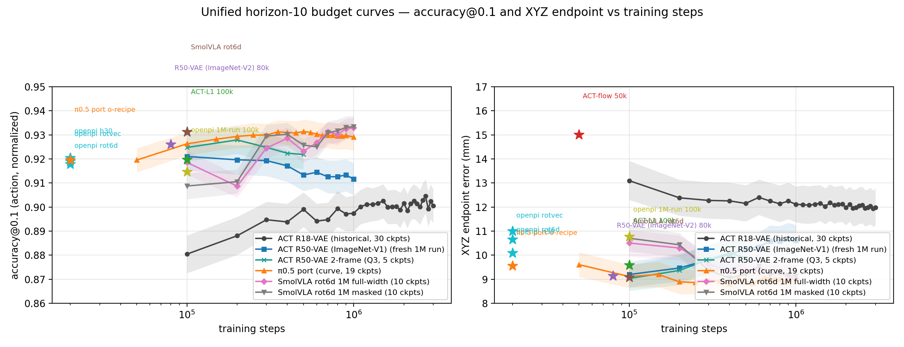

*Fig. 8. All h10 budget points. The π0.5 port reaches an approximately 8.8–9.1 mm plateau around 200k; SmolVLA reaches the same region much later.*

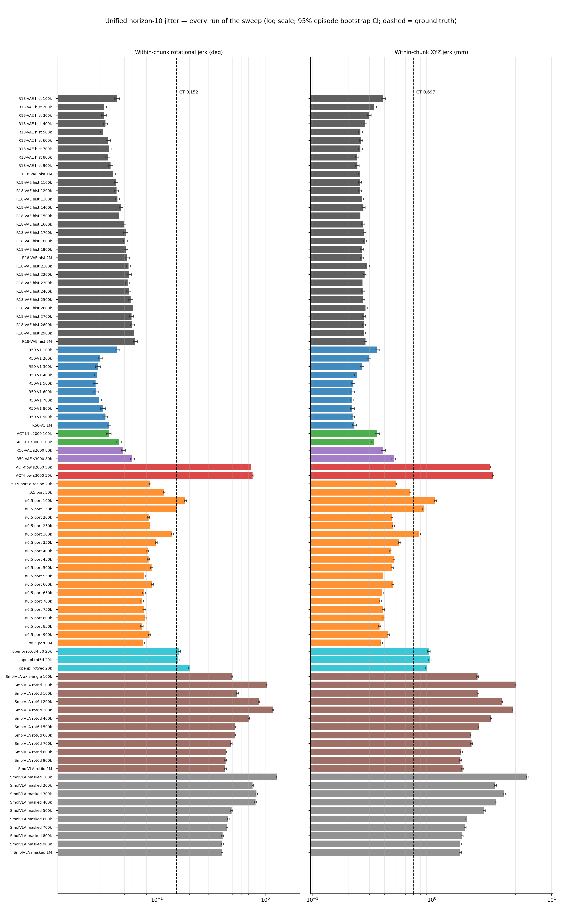

*Fig. 9. Within-chunk second differences for every h10 run; dashed lines show the demonstrated trajectory.*

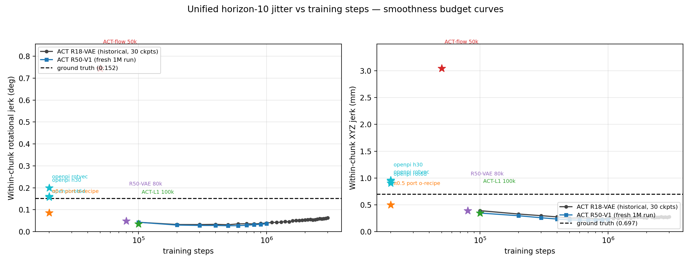

*Fig. 10. Motion-texture proxy versus training steps.*

At h10, Acc@0.5 is saturated around 0.99 and provides little discrimination. Acc@0.1, endpoint error, and dynamics are more useful. Marginal intervals put many mature policies in a broad 9–10 mm region, but official OpenPI's canonical 10.7–11.0 mm rows sit at or above its upper edge; this is more precise than the older “all stacks tie at 9–10 mm” summary.

### Additional controlled-family and training-seed evidence

The additional 28-run matrix extends the canonical h10 comparison to architectures and seeds absent from the main sweep. These checkpoints became available after recovery of the failed artifact disk; that is provenance only, not an analytical grouping.

| Run | Step | XYZ end (mm) | Rot jerk / GT | XYZ jerk / GT |
| --- | ---: | ---: | ---: | ---: |
| ACT-L1 s1000 | 30k / 100k | 13.19 / 9.85 | 0.62 / 0.51 | 0.76 / 0.50 |
| ACT R18-VAE s1000 | 30k / 100k | 14.15 / 12.65 | 0.95 / 0.49 | 1.03 / 0.71 |
| ACT R18-VAE s2000 / s3000 | 100k | 9.56 / 9.99 | 0.45 / 0.55 | 0.53 / 0.54 |
| ACT R34-VAE s1000 | 30k | 13.45 | 1.04 | 1.07 |
| ACT R50-large s1000 | 30k | 10.16 | 0.90 | 0.83 |
| ACT R50-VAE (ImageNet-V2) s1000 | 30k / 100k | 10.70 / 9.39 | 0.89 / 0.54 | 1.09 / 0.67 |
| ACT R50-VAE (ImageNet-V1) s1000 | 30k / 100k | 10.17 / 9.46 | 0.93 / 0.42 | 1.01 / 0.48 |
| ACT R50-VAE (ImageNet-V1) s2000 | 70k | 9.71 | 0.64 | 0.65 |
| ACT R50-VAE (ImageNet-V1) s3000 | 20k | 11.95 | 0.80 | 0.96 |
| ACT-flow 1e-5 s1000 | 30k / 100k | 13.36 / 10.86 | 5.21 / 3.15 | 7.69 / 4.46 |
| ACT-flow 1e-4 s1000 | 30k | 26.16 | 6.20 | 9.06 |
| ACT-flow beta s1000 | 30k | 22.71 | 6.00 | 9.57 |
| ACT-DP s1000 | 30k / 100k | 17.90 / 14.17 | 5.11 / 2.29 | 6.36 / 2.49 |
| ACT-DP s2000 / s3000 | 100k | 14.56 / 14.12 | 3.95 / 2.37 | 5.27 / 2.30 |
| Diffusion R18 s1000 | 30k / 100k | 10.33 / 9.23 | 2.98 / 1.45 | 3.29 / 1.25 |
| Diffusion R18 s2000 | 100k | 9.05 | 1.47 | 1.36 |
| Diffusion R18 s3000 | 30k | 14.11 | 5.99 | 7.48 |
| released UMI U-Net | 30k | 10.01 | 2.03 | 1.98 |
| released UMI transformer | 30k | 9.58 | 1.40 | 1.19 |


*Fig. 11. All 28 additional runs: endpoint error and physical rotational jerk.*


*Fig. 12. Matched or near-matched training-seed groups. Triangles identify partial budgets.*


*Fig. 13. Budget changes in endpoint error and physical jerk.*

Broad family order is repeatable, but training-seed uncertainty is not negligible. At 100k, ACT-L1 spans only about 0.3 mm and ACT-DP about 0.4 mm, whereas R18-VAE spans about 3.1 mm. Per-episode bootstrap intervals do not capture this training variability.

## 5. Canonical full-chunk results

The h30 sweep scores the native 30-action chunk over about one second. This is the harder and more deployment-relevant offline regime for policies that execute 30 actions.

| Model / checkpoint | Steps | XYZ end (mm) | Rot end (deg) | Acc@0.1 | Rot 2nd-diff (deg) |
| --- | ---: | ---: | ---: | ---: | ---: |
| ACT-flow s2000/s3000 | 50k | 31.41–31.97 | 5.45–5.70 | 0.634–0.654 | 0.772–0.818 |
| ACT-L1 s2000/s3000 | 100k | 23.73–24.33 | 4.83–4.87 | 0.719 | 0.052–0.055 |
| ACT R50-VAE (ImageNet-V1) | 100k | 23.24 [21.46, 25.09] | 4.58 | 0.735 | 0.057 |
| ACT R50-VAE (ImageNet-V1) | 600k | 21.22 [19.59, 22.91] | 4.16 | 0.743 | 0.028 |
| ACT R50-VAE (ImageNet-V1) | 1M | 21.32 [19.74, 22.94] | 4.28 | 0.742 | 0.032 |
| ACT R50-VAE (ImageNet-V1), 2-frame Q3 | 100k | 23.03 [21.31, 24.81] | 4.62 | 0.736 | 0.064 |
| ACT R50-VAE (ImageNet-V1), 2-frame Q3 | 500k | 21.63 [20.03, 23.30] | 4.38 | 0.744 | 0.034 |
| historical ACT R18 | 100k | 25.57 [23.64, 27.56] | 5.02 | 0.681 | 0.059 |
| historical ACT R18 | 3M | 23.31 [21.45, 25.20] | 4.50 | 0.715 | 0.054 |
| official OpenPI h30-trained | 20k | 23.20 [21.56, 24.91] | 4.68 | 0.725 | 0.178 |
| π0.5 port | 100k | 23.05 [21.60, 24.58] | 4.43 | 0.730 | 0.170 |
| π0.5 port | 350k | 21.86 [20.32, 23.46] | 4.31 | 0.741 | 0.093 |
| π0.5 port | 700k | 21.77 [20.17, 23.45] | 4.25 | 0.743 | 0.072 |
| π0.5 port | 1M | 21.75 [20.14, 23.42] | 4.29 | 0.743 | 0.077 |
| SmolVLA rot6d, short schedule | 100k | 27.29 [25.72, 28.87] | 4.68 | 0.714 | 0.924 |
| SmolVLA axis-angle, short schedule | 100k | 27.57 [26.10, 29.04] | 4.86 | 0.715 | 0.847 |
| SmolVLA rot6d, long schedule | 1M | 26.26 [24.54, 28.02] | 4.41 | 0.729 | 0.656 |
| SmolVLA masked, long schedule | 1M | 26.15 [24.31, 28.05] | 4.35 | 0.736 | 0.595 |


*Fig. 14. Representative native-h30 models on the six co-primary metrics.*

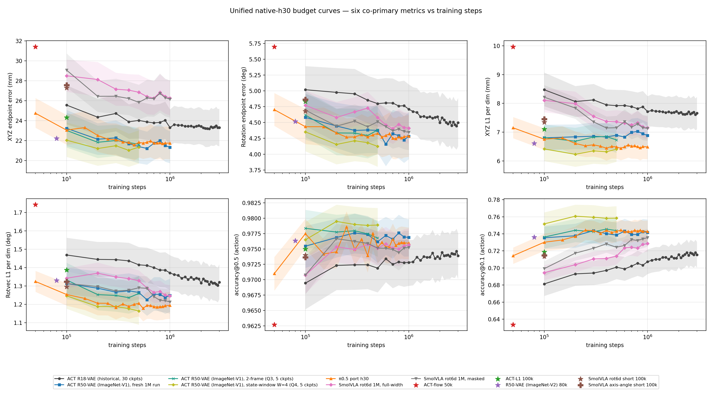

*Fig. 15. All native-h30 budget points for historical R18, fresh one-frame R50, Q3 two-frame R50, Q4 state-window W=4 R50, π0.5 port, and both SmolVLA padding modes across the same six co-primary metrics as Fig. 14: XYZ/rotation endpoint error, XYZ/rotation L1 per dimension, Acc@0.5, and Acc@0.1. The teal × curve is the five-checkpoint two-frame arm and the olive P curve the five-checkpoint W=4 arm (21.0–22.1 mm, CI-tied with the one/two-frame arms); stars are single-budget reference models.*

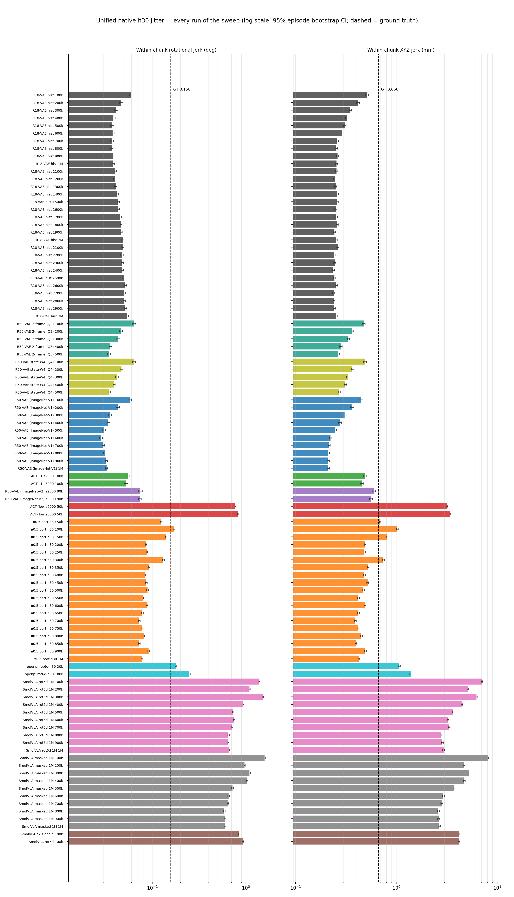

*Fig. 16. Within-chunk second differences for every h30 run.*


*Fig. 17. Motion-texture proxy versus training steps at h30.*

The main h30 conclusions are stable:

- R50 is better than historical R18 at every matched budget.
- The Q3 two-frame R50 curve overlaps the matched one-frame R50 curve on all six native-h30 metrics; temporal stacking does not improve the far horizon either.
- Mature R50 and the π0.5 port occupy the strongest endpoint band, roughly 21–22 mm.
- Official OpenPI reaches approximately ACT-L1@100k quality after only 20k steps, demonstrating strong early learning, but not a ninefold advantage over mature R50 or the port at every operating point.
- SmolVLA improves with budget but retains a far-horizon deficit.
- ACT-flow is weak on both error and dynamics at both horizons.

### Matched training-seed checks at h30

The available seed-2000/3000 companion runs reproduce the broad family ordering at their matched partial budgets:

| Family | Seed/budget | XYZ end h30 (mm) | Acc@0.1 |
| --- | --- | ---: | ---: |
| ACT-L1 | s2000 / s3000, 100k | 24.33 / 23.73 | 0.719 / 0.719 |
| ACT R50-VAE (ImageNet-V2) | s2000 / s3000, 80k | 22.21 / 22.10 | 0.736 / 0.744 |
| ACT-flow | s2000 / s3000, 50k | 31.42 / 31.97 | 0.634 / 0.654 |


*Fig. 18. Partial-budget companion runs on the v2 metrics.*

## 6. Flow-VLM, notation, and recipe controls

### π0.5 port budget context

| Checkpoint | XYZ end h30 (mm) | Rot end (deg) | Rot 2nd-diff (deg) |
| --- | ---: | ---: | ---: |
| π0.5 port 650k | 21.97 [20.33, 23.67] | 4.32 | 0.078 |
| π0.5 port 700k | 21.77 [20.17, 23.45] | 4.25 | 0.072 |
| π0.5 port 1M | 21.75 [20.14, 23.42] | 4.29 | 0.077 |

The port is effectively converged by roughly 350k–650k. Extending 700k to 1M does not improve endpoint accuracy.

### Rotation notation

The original SmolVLA comparison used h30 scoring:

| SmolVLA notation | XYZ end (mm) | Rot end (deg) | Rot 2nd-diff (deg) | XYZ 2nd-diff (mm) |
| --- | ---: | ---: | ---: | ---: |
| rot6d | 26.87 [25.28, 28.49] | 4.60 [4.36, 4.85] | 0.91 | 4.09 |
| axis-angle | 27.00 [25.44, 28.58] | 4.76 [4.49, 5.04] | 0.83 | 4.12 |
| ground truth | — | — | 0.158 | 0.66 |

The original OpenPI comparison used h10 scoring:

| OpenPI notation | XYZ end (mm) | Rot end (deg) | Rot 2nd-diff (deg) | XYZ 2nd-diff (mm) | Latency (s) |
| --- | ---: | ---: | ---: | ---: | ---: |
| rotvec | 10.05 [9.44, 10.70] | 1.66 [1.57, 1.75] | 0.20 | 0.92 | 0.11 |
| rot6d | 9.41 [8.89, 9.94] | 1.69 [1.61, 1.78] | 0.16 | 0.97 | 0.11 |
| ground truth | — | — | 0.153 | 0.65 | — |

These pre-canonical numbers remain the direct within-experiment notation results; later canonical-window rows should be used for cross-family comparisons.


*Fig. 19. Rotation notation has little endpoint effect. Small second-difference effects are stack-dependent.*


*Fig. 20. Historical horizon-matched budget context. Its “all tied / 9×” caption is retained as an experimental artifact, but the final interpretation is superseded by the canonical h10 and h30 tables above.*

### Horizon and stack/recipe control

| Training arm | Scoring | XYZ end (mm) | Rot end (deg) | Acc@0.1 | Rot 2nd-diff (deg) |
| --- | --- | ---: | ---: | ---: | ---: |
| OpenPI h30-trained | t+30, original window | 23.83 [22.11, 25.62] | 4.93 | 0.702 | 0.181 |
| OpenPI h30-trained | t+10, original window | 10.89 [10.25, 11.53] | 1.96 | 0.905 | 0.163 |
| OpenPI h10-trained rot6d | t+10, original window | 9.41 [8.89, 9.94] | 1.70 | 0.934 | 0.161 |
| OpenPI h10-trained rotvec | t+10, original window | 10.06 [9.44, 10.70] | 1.66 | 0.933 | 0.202 |
| PyTorch port, OpenPI recipe | t+30, original window | 25.05 [23.31, 26.86] | 4.65 | 0.721 | 0.094 |
| PyTorch port, OpenPI recipe | t+10, original window | 9.57 [9.02, 10.13] | 1.81 | 0.920 | 0.086 |

The same OpenPI weights move from 10.89 mm at t+10 to 23.83 mm at t+30, directly measuring the horizon confound. The cross-stack arm is **not a pure JAX-versus-PyTorch experiment**: it also retains 10D-versus-20D state construction, normalization-statistics coverage, dataset layout, and numerical differences. It is best read as a stack-plus-recipe port comparison.

### SmolVLA budget and padding

| Step | Full-width h10 | Masked h10 | Full-width h30 | Masked h30 | Full rot 2nd-diff h30 | Masked rot 2nd-diff h30 |
| ---: | ---: | ---: | ---: | ---: | ---: | ---: |
| 100k | 10.51 | 10.71 | 28.50 | 29.07 | 1.391 | 1.582 |
| 300k | 9.63 | 9.38 | 27.16 | 26.45 | 1.512 | 1.093 |
| 500k | 9.37 | 9.21 | 26.85 | 25.84 | 0.730 | 0.718 |
| 700k | 9.27 | 9.18 | 26.27 | 26.21 | 0.717 | 0.639 |
| 1M | 9.06 | 9.15 | 26.26 | 26.15 | 0.656 | 0.595 |

Endpoint intervals overlap at every budget and both horizons. Masking gives a small late smoothness advantage but no meaningful endpoint advantage. The task therefore does not reproduce the large padding sensitivity observed in the separate strawberry experiment.

## 7. Physical motion dynamics

**Dynamics definition.** For a chunk of poses (x_t, R_t), t = 0…9, at dt = 1/30 s: translational jerk is j_t = (x_{t+3} − 3x_{t+2} + 3x_{t+1} − x_t)/dt³ (third finite difference of position; 7 samples per chunk), reported as mean ‖j_t‖ in mm/s³. Rotational jerk runs on the scalar angular speed ω_t = θ(R_tᵀ R_{t+1})/dt (geodesic inter-step angle over dt): α_t = (ω_{t+1} − ω_t)/dt, then j_t = (α_{t+1} − α_t)/dt, reported as mean |j_t| in deg/s³. Velocity and acceleration are the first and second differences under the same scheme. Values are per-chunk means → per-episode means → episode-balanced means with 95% bootstrap CIs; ground truth is scored identically on the demonstrated chunk.

The physical sweep uses first, second, and third differences at 30 fps. Ground truth over the canonical h10 window is:

- rotation: 8.25 deg/s velocity, 65.9 deg/s² acceleration, 2,793 deg/s³ jerk;
- translation: 73.5 mm/s velocity, 628 mm/s² acceleration, 29,521 mm/s³ jerk.

Representative data are now shown in the same format at every derivative
order (episode-balanced mean [95% bootstrap CI]); all 126 rows are available
in `repro/physical_dynamics_h10.{csv,md}`:

| Model | Step | Rot velocity (deg/s) | XYZ velocity (mm/s) |
| --- | ---: | ---: | ---: |
| demonstrated | — | 8.25 | 73.5 |
| historical ACT R18 | 3M | 6.26 [6.00, 6.52] | 57.4 [55.3, 59.5] |
| ACT R50-VAE (ImageNet-V1) | 800k | 5.32 [5.01, 5.65] | 58.9 [56.3, 61.6] |
| ACT-L1 s2000 | 100k | 4.65 [4.38, 4.93] | 63.2 [60.2, 66.2] |
| ACT-flow s2000 | 50k | 14.59 [14.26, 14.94] | 83.6 [81.1, 86.3] |
| π0.5 port | 1M | 5.66 [5.38, 5.95] | 61.8 [59.0, 64.6] |
| SmolVLA rot6d | 100k | 11.83 [11.56, 12.11] | 78.1 [75.6, 80.7] |
| SmolVLA rot6d | 1M | 10.21 [9.90, 10.56] | 70.3 [67.9, 72.8] |

| Model | Step | Rot acceleration (deg/s²) | XYZ acceleration (mm/s²) |
| --- | ---: | ---: | ---: |
| demonstrated | — | 65.9 | 628 |
| historical ACT R18 | 3M | 34.0 [32.2, 35.9] | 251 [243, 258] |
| ACT R50-VAE (ImageNet-V1) | 800k | 19.1 [18.1, 20.1] | 194 [187, 202] |
| ACT-L1 s2000 | 100k | 25.0 [23.6, 26.5] | 313 [300, 327] |
| ACT-flow s2000 | 50k | 212 [205, 220] | 2,747 [2,686, 2,811] |
| π0.5 port | 1M | 35.1 [33.6, 36.6] | 340 [332, 349] |
| SmolVLA rot6d | 100k | 178 [171, 185] | 2,163 [2,106, 2,221] |
| SmolVLA rot6d | 1M | 149 [143, 156] | 1,622 [1,573, 1,671] |

| Model | Step | Rot jerk (deg/s³) | XYZ jerk (mm/s³) |
| --- | ---: | ---: | ---: |
| demonstrated | — | 2,793 | 29,521 |
| historical ACT R18 | 3M | 903 [846, 962] | 5,261 [5,065, 5,458] |
| ACT R50-VAE (ImageNet-V1) | 800k | 459 [437, 483] | 4,445 [4,269, 4,624] |
| ACT-L1 s2000 | 100k | 1,272 [1,191, 1,360] | 15,732 [14,963, 16,546] |
| ACT-flow s2000 | 50k | 11,043 [10,600, 11,494] | 148,903 [145,143, 152,738] |
| π0.5 port | 1M | 1,389 [1,328, 1,450] | 14,703 [14,266, 15,158] |
| SmolVLA rot6d | 100k | 9,192 [8,773, 9,620] | 114,806 [111,413, 118,168] |
| SmolVLA rot6d | 1M | 7,821 [7,435, 8,231] | 86,311 [83,458, 89,198] |


*Fig. 21. Physical rotational and translational velocity for representative models.*


*Fig. 22. Physical rotational and translational acceleration in the same format.*


*Fig. 23. Physical rotational and translational jerk, completing the matched derivative suite.*


*Fig. 24. Velocity for every run (log scale, 95% bootstrap CIs, dashed = demonstrated).*


*Fig. 25. Acceleration for every run in the same ordering and format.*


*Fig. 26. Jerk for every run, completing the all-run derivative suite.*


*Fig. 27. Predicted-to-demonstrated ratio across velocity, acceleration, and jerk. Each grouped triplet is a fixed checkpoint, not a training trajectory.*


*Fig. 28. All canonical-h10 physical motion dynamics in the same 2×3 budget layout as Fig. 15: rotational velocity/acceleration/jerk across the top and translational XYZ velocity/acceleration/jerk across the bottom. Lines and confidence bands connect checkpoints from the same training trajectory, dashed lines are demonstrated references, and stars are single-budget or independent companion runs.*


*Fig. 29. Physical velocity versus training steps. Lines connect checkpoints from the same training trajectory; stars are single-budget or independent companion runs.*


*Fig. 30. Physical acceleration versus training steps. Lines connect checkpoints from the same training trajectory; stars are single-budget or independent companion runs.*


*Fig. 31. Physical jerk versus training steps. Lines connect checkpoints from the same training trajectory; stars are single-budget or independent companion runs.*

The second-difference findings survive in true physical jerk:

- ACT predicts approximately correct speed but suppresses acceleration and jerk, especially in translation.
- SmolVLA exceeds demonstrated dynamics at every derivative order; more training helps but does not remove the gap.
- The π0.5 port is closer to demonstrated dynamics than ACT or SmolVLA, though its mature checkpoints remain somewhat smoother than the demonstrations.
- Under-trained ACT-flow is simultaneously inaccurate and excessively rough.

This is a trajectory-similarity result, not proof that matching demonstration jerk maximizes closed-loop success. Contact phases may require different dynamics from free-space motion.

### Adjacent-frame direct prediction change

The revised canonical diagnostic queries each policy independently at t and t+1, then compares the two decoded relative-motion chunks **at the same chunk index** over h10 and, where native, h30. There is no shared-future timestamp alignment, anchor compensation, or k=5/k=10 sweep. The two calls use independent deterministic sampler seeds, so the score intentionally includes both the changed observation/relative-pose anchor and fresh stochastic-sampler variation. Each row uses the canonical 100 episodes × 5 adjacent pairs, episode-balanced means, and 95% bootstrap CIs. Full protocol and table: §9.2.19 of the full report.

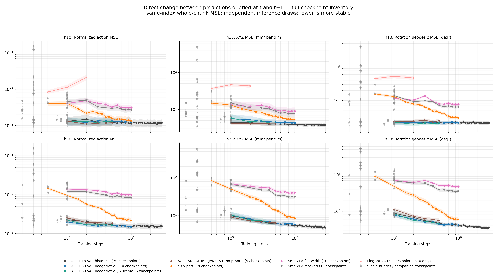

*Fig. 32. All canonical adjacent-frame direct prediction-change results in the same 2×3 budget layout as Figs. 15 and 28: normalized action, translational XYZ, and rotational geodesic MSE at h10 across the top and h30 across the bottom (log x/y scales; lower means less output change). Lines and confidence bands connect checkpoints from the same training trajectory; stars are single-budget or independent companion runs. The inventory contains 129 PyTorch checkpoints plus five official OpenPI/JAX checkpoints (134 total; 262 native-horizon rows). H10-only OpenPI models and the 16-action LingBot-VA curve appear only in the top row.*

- Deterministic ACT occupies the low-change band. The historical R18 improves most clearly over h30 (10.01 → 4.88 mm²/dim XYZ MSE from 100k → 3M), while fresh R50 improves 10.25 → 5.92 by 1M. H10 changes are smaller because only the near chunk is compared.
- Stochastic flow/diffusion/VLA policies generally move more between independent calls because this metric includes sampler variation. Training suppresses it strongly in the π0.5 port: XYZ MSE falls 13.18 → 5.45 mm²/dim at h10 and 51.16 → 8.83 at h30 from 100k → 1M, bringing the mature port close to deterministic ACT. SmolVLA also improves but remains much higher over the full chunk (full-width 70.29 → 40.36; masked 67.30 → 31.45 mm²/dim h30).
- Official OpenPI/JAX sits between mature ACT/port and early stochastic rows at h10 (rot6d 20k 8.21, rotvec 20k 7.69, 1M-schedule 100k 6.51 mm²/dim XYZ). Its h30 20k arm is 29.25, while the stopped stretched-schedule h30 100k arm is worse at 44.45; more nominal steps do not guarantee more stable independent samples.
- The Q3 two-frame curve again tracks one-frame ACT (at 500k: h10 XYZ 4.37 vs 4.53 mm²/dim; h30 6.64 vs 6.51). Temporal stacking does not materially change adjacent-frame output stability.
- Lower direct-change MSE is **not** accuracy. The Q4 no-proprio model can be less reactive in XYZ while remaining much less accurate; at 500k its h10 XYZ MSE is 4.11 vs 4.53 for the proprio model, but rotation MSE is worse (0.249 vs 0.211 deg²), and its canonical endpoint deficit remains +2.94 mm.
- H30 exposes more accumulated output change than h10 across every family. Select a model using endpoint accuracy, motion dynamics, and this diagnostic together; a constant but wrong chunk would score perfectly here.

## 8. What the evidence answers

### Q1: Does capacity improve ACT?

**Yes, for the ResNet backbone.** R50-VAE (ImageNet-V1) improves over R18-VAE (ImageNet-V1), so the result is not explained by ImageNet-V2 weights. It reaches the strong h10 group near 100k and lowers mature h30 endpoint error by roughly 2 mm. The wider/deeper 145M ACT transformer was not worthwhile at the tested LR and budget.

Practical choice:

- use **ACT-L1** when low latency, low memory, and simplicity dominate;
- use **ACT R50-VAE (ImageNet-V1)** when the roughly 25% inference-cost increase is acceptable and full-chunk accuracy matters;
- select the checkpoint on the horizon that will actually be executed.

### Q2: Is flow matching the cause of weak flow-policy behavior?

**No general claim is supported.** The matched ACT-flow formulation is weak, and swapping it to epsilon/DDIM diffusion does not fix it. But conventional and released-UMI diffusion policies are competitive, while pretrained flow VLAs can be strong. The evidence is consistent with an interaction among denoiser architecture, time/action conditioning, objective weighting, optimizer, sampler, pretraining, and budget.

### Q3: Does multi-frame visual input help?

**No.** A 2-frame (t−1, t) channel-stacked ACT R50-VAE (ImageNet-V1) arm (widened conv1, tiled pretrained filters, +9,408 parameters; `--policy.consecutive_frames=2`) ties the matched 1-frame budget curve at all five shared checkpoints (100k–500k) at both h10 and native h30: XYZ endpoint gaps are ≤0.37 mm and ≤0.30 mm, respectively, with fully overlapping CIs. Rotation endpoint, component L1, Acc@0.5/0.1, within-chunk and physical jerk, and adjacent-frame prediction change also tie. The native-h30 six-metric curve is included in Fig. 15; keep the simpler 1-frame input. Full tables and read-outs: §9.2.17 of the full report.

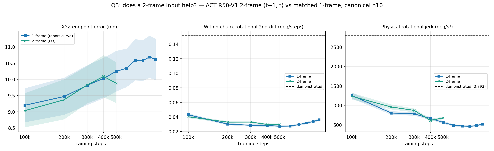

*Fig. 33. Q3 budget comparison — XYZ endpoint, within-chunk rotational 2nd-diff, and physical rotational jerk for the 2-frame arm against the matched 1-frame curve (95% CI bands, dashed = demonstrated).*

### Q4: Does ACT need proprioception?

**Yes.** The image-only arm (`use_proprioception=false`, 500k, same R50-VAE (ImageNet-V1) recipe and seed) is worse than its proprio twin at every matched budget, with fully separated bootstrap intervals:

| ckpt | no-proprio end (mm) | 1-frame end (mm) | gap |
|---|---:|---:|---:|
| 100k | 13.55 [12.75, 14.36] | 9.20 [8.67, 9.72] | +4.35 |
| 300k | 13.41 [12.68, 14.18] | 9.81 [9.21, 10.44] | +3.60 |
| 500k | 13.19 [12.43, 13.99] | 10.25 [9.62, 10.88] | +2.94 |

The no-proprio curve is flat within noise — budget does not close the gap; the apparent shrinkage is the baseline's known late-budget t+10 drift. Motion stays deterministic-ACT over-smoothed (0.31–0.63× GT rot jerk) but is uniformly rougher than the proprio twin at matched budget. Its 500k direct-change result is mixed (h10 XYZ MSE 4.11 vs 4.53 mm²/dim, rotation 0.249 vs 0.211 deg²), which is expected because a less responsive but inaccurate policy can change less. Since the state input is free at inference time on this pipeline (derived from the same SLAM/relative-EE path as the targets), proprioception stays — roughly a third of the t+10 endpoint error budget is carried by it. How much state history to keep is answered in the addendum below (§9.2.20).

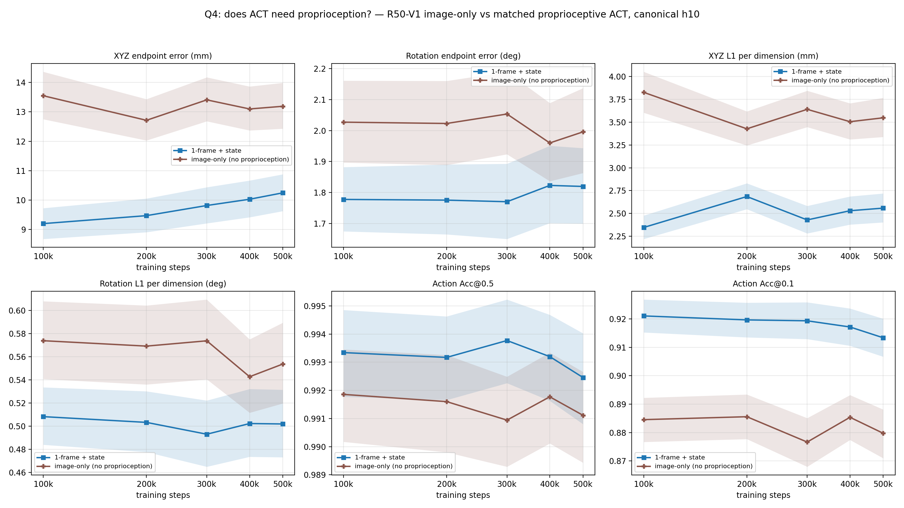

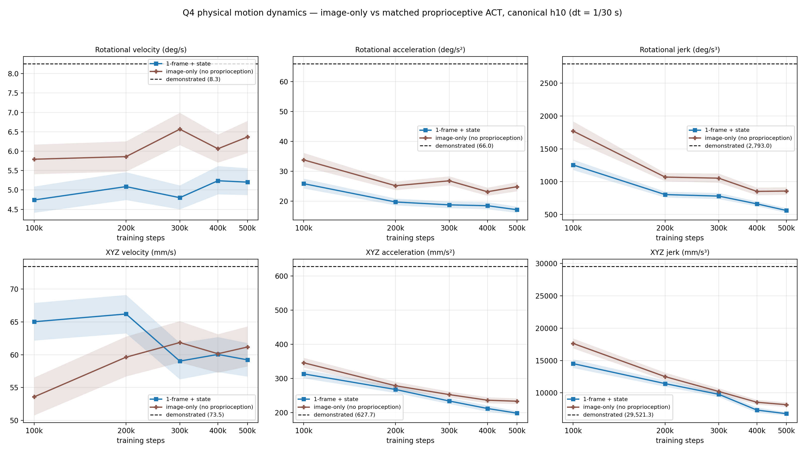

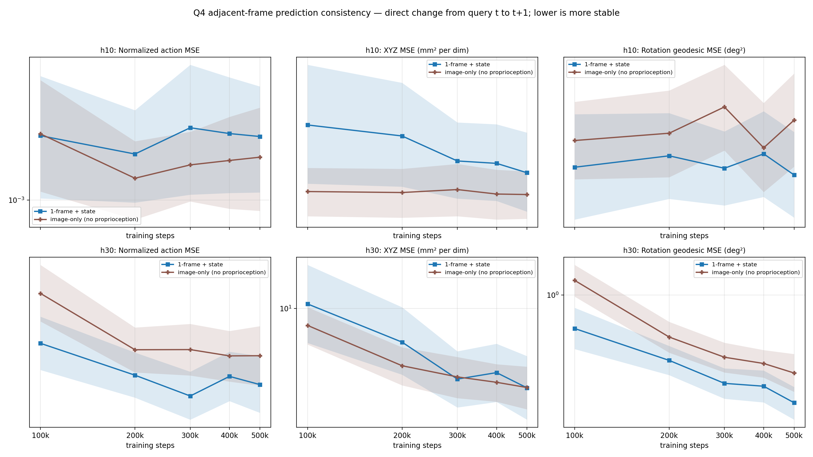

*Fig. 34. Q4 matched-budget comparison in three aligned 2×3 views: (top) the six canonical co-primary metrics from Fig. 15; (middle) rotational and translational velocity, acceleration, and jerk in the format of Fig. 28; (bottom) normalized-action, XYZ, and rotation adjacent-frame direct prediction-change MSE at h10 and h30 in the format of Fig. 32. Curves compare the image-only arm with the matched proprioceptive 1-frame ACT at 100k–500k; bands are 95% episode-bootstrap CIs, dashed lines are demonstrated physical-motion references, and lower cross-frame MSE means less output change. Full table and read-outs: §9.2.18 of the full report.*

### LingBot-VA: video-action policy under the unified protocol

The only video-action policy in the inventory: a Wan-2.2-stack transformer (~5B, LoRA on all linear layers) that generates future video latents (20 CFG flow steps) and decodes a 16-action chunk through a 50-step action head. Trained 200k steps at batch size 4 on-host (axis-angle, seed 1000) and scored at three budgets under the canonical protocol (500 queries, h10 identity-clip of the 16-action chunk, seed 1000):

| ckpt | XYZ end (mm) | Rot end (°) | Acc@0.1 | Rot 2nd-diff | Phys rot jerk (×GT) | Gripper end |
|---|---:|---:|---:|---:|---:|---:|
| 50k  | 21.31 [20.61, 22.03] | 3.29 | 0.539 | 0.204 | 1.63× | 0.353 |
| 100k | 19.97 [18.93, 21.01] | 2.93 | 0.711 | 0.223 | 2.02× | 0.595 |
| 200k | 19.32 [18.21, 20.44] | 2.86 | 0.719 | 0.209 | 1.99× | 0.535 |

Endpoint is ~2× the 9–11 mm pack with CIs disjoint from every other family; budget buys only 2.0 mm over 50k→200k and the last two budgets overlap in CI. Acc@0.1 jumps 0.54→0.71 at 100k then plateaus ~0.2 below the pack's 0.91–0.93. The gripper channel concentrates the domain gap (4–7× worse than every other row). Dynamics are not the failure mode: 2nd-diff sits just above the port band and physical jerk rises with budget — the opposite of ACT's budget-buys-smoothness direction. Adjacent-frame consistency does degrade with budget: normalized MSE rises 0.0084→0.0212 and XYZ MSE 37.0→43.7 mm²/dim from 50k→200k, leaving LingBot substantially less stable than both anchors. Caveat: the evaluator feeds one conditioning frame per query, so the policy's autoregressive video-rollout path is never exercised — these are one-shot first-chunk scores under a large domain shift (frozen LIBERO-oriented base vs single-camera UMI), a floor for this recipe rather than a bound on the architecture. Full table, read-outs, and the runtime-fix comparability note: §9.2.16 of the full report.

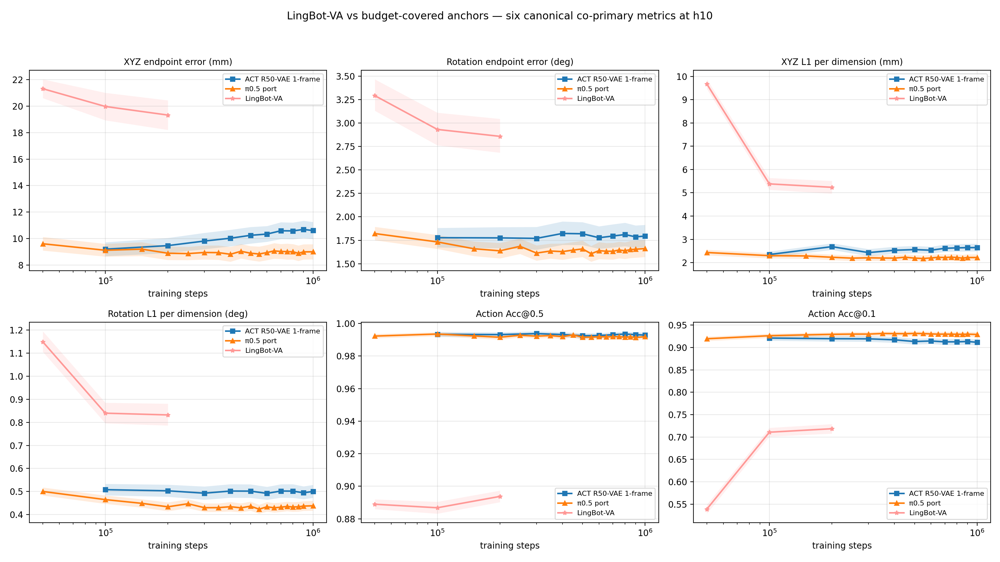

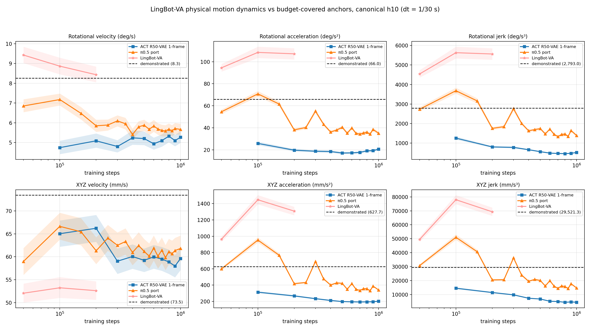

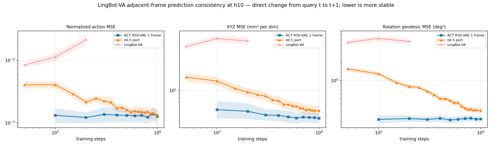

*Fig. 35. Standard three-view LingBot-VA budget comparison against the report's two budget-covered anchors (ACT R50-VAE 1-frame and π0.5 port): (a) the six canonical co-primary metrics, (b) rotational and translational velocity/acceleration/jerk, and (c) normalized-action, XYZ, and rotation adjacent-frame direct prediction-change MSE. LingBot-VA has a 16-action chunk, so the consistency view is h10-only; h30 is structurally unsupported. Bands are 95% episode-bootstrap CIs, dashed lines are demonstrated physical-motion references, and lower consistency MSE means less output change.*

### Q4 addendum: how long should the proprioceptive window be?

**Four poses ≈ 100 ms of end-effector history; five and ten add nothing measurable.**
The `umi_state_window` knob (default W=2, bit-identical to all prior runs) extends
the state to `[rel(t−(W−1)|t) … rel(t−1|t) ‖ identity+gripper]`. W=5 and W=10
(first 2026-08-28), W=3 (2026-08-29), and W=4 (2026-08-30) repeat the R50-VAE
(ImageNet-V1) recipe — 500k steps, seed 1000, checkpoints every 100k, host 4090
for W=3/W=4/W=5 and kiwi 5080 for W=10 — and all twenty rows were scored under
the canonical h10 protocol:

| ckpt | W=0 (mm) | W=2 (mm) | W=3 (mm) | W=4 (mm) | W=5 (mm) | W=10 (mm) |
|---|---:|---:|---:|---:|---:|---:|
| 100k | 13.55 [12.75, 14.36] | 9.20 [8.67, 9.72] | 8.86 [8.25, 9.50] | 8.41 [7.92, 8.91] | 9.33 [8.87, 9.82] | **7.96 [7.51, 8.42]** |
| 200k | 12.71 [12.03, 13.43] | 9.47 [8.91, 10.05] | 9.01 [8.35, 9.71] | 8.31 [7.77, 8.87] | 8.16 [7.70, 8.62] | **7.86 [7.36, 8.37]** |
| 500k | 13.19 [12.43, 13.99] | 10.25 [9.62, 10.88] | 9.20 [8.63, 9.79] | 9.05 [8.49, 9.63] | **8.50 [8.00, 9.02]** | **8.59 [8.07, 9.13]** |

Endpoint responds as a one-pose step between 3 and 4, not a ramp: W=3 CI-ties
W=2 at every matched budget, while W=4 already sits in the long-window band
(8.31–8.82 mm at 100k–400k, CI-overlapping W=5 everywhere; rotation 1.60–1.67°
and Acc@0.1 0.930–0.934 at W=5 level). W=4, W=5, and W=10 tie each other on
endpoint (W=10 CI-separated from W=2 at all five budgets, W=5 at ≥200k; only
rotation still edges down to 1.53°), so the sweep brackets the useful window
as {2,3} ≈ tie < {4,5,10} ≈ tie — ~100 ms of EE history suffices. Fine-grained
metrics move earlier than the endpoint: rotation and Acc@0.1 already improve
~half-way at W=3 (0.913 → 0.926 → 0.930 → 0.931 at 500k). The best endpoint
rows in the entire 126-run inventory are W=10@200k (7.86 mm) and W=10@100k
(7.96 mm) — ~1.2 mm below the previous pack top, with the eight lowest rows
all W≥4 — and all four new curves are budget-flat after 100k–200k (W=4 drifts
mildly to 9.05 mm at 500k, still CI-tied with W=5). The gain costs almost no
motion quality: rot jerk rises only 0.20 → 0.23× GT (still deterministic-ACT
over-smoothed) and W=10's XYZ jerk ties W=2 exactly. The mechanism is
finite-difference EE velocity/acceleration at no sensing cost — the same
temporal signal temporal ensembling exploits, and consistent with Q3's null
result for a second camera frame. Caveats: one seed per arm (recovered-trio
noise ~0.3–0.4 mm ≪ the 1.7 mm gap), different GPUs for W=10 vs the host arms,
and W>2 is offline-only — the live 2-D state path raises `NotImplementedError`
by design, and the §9.2.19 cross-frame sweep was not extended to the new arms.
At native h30 (Fig. 15) the W=4 arm runs 21.0–22.1 mm across 100k–500k —
CI-tied with the one/two-frame R50 arms at every matched budget — so the h10
window gain compresses under full-chunk scoring: the lever buys short-horizon
tracking, not long-horizon prediction.
Full tables, protocol, and read-outs: §9.2.20 of the full report.

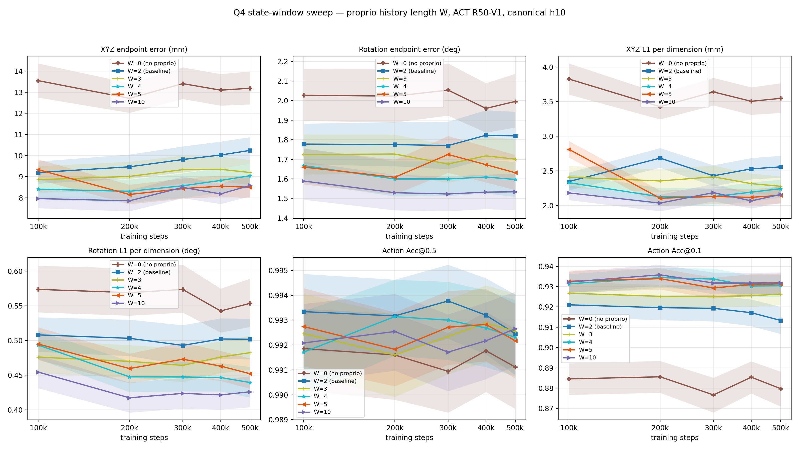

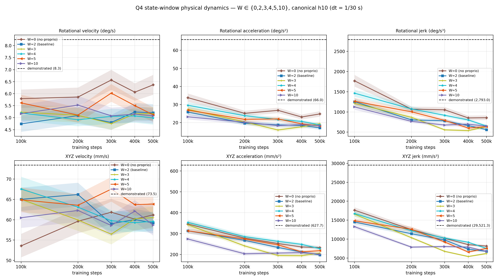

*Fig. 36–37. Q4 state-window sweep W ∈ {0, 2, 3, 4, 5, 10} in two aligned 2×3 views: the six canonical co-primary metrics (Fig. 15 format) and rotational/translational velocity/acceleration/jerk with demonstrated references (Fig. 28 format). All panels share the five 100k–500k checkpoints; bands are 95% episode-bootstrap CIs.*

### Policy-family recommendation from the offline evidence

| Need | Candidate | Reason |
| --- | --- | --- |
| simple, fast deterministic control | ACT-L1 | lowest inference cost; competitive h10/h30 endpoint |
| best ACT h10 endpoint (offline eval only) | ACT R50-VAE state-window W=10, 100k–200k | 7.86–7.96 mm h10 — best rows in the inventory, budget-flat; W=4 is the minimal sufficient window (8.31–8.82 mm); W>2 has no live 2-D state path yet |
| best ACT full-chunk result | ACT R50-VAE (ImageNet-V1), roughly 600k | approximately 21.2 mm h30; strong h10 early checkpoint (W=4 scored at h30: 21.0–22.1 mm, CI-tied with the one/two-frame arms) |
| best mature flow-VLM endpoint | π0.5 port, roughly 350k–700k | approximately 8.8–9.0 mm h10 and 21.7–21.9 mm h30 |
| compute-efficient early VLM fine-tuning | official OpenPI h30 recipe | reaches approximately 23.2 mm h30 at 20k steps |
| smaller VLA / h10-only emphasis | SmolVLA | reaches approximately 9.1 mm h10, but remains weak at h30 and high-jerk |

These are candidates for robot testing, not a final deployment ranking.

## 9. Limitations and required next experiment

1. **Open-loop evaluation only.** The study does not measure compounding error, recovery, contact, grasp/lift success, safety failures, or action-queue effects.
2. **One demonstrated future per query.** A generative policy can produce a valid alternative and still be penalized. Expected-of-K, best-of-K, energy-score, and diversity metrics would better characterize multimodal policies.
3. **Incomplete training-seed balance.** Available seeds support broad family differences, but not every adjacent comparison has three matched-budget trainings.
4. **Repeated use of one validation set.** Model selection, checkpoint selection, and new metrics were all developed on the same 100 episodes. Final claims need an untouched test set, ideally across sessions, operators, scenes, and occlusion regimes.
5. **Confidence intervals are descriptive.** Most cross-family claims use marginal episode-bootstrap intervals. Formal paired differences or equivalence tests should be used for “better” or “equivalent” claims.
6. **Acc@ε is adapted, not native.** Its q01–q99 scale comes from decoded pose coordinates, not the exact normalized action representation optimized by each policy.
7. **Cross-stack controls retain stack-native differences.** State construction, normalization coverage, layout, and numerics remain confounded.

The decisive follow-up is a blinded, block-randomized closed-loop evaluation of ACT-L1, ACT R50-VAE (ImageNet-V1), the π0.5 port, official OpenPI, and SmolVLA. It should report overall and substage success, recovery, safety events, execution latency, and confidence intervals over randomized initial poses and occlusions. A minimum trial count should be selected by a power calculation rather than convenience.

## 10. Reproducibility and result coverage

All **41 unique figures** from the full report are embedded above. The budget figures retain every checkpoint in the 30-point historical R18, 10-point one-frame R50, 5-point two-frame R50, 5-point no-proprio R50, 5-point W=3, W=4, W=5, and W=10 state-window R50 curves (plus the W=4 native-h30 curve in Fig. 15), 19-point π0.5-port h30, 18-point π0.5-port h10, two 10-point SmolVLA sweeps, and 3-point LingBot-VA curve. The adjacent-frame direct-MSE figure covers all 129 PyTorch checkpoints plus five official OpenPI/JAX checkpoints. The tables retain all experimental families and every decision-relevant milestone; the full 126-row h10 and 99-row h30 numeric inventories remain in the [full research record](RESEARCH_REPORT.md) and are reconstructible from the tracked evidence bundle.

The repository-tracked [`repro/`](repro/) directory contains:

- per-episode compressed JSON for 88 main-sweep physical-dynamics runs and 28 additional controlled-matrix runs;
- adjacent-frame direct-MSE CSV plus compact per-episode evidence for all 134 checkpoints / 262 native-horizon rows;
- the immutable 500-query frame list and its hash;
- per-run training configurations;
- dataset and checkpoint SHA-256 manifests;
- environment freezes;
- LeRobot and OpenPI commit identities.

Primary regeneration commands:

```bash
uv run python examples/umi_relative_ee/act_flow_ablation/compile_unified_h10.py
uv run python examples/umi_relative_ee/act_flow_ablation/compile_unified_h30.py
uv run python examples/umi_relative_ee/act_flow_ablation/compile_physical_jerk.py
uv run python examples/umi_relative_ee/act_flow_ablation/compile_cross_frame_mse.py

MPLCONFIGDIR=/tmp/lerobot-matplotlib uv run --with matplotlib python \
  examples/umi_relative_ee/act_flow_ablation/plot_unified_h10.py
MPLCONFIGDIR=/tmp/lerobot-matplotlib uv run --with matplotlib python \
  examples/umi_relative_ee/act_flow_ablation/plot_unified_h30.py
MPLCONFIGDIR=/tmp/lerobot-matplotlib uv run --with matplotlib python \
  examples/umi_relative_ee/act_flow_ablation/plot_cross_frame_mse.py
```

For implementation details, incidents, exact launchers, and the full chronological audit trail, use [RESEARCH_REPORT.md](RESEARCH_REPORT.md).
