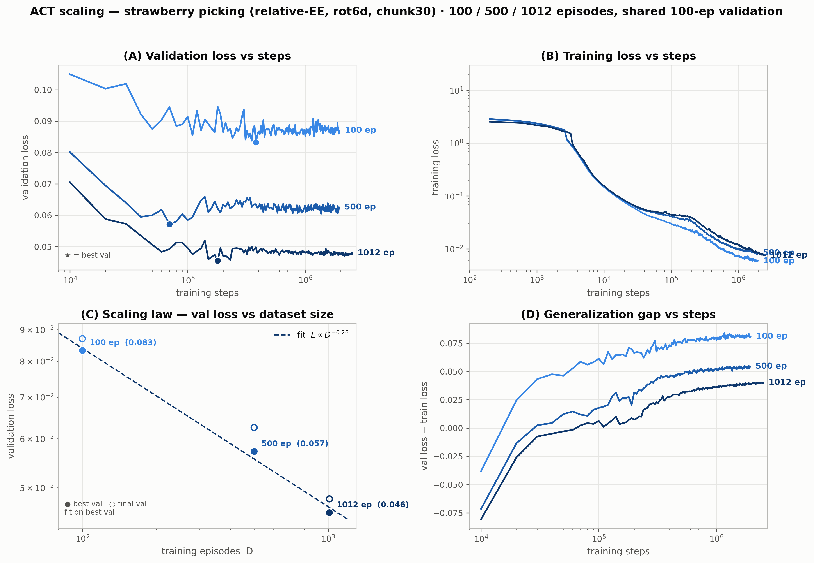
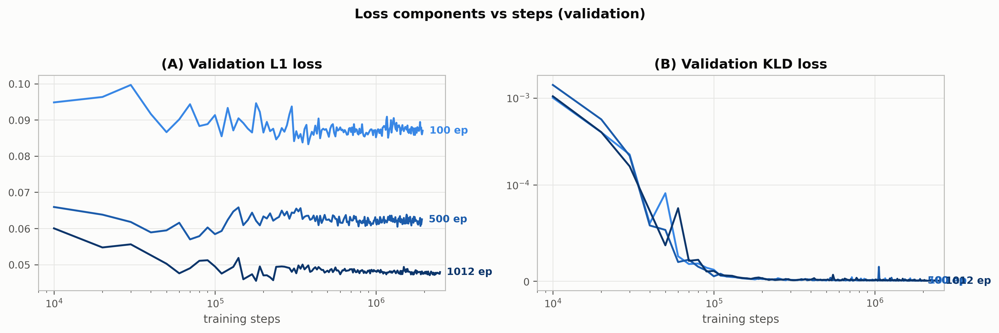

# Scaling Report — ACT, relative-EE, strawberry picking

**Question:** How does ACT validation loss scale with training-data size?
**Setup:** 3 nested train subsets — **100 / 500 / 1012 episodes** — identical ACT policy
(UMI relative-EE, rot6d, chunk30, 52M params), identical optimizer (AdamW 1e-5, batch 8),
shared **100-episode validation set**. Full method in [`EXPERIMENT.md`](EXPERIMENT.md).

> The 100-ep and 500-ep runs were **stopped early at ~1.93–1.95M steps** (out of 2.5M) once
> the result was unambiguous — both had overfit their best val by ~1.5M steps, so no signal
> was lost. Best-val is the primary metric throughout.

## Headline result

Validation loss follows a clean **power law in dataset size**:

> **L(D) ≈ 0.27 · D^(−0.26)**  &nbsp;&nbsp;(D = training episodes, fit on best val)

| episodes D | best val loss | (fit predicts) | final val loss | best-val step |
|---:|---:|---:|---:|---:|
| 100 | **0.0833** | 0.0840 | 0.0870 | 380k |
| 500 | **0.0572** | 0.0556 | 0.0625 | 70k |
| 1012 | **0.0456** | 0.0465 | 0.0480 | 180k |

Power-law predictions match all three points within ±3% (effectively exact with 3 points →
exponent **b ≈ 0.26**, episodes; **≈ 0.29** if D is measured in frames). In practical terms:
**~10× more data (100→1012 ep) roughly halves val loss (0.083→0.046)**, or each **doubling of
data cuts val loss by ~16%** (2^−0.26 ≈ 0.84).

## Figures

**Figure 1 — scaling (2×2).** (A) val loss vs steps, (B) train loss vs steps,
(C) val loss vs dataset size — log-log with power-law fit, (D) generalization gap vs steps.

**Figure 2 — loss components (validation).** L1 (left) and KLD (right) vs steps.

wandb (all grouped in `biorobotlab/lerobot_scaling_ee`):
[100ep](https://wandb.ai/biorobotlab/lerobot_scaling_ee/runs/5t50tck6) ·
[500ep](https://wandb.ai/biorobotlab/lerobot_scaling_ee/runs/454v0q73) ·
[1012ep](https://wandb.ai/biorobotlab/lerobot_scaling_ee/runs/5wkorw6c) (mirror).

## Findings

**1. Data scales — power law, with strong diminishing returns.**
Monotonic, near-perfect log-log linearity across 100→1012 ep. But the shallow exponent
(0.26) means **loss is expensive to push down**: extrapolating the fit, reaching
**L=0.04 needs ~1.6k episodes** and **L=0.03 needs ~5k** — i.e. roughly 5–15× more data
than the current 1012 set for a modest further reduction. Data alone has mostly played out
at this scale; architectural / representation gains likely dominate beyond here.

**2. Everything overfits early — the 2.5M-step budget is ~10–30× too large.**
Best validation arrives at **70k (500-ep), 180k (1012-ep), 380k (100-ep)** — then val loss
plateaus and slowly drifts up while train loss keeps dropping (memorization). For these data
scales, ~**300–500k steps** captures the achievable val loss; training to 2.5M only adds
overfit. Implication: for deployment, early-stop on val (~best-val step).

**3. Generalization gap collapses with data.**
At each run's best-val step, gap (val−train) = **0.070 (100-ep) → 0.012 (500-ep) → 0.007
(1012-ep)**. The 100-ep model memorizes its small set (train 0.006 vs val 0.083); the 1012-ep
model generalizes (train 0.008 vs val 0.046). This is the mechanism behind the scaling law:
more data shrinks the gap, which shrinks val loss. *(Panel D.)*

**4. Loss is L1-dominated; KLD vanishes (VAE posterior collapse).**
KLD → ~0 within the first ~50k steps for every run (the ACT VAE posterior collapses to the
prior), so essentially **all of val loss is L1** (reconstruction). KLD is not a useful
discriminator across data sizes here. *(Fig 2.)*

## Caveats
- **Leading-prefix subsets:** 100/500 are the *first* N episodes by session order, so at
  small N early recording sessions are over-represented (100-ep ≈ 117 frames/ep vs ≈87 for
  the full set). Fine for a nested sweep; the 100-ep point may be slightly optimistic/pessimistic
  depending on early-session difficulty.
- **3 data points** → the exponent is a rough estimate (log-linear fit on 3 points). Treat
  b≈0.26 as ±0.05.
- **Single seed per point** — no error bars; val curves are noisy (±0.005 band) but the
  inter-run gaps (0.083 / 0.057 / 0.046) far exceed the noise.
- 100/500 runs **stopped at ~1.94M**, not 2.5M (best-val fully captured earlier; see table).
- Normalization stats recomputed per subset (correct for fair comparison; means the
  MIN_MAX bounds differ slightly across runs).

## Reproduce
- Runs launched via the parent directory's `train_relative_ee_processor.py` (see
  [`EXPERIMENT.md`](EXPERIMENT.md) for the exact config & subsets).
- Figures regenerated by `make_figures.py`, which reads per-run history CSVs
  (`_{100,500,1012}_history.csv`) produced by pulling each run's metrics from wandb
  (`run.history(...)`) or parsing the run console logs. Power-law fit is a log-linear
  `np.polyfit` on best-val points.

## Bottom line
Val loss scales as a power law **L ∝ D^(−0.26)** over 100→1012 demos, halving per decade of
data. The model overfits within a few hundred k steps regardless of data size, so the
practical lever past 1k demos is no longer "more data" — returns have diminished enough that
representation/architecture changes should outperform further data collection. For this
setup, **~1012 episodes + early-stop near its best val (~180k steps) is the efficient
operating point.**
